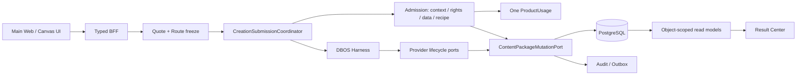

# 美业内容 Agent 优化报告与实施路线（交叉复核修订版）

> 日期：2026-07-24  
> 输入：[全面开发 Review](comprehensive-development-review-2026-07-24.md)  
> 原则：先关闭合入正确性，再关闭试点/发布产品安全与发布工程，随后补产品闭环，最后做结构和规模化优化；保留现有 canonical 对象、ports、DBOS 和测试资产，不做大爆炸重写。  
> 修订说明：吸收 Agent Team Review 中可复核的 Operations、额度投影、邮件日志、RouteSnapshot、Harness 激活、Canvas/Core 和 cutover 发现；不采纳“主链全部落地、无阻断”的排序前提。

## 1. 优化目标

本路线不以“消灭所有技术债”为目标，而以四个可验证结果为目标：

1. **同一条 Composer 请求在正式 8 个 Recipe 上都能正确报价、冻结、执行、恢复和交付。**
2. **任何可见内容、素材外发、计费、采用和发布都有唯一、可审计、可重放的事实链。**
3. **同一 SHA 可以在 staging 四单元部署，并通过 readiness、三模态、网络、恢复和安全发布门。**
4. **产品从“能生成”补全为“今天建议什么 → 完整成品 → 拿到文件/交接 → 结果回流 → 下次更准”。**

## 2. 实施原则

### 2.1 不推倒重来

继续使用：

- `@meiye/contracts`；
- `CreationExecutionSnapshot`；
- `CreationSubmissionCoordinator`；
- DBOS Harness；
- ContentPackage revision/OCC；
- ProductQuote、ProductUsage、ProviderCost；
- Result Center；
- 现有 Provider lifecycle 与 honest capability 模型。

优化重点是消除旁路和重复合同，而不是再造一套框架。

### 2.2 一个对象只有一个权威写入口

任何页面、Canvas、Pro Studio、legacy repository 或 delivery service 都不得绕过 `ContentPackageMutationPort` 直接写聚合表。

### 2.3 发布状态必须绑定证据

所有状态统一使用：

- `implemented`
- `contract_verified`
- `runtime_verified`
- `live_verified`
- `release_verified`
- `merchant_validated`

状态必须绑定 commit SHA、环境、时间、证据路径和过期条件。

### 2.4 用门槛替代混合 P0/P1

- **M — 合入门**：当前 Composer 候选的正式配置、Day-0、Quote/Route、账本和新 seam。
- **R — 试点/发布产品门**：完整 MarketingPackage、可见内容真实性、素材外发、唯一 mutation 和依赖安全。
- **E — 发布工程门**：同一 SHA 的部署、readiness、Provider、网络、恢复和保护环境。
- **P/S — 产品与规模化门**：经营闭环、对象级查询、容量、模块边界和维护性。

同一问题不能仅因“代码存在”就越过更高证据层级；WIP 风险也不能写成已发生的生产事故。

## 3. 路线总览

| 阶段 | 目标 | 预计量级 | 完成门 |
|---|---|---:|---|
| Phase 0：候选冻结 | 建立可复现基线 | XS | 当前 untracked 文件纳入完整变更，状态/证据绑定同一 SHA |
| Phase 1：合入正确性 | 关闭当前 Composer 候选的确定性断点 | L | 8/8 Recipe、Context、Day-0、Quote/Route、幂等、账本和当前 browser seam 全绿 |
| Phase 2：试点/发布产品门 | 关闭内容真实性、素材外发、完整包和唯一事实链 | L | 红线、权利、完整媒体包、采用、唯一 mutation、SCA 全绿 |
| Phase 3：发布工程 | 建立 staging/release/promotion 闭环 | L | 同 SHA 四单元、readiness、Provider、网络、恢复全部通过 |
| Phase 4：产品完整度 | 补主动推荐、Recent、结果学习和真实商家验证 | L | 五类任务语义逐类闭环，真实门店能完成核心任务 |
| Phase 5：性能与架构 | 达到真实规模与长期可维护 | XL | 规模压测、对象级查询、流式媒体、模块边界和 SLO 达标 |

量级仅表示相对复杂度：XS < S < M < L < XL；不替代团队估算。

## 4. Phase 0：候选冻结与真相基线

### 目标

在任何修复前，先消除“HEAD 绿、工作树在途、外部证据旧”的混合状态。

### 工作项

1. 把 Composer BFF、client、route resolver 及测试纳入一个完整可复现变更。
2. 记录基线：
   - commit SHA；
   - `pnpm check`；
   - `pnpm typecheck`；
   - `pnpm test`；
   - `pnpm audit --prod`；
   - 当前 bundle；
   - 当前 Recipe 2/8 admission 结果。
3. 新建机器可读 status manifest，替换文档中模糊的 `ready-for-agent`。
4. 更新 Pro Studio 状态为“本地 parity candidate；release blocked”，不得退回“尚未实现”，也不得升级为“已发布”。

### DoD

- 新环境可从单一 SHA 重现相同代码与测试结果；
- 报告、Spec、evidence 不再把 HEAD 和工作树混在一个状态中；
- 所有后续修复都可独立评审和回退。

## 5. Phase 1：合入正确性与当前主 seam

### 5.1 Composer / Recipe 合同

| 工作项 | 门槛 | 方案 | DoD |
|---|---|---|---|
| 平台与分发目标拆分 | M | `contentPackagePlatform?` 与 `distributionTarget[]` 分离；朋友圈只作为分发/导出目标 | 8 个正式 Recipe 全部通过 publish+submit validator |
| 冻结用户显式选择 | M | 平台、交付物、模型、参数写入服务端签名 preview/quote | 修改路由或设置后必须重新报价 |
| Context 事实满足来源 | M | structured fact slot 替代 MIME `text` | 已确认 facts 不要求用户再上传文本文件 |
| Recipe policy 真正执行 | M | 消费数量、用途、平台、rights、fallback；每个素材只能按规则分配 | 缺槽位或复用冲突时零 usage、零 Provider effect |
| Prompt 版本冻结 | M | Snapshot 记录 prompt revision、内容 hash 与 Recipe revision | 历史任务可精确重放 |

### 5.2 Day-0 身份、上传恢复与 Harness 激活

- Snapshot 使用显式 `neutral | registered` 身份语义，或服务端权威中性身份 revision；不能用模糊 `identity?` 区分“中性表达、查询失败、旧数据缺失”。
- 多身份显式选择并记忆默认；查询失败、无身份、未选择分别呈现。
- 移动端恢复素材/身份可发现入口。
- 上传使用 stable uploadId/hash 和服务端状态，不依赖组件内 object URL；刷新恢复覆盖权利答案和附件状态。
- `.env.example` 将 Harness 标为主链必需能力；统一 dev profile 默认启动 DBOS system database；未配置时前端显示明确不可用状态，不落通用 404/失败 toast。

### 5.3 Quote、Route、计费与幂等

| 工作项 | 门槛 | 方案 | DoD |
|---|---|---|---|
| ProductUsage 事实验证 | M | 先用真 PG、故障重放和 N 候选执行确认是否存在第二个用户侧 usage；内部节点只记录供应成本 | 每个产品任务恰好一个 ProductUsage，ProviderCost 按实际 attempt 记录 |
| Quote 不可改绑 Task | M | 不同 Task 二次确认返回 `IDEMPOTENCY_CONFLICT` | 内存与真 PG 并发测试通过 |
| 幂等先查 receipt | M | authorization 后、mutable admission 前查 raw fingerprint receipt | confirmed/reserved/dispatched/settled 全阶段 replay 返回原结果 |
| Quote + Route 同时冻结 | M | 报价阶段生成 RouteSnapshot；submit 不再补冻结 | 路由变化必须重新报价 |

### 5.4 当前三模态 browser hard gate

严格的 Day-0 spec 已存在，但普通 PR 不运行，部分共享 fixture 仍等待退役命令。新 required gate 必须在 production build 下覆盖：

1. 零身份新用户走明确中性表达；
2. 文案 / 图文 / 视频使用正式 Recipe 和显式平台；
3. 服务端 quote + route；
4. 新 `/composer/submissions`；
5. SSE 首 token / 阶段恢复；
6. Result Center 精确 `Work → Task → Snapshot → ContentPackage` lineage；
7. 同 idempotency key 全生命周期 replay；
8. 刷新、断线、跨设备恢复；
9. same-workspace 外来 `taskId` 返回 `LINEAGE_MISMATCH`。

旧 UI spec 删除、归档或明确降级，不能继续影响 release 判断。普通 PR required job 至少运行 recorded-provider 的三模态关键旅程。

### Phase 1 完成门

- 正式 Recipe **8/8**；
- Day-0 零资产可提交，多身份不会静默选错；
- Context facts 不再伪装成文本文件；
- ProductUsage 真 PG 证据证明一次产品扣费；
- 全生命周期幂等 replay；
- Quote 与 Route 同时冻结；
- 当前三模态 browser hard gate 进入 required；
- fresh clone 的开发主链可用或诚实标记不可用。

## 6. Phase 2：试点/发布产品安全与完整包

### 6.1 最终内容真实性与数据政策

| 工作项 | 门槛 | 方案 | DoD |
|---|---|---|---|
| 最终可见文本红线 | R | 对 title/body/CTA 做独立抽取，再与 claims/assets/identity 双向核对 | 可见恶意文本 + 空 claims 必须 fail closed |
| 真实 `dataClass` | R | 由素材、StoreFact、身份、任务推导并冻结 | 敏感数据无合格路由时零外发 |
| 统一 Rights resolver | R | Product/Canvas 同一政策；admission 与 dispatch 前各重查一次 | 撤权竞态、过期、禁止外发全部阻断 |
| 全媒体真实性校验 | R | magic bytes、解码/ffprobe、隔离、规范化重编码 | 伪 MIME、polyglot、截断、炸弹样本全部拒绝/隔离 |

### 6.2 三模态完整 MarketingPackage

每个公开 Recipe 至少交付：

- 主推荐；
- 平台/用途 variant；
- CTA 和 marketing evidence；
- facts/rights status；
- 必要视觉/口播/拍摄建议；
- manifest、复制、单项下载、完整 ZIP；
- assisted handoff、异步恢复和“基于此再创作”。

未达到合同的媒体结果只能标为 media draft，不能标为完整 MarketingPackage。若当前发布范围不包含完整媒体包，应隐藏相应 Recipe/入口并在 capability 中诚实降级。

### 6.3 显式采用与唯一 ContentPackage mutation

把当前 revision port 演进为 `ContentPackageMutationPort`，统一 `createShell/createIfAbsent/appendRevision/adoptCandidate/attachDelivery` 和 transaction-aware client。

迁移顺序：

1. Pro Studio adoption；
2. Result adoption；
3. Operations 手改；
4. assisted delivery；
5. video delivery；
6. legacy store 冻结写方法。

目标是唯一 semantic mutation policy，而不是机械要求全仓只有一个 SQL 文件。允许唯一受控 adapter 或存储过程执行 DML，但 audit、outbox、rights、execution binding、OCC 和 idempotency 必须同事务；生产数据库撤销其他业务角色的聚合表写权限。

Result 必须调用显式 adoption command，以 adopted candidate/revision 判断状态；`review_ready → adopt → variant → deliver` 全链通过。

Phase 1 browser gate 在本阶段扩展到每个公开媒介的 `Result → adopt → platform variant → copy/ZIP/assisted → reload`；历史 revision 深链不得跳到最新对象。

### 6.4 SCA 与低成本安全止血

- 对当前审计的 high 按 direct/transitive、reachable/unreachable 建表；升级 direct parents 并重跑图片、Canvas 和全量合同测试。
- `pnpm audit --prod` 或等价 SCA 进入 required gate；High/Critical 必须清零或有到期、负责人和不可达证据的正式豁免。
- 邮件 Provider 缺字段日志只记录缺失字段名，禁止记录收件人、subject 和完整 HTML/token。

### Phase 2 完成门

- 可见文本 redline 对抗集全绿；
- 撤权竞态零字节外发；
- 所有公开媒体 Recipe 形成完整包，或被 capability 明确隐藏/降级；
- 显式 adoption 与唯一 ContentPackage mutation 成立；
- 每个公开媒介的采用、交付和刷新恢复 browser journey 通过；
- 全仓无未授权 ContentPackage semantic DML；
- `pnpm audit --prod` High/Critical 为 0 或只有正式豁免；
- 邮件与认证日志不包含 token、HTML 或不必要 PII。

## 7. Phase 3：Web 边界与发布工程

### 7.1 Web 与管理边界

- Better Auth `tanstackStartCookies()` 放到 plugins 最后；
- 所有 Cookie 写 API 统一校验精确 Origin、`Sec-Fetch-Site`、`application/json` 和 CSRF token；
- 管理命令按 capability 启用 recent authentication，优先 MFA/WebAuthn；
- 管理授权读取禁用一小时 cookie cache；
- `/test-error` 和 prototype route 生产不可达；
- 全局补 CSP、frame-ancestors、nosniff、Referrer/Permissions Policy。

### 7.2 部署与环境

1. 把 Web workflow 移到仓库根 `.github/workflows`，设置正确 working directory。
2. 清理 Wrangler 模板名、演示域名和全零 Hyperdrive。
3. 建立 Web、Core HTTP、Core Worker、Canvas 四单元同 SHA/digest manifest。
4. migration 由单独 release job 负责，应用进程不再争抢 migration ownership。
5. `main` 开启 branch protection/ruleset，required checks 不可绕过。
6. 根 `pnpm dev` 使用统一 runtime profile，并增加四服务启动 smoke。

### 7.3 Readiness、网络与恢复

- 九类 readiness probe 全部在生产装配中显式接线；
- 部署只认 `/health/ready`，不能退回普通 health；
- 网络 gate 增加 `--require-evidence`，缺证据必须非零退出；
- 证据绑定 deployment ID、完整 SHA、合同 hash、WAF/ACL/timeout 探针；
- 恢复从“verify-only”升级为隔离环境真实 restore drill；
- 记录 PITR、对象版本、KMS/SecretRef、RPO/RTO、销毁和负责人；
- release manifest artifact 在 workflow 内生成、下载和校验。

### 7.4 Provider 与 promotion

D-100 当前门：

- 文案、图片、视频各一条 `official_direct` 当前真实成功；
- evidence 未过期，绑定同一 SHA；
- 无第二渠道时明确 `single_channel / no_fallback`；
- Provider live gate 必须发生在 release 之前；
- production promotion 使用 protected environment、人工 reviewer、canary、观测窗口和明确回滚版本。

### Phase 3 完成门

只有同时满足以下条件才可标 `release_verified`：

- 四单元同 SHA/digest；
- readiness 200；
- High/Critical 依赖为 0，或只有经安全负责人批准、带到期时间和不可达证据的正式豁免；
- network evidence 有效；
- 三模态 Provider evidence 有效；
- full E2E；
- recovery drill；
- branch/environment protection；
- canary 与回滚验证。

## 8. Phase 4：补全产品经营闭环

### 8.1 主动推荐，不恢复重首页

保持 D-073～D-076 的轻入口，只增加小而有价值的层：

- 今天为什么值得发；
- 使用了本店哪些事实/素材；
- 希望顾客做什么；
- 一个可直接采用的主推荐；
- 继续上次工作；
- Day-0 诚实示例。

不要恢复五个固定按钮、大机会流或前置建档表。

Recent 直接消费 canonical `recent_list`：桌面最多 6 条、移动最多 4 条，使用状态驱动下一动作并链接精确 `/dashboard/results/$workId`；示例使用隔离的 example workspace/source，绝不进入商家事实、推荐、搜索或计费。

### 8.2 一个主推荐，备选按需

- 默认只执行一个主候选；
- 低置信、明显主观分歧或用户主动展开时生成最多两个差异化备选；
- 评分并行且有 Provider 成本预算；
- 记录主推荐直接采用率、备选展开率、编辑距离和单位任务成本。

### 8.3 交付体验与诚实能力范围

Phase 2 已负责完整 MarketingPackage 的正确性门；本阶段只补产品体验：

- Recent 和内容页可继续交付同一个 canonical revision；
- 复制、单项下载、完整 ZIP、系统分享和 assisted handoff 使用一致状态语言；
- 能力未通过 live gate 时保持隐藏或明确不可用；
- Landing 和产品内不得承诺当前不存在的“一键自动发布”。

首轮不建设完整自动平台发布框架。只有某个平台通过独立 live gate 升为 `automatic_verified` 后，才启动 delivery attempt 状态机、授权重校和 reconcile。

### 8.4 Result 与 Outcome

建立唯一 `OutcomeObservation` / `PublicationRecord`：

- package revision；
- publication record；
- server `recordedAt`；
- source/evidence；
- supersede/correction；
- PII server-side policy；
- 手工与自动信号分层。

Result Center：

- object-scoped query；
- typed return origins：content/recent/task/notification/relay；
- 安全 GET 有界 retry；
- adoption、delivery、outcome 一条 lineage；
- mutation 局部更新缓存，不再全量失效 workspace。

### 8.5 真实商家验证

先选择 8–12 家非医疗门店，按最近 30 天任务回放：

- 为什么发；
- 用了什么；
- 谁在表达；
- 发到哪里；
- 希望顾客做什么；
- 后来发生什么。

首批必须采集：

- `time_to_evaluable_package`
- `publishable_package_rate`
- 主推荐直接采用率
- 备选展开率
- 修改距离/修改次数
- 导出/交接/发布成功率
- 结果信号回收率
- 单任务产品成本与供应成本
- Day-0 首次成功率

只有真实数据达到预先登记阈值，才标 `merchant_validated`。

## 9. Phase 5：性能与可扩展性

### 9.1 先关闭资源耗尽路径

| 风险 | 当前上界 | 优化 |
|---|---:|---|
| Canvas copy outbox 重入 | 每 250ms 新启动；60s 调用可积约 240 个 Promise | 固定并发/semaphore 或 pg-boss；完成后自调度 |
| 视频下载 | 4 × 250 MiB；复制后可接近或超过 2 GiB RSS | 流式写对象存储/临时文件，增量 hash/magic/size |
| Composer 素材 admission | 50 × 10 MiB raw + base64，理论超 1 GiB | 批量 metadata/digest；总字节预算；dispatch 才读取 |
| 公平容量队列 | 单请求最多约 1,200 claim 轮、数千 SQL | LISTEN/NOTIFY 或 dispatcher；短期 jitter 指数退避 |
| Canvas export | base64 JSON + decode/copy + zipSync + Blob | 二进制授权流、批量授权、流式 ZIP、大包异步 |

### 9.2 Operations 先拆持久化写边界

第一步不是拆 10,000 行 service，而是从 `OperationsWorkspaceState` 中剥离 append-only 的 audit/task/creation/weekly facts：只追加、不在每次 mutation 中全量回读和重写。

随后按 ContentPackage、CreativeJob、Task、Template/Canvas、WeeklyBatch 建 entity-specific repository 和 aggregate-level OCC/lock；整 workspace advisory lock 仅保留到目标子聚合完成迁移为止。

第一批对象级查询：

- command receipt；
- 单 ContentPackage；
- Result target；
- canonical history page；
- active task summary；
- assets by IDs。

第二批：

- entity-specific repositories；
- SQL 层 cursor/sort/filter；
- set-based mutation；
- aggregate-level OCC/lock；
- page read models。

验收基准：

- 1k / 10k / 100k records per workspace；
- `EXPLAIN (ANALYZE, BUFFERS)`；
- pg_stat_statements；
- p50/p95/p99；
- 每请求 SQL 数；
- advisory lock wait。

### 9.3 额度/用量投影窗口化与快照

1. 基线：记录一次 projection 的 SQL 数、事件数、p50/p95/p99 和连接占用。
2. 短期：独立查询可并行，但不得把 `Promise.all` 视为治本或“零风险”。
3. 中期：用一次 set-based SQL 读取当前计费周期。
4. 终态：建立按月 rollup/snapshot，只重放 snapshot 之后的增量事件。

验收使用 1k/10k/100k entitlement/usage 事件；证明延迟不再随账户全生命周期线性增长。

### 9.4 SSE 与任务列表

- 视频 list 用 set-based join/CTE + cursor；
- 增加 `videoWorkflowId` expression index；
- 全局任务中心默认只读 active count + 最近 5 条；
- 打开面板再加载历史；
- SSE 采用共享 broadcaster/outbox/NOTIFY，至少先查 revision 再取完整对象；
- timeout 完成时移除 Abort listener。

目标：

- 状态静止时 DB QPS 不随 SSE 连接按 `3 QPS/连接` 线性增长；
- 1/50/200 连接压测 listener 数保持常数；
- reconnect 不重放 Provider effect。

### 9.5 Web 与 Canvas 前端预算

当前：

- Web main JS gzip 约 329 KiB / 350 KiB；
- Canvas initial chunks gzip 约 375 KiB / 450 KiB。

措施：

- Pro Studio、admin、Result 媒介面板、编辑器/Markdown 路由级 lazy load；
- 以 Vite/Next manifest 统计 route JS、CSS、request count；
- Dashboard、Search、Result Center 分别设预算；
- service worker 不缓存私有视频/资产，设置 TTL、max entries、quota cleanup；
- 真实中端移动设备测 LCP、INP、首屏请求数。

### 9.6 连接与运行时

- 建立“副本数 × API/Worker/pg-boss/DBOS pool”全局连接预算；
- 设置 pool max、acquire/connect/idle timeout；
- Core 构建可运行 `dist`，不再生产直接 `tsx`；
- 记录冷启动、RSS、heap、event-loop lag；
- Hyperdrive 在真实 staging 验证 prepared statement 配置。

## 10. 可维护性与开发体验

### 10.1 共享 contracts 与 RouteSnapshot

新增：

- `@meiye/contracts/composer`
- `@meiye/contracts/canvas`

统一 request、response、error、event schema；Core、BFF、Web、Canvas 都执行 runtime parse。生产启用 Canvas vNext contract，而不是只由测试引用。

RouteSnapshot 选择一个 canonical schema；领域视图使用 `FoundationRouteSnapshot`、`SupplyRouteSnapshot` 等明确名称，只保留从 canonical 向领域投影的单向 adapter。若多形态是有意的终态，应撤回“单一类型”承诺并记录字段所有权，不能继续靠同名类型和双向归一化器维持口头一致。

### 10.2 Canvas / Core ownership ADR

推荐目标：

- Canvas 是 UI/BFF；
- project、asset、entitlement、Agent application service 通过 Core；
- migration 由 release job 单独执行；
- Canvas 不直接实例化 Core PG repositories。

若保留共享数据库，必须定义：

- 唯一 migration owner；
- 互斥表权限；
- 中性 domain ports 包；
- 禁止跨应用导出具体 repository。

### 10.3 Legacy cutover 与 worker 触发点

- 立即登记 legacy ProductService 退役条件：所有活跃 workspace 已迁移、legacy in-flight decision 归零并稳定 N 天；当前只落判据和指标，不重写即将退役的 1,557 行 apply。
- 多副本前验证 outbox/resume worker 的 claim/lease；空轮询先指数退避，有活复位；达到副本或队列阈值后再独立 worker/leader election。
- Provider gateway 的 recorded 响应只能用于 DEV/fixture，并在受保护环境 fail-closed。

### 10.4 分步拆超大模块

按现有能力边界逐个提取：

- Operations：task、template/canvas、creative-work、content-package、migration；
- Model Supply：planning、execution、media lifecycle、ledger、admin control；
- Composer：session controller、submission、assets/rights、brief、presentation；
- Result：target resolver、queries、commands、media panels。

每次只迁移一个用例，保留 facade，迁移前后同一合同测试全绿。Operations 拆 service 必须晚于或伴随 9.2 的持久化边界拆分；其他模块也不得用“机械搬文件”冒充所有权治理。

### 10.5 质量门与文档

- Core `check` 增加 Biome，但先只检查新增/修改代码，避免全仓格式化；
- Web Biome 例外改为文件级 suppression 并写理由；
- route test 文件移出 routes；
- Knip 先建立已知误报基线，再做“新增不得增长”；
- 新增根 README：拓扑、端口、env、开发命令、测试层、部署和文档权威；
- authority manifest 生成 `docs/current.md`；
- 大视频迁 LFS/对象存储/Release Artifact。

## 11. 建议的工程批次

### Batch A：当前 Composer 合入门

1. Composer 8/8 Recipe contract；
2. platform/distribution + signed preview；
3. Context structured slots；
4. neutral identity + upload resume；
5. Quote/Route/idempotency；
6. ProductUsage 真 PG 证据；
7. current three-modal browser gate；
8. Harness/dev 激活口径；
9. Result task lineage；
10. 候选冻结为可复现 SHA。

### Batch B：试点/发布产品门

1. visible-text redline；
2. dataClass + Rights；
3. explicit adoption + variant；
4. unique ContentPackage semantic mutation；
5. complete media MarketingPackage 或诚实隐藏；
6. media truth validation；
7. SCA High/Critical 清零或正式豁免；
8. mail log redaction；
9. Cookie/CSRF/admin step-up；
10. Pro Studio entitlement 三态。

### Batch C：staging / release engineering

1. root deploy workflow；
2. branch protection；
3. four-unit manifest；
4. readiness wiring；
5. network evidence required；
6. current SHA Provider gate；
7. real restore drill；
8. protected environment；
9. canary/rollback；
10. immutable release evidence archive。

### Batch D：产品完整度

1. lightweight recommendation / Recent / example；
2. one recommendation, alternatives on demand；
3. object-scoped Result；
4. Outcome revision lineage；
5. Content/Assets rich filters；
6. assisted handoff completion；
7. honest landing/delivery language；
8. merchant pilot instrumentation；
9. 8–12 store validation；
10. merchant-validated thresholds。

### Batch E：规模化

1. outbox concurrency；
2. Operations append-only 剥离与对象级查询；
3. entitlement/usage window + snapshot；
4. video list/SSE；
5. streaming media/download/export；
6. capacity queue wakeup；
7. route bundle/pool budgets；
8. Agent/outbox normalized tables；
9. RouteSnapshot/contracts 与 module extraction；
10. docs/repo media governance。

## 12. 每阶段统一验收模板

每个优化票必须回答：

1. **用户结果**：商家看见什么不同？
2. **权威对象**：写入哪个 canonical object/revision？
3. **副作用**：Provider、计费、发布、外发何时发生？
4. **幂等**：同 key、断线、重启、超时如何处理？
5. **安全**：workspace、rights、dataClass、CSRF、PII 如何验证？
6. **性能**：SQL 数、payload、内存、并发和 bundle 有什么预算？
7. **证据级别**：implemented / contract / runtime / live / release / merchant 哪一级？
8. **回滚**：回滚代码是否会破坏已写数据？

没有明确答案的票，不进入核心主路径。

## 13. 不建议做的事

- 不要另建第二个 MarketingPackage 聚合；
- 不要恢复五个固定按钮来“满足五类入口”；
- 不要在首页重新铺开模型、额度、全部权利和参数表；
- 不要为拆 god module 做全仓重写；
- 不要用更多 recorded/unit 测试替代当前三模态 browser gate；
- 不要把旧 Provider live evidence 重绑到新 SHA；
- 不要在生产 gate 缺证据时自动降级为成功；
- 不要在修复期间顺手重命名整个 `mkfast-template-main` 或全仓格式化。
- 不要用全局 grep 要求每个后端 action 都必须出现前端字符串消费方；只对产品可见 capability 使用 manifest + browser contract。
- 不要在服务端 cursor/object-scoped query 之前给所有长列表默认加虚拟化。
- 不要把四次查询改成 `Promise.all` 当作额度投影治本；终态是 set-based SQL、周期窗口和 snapshot。
- 不要为了去重一次修改全部 repository 的事务代码；只有语义一致的路径才逐步抽 helper。
- 不要在持久化边界尚未拆分前机械拆 Operations god file。
- 不要为首轮完整度提前建设自动平台发布；先保证文件包、系统分享、assisted handoff 和诚实 capability。

## 14. 推荐决策

当前最优路线是：

1. **暂停合入 Composer 工作树，完成 Batch A 的当前 seam 合入门。**
2. **完成 Batch B 的产品安全和完整包门，才能进入真实试点。**
3. **完成 Batch C 的同一 SHA staging/release 证据，才能称为 release candidate。**
4. **再执行 Batch D 的 Recent、推荐、Result/Outcome 和真实商家验证。**
5. **Batch E 以压测数据驱动 Operations、额度、SSE、媒体流和模块边界治理。**

性能中的资源耗尽路径可以与前述门槛并行测量和止血，但大结构重构不能先于正确性、安全和发布事实。这样既吸收 Agent Team Review 对规模化风险的高价值发现，也避免在错误的主干上继续堆产品功能。
