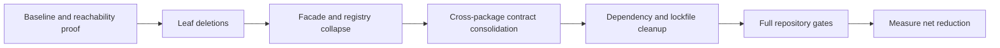

# Ponytail 全仓清理优化执行报告（Agent Runbook）— 2026-08-12

> 基线：`main@e8e9edafe646`（审查时 `main` 相对 `meiyeagent/main` ahead 6，工作树 clean）
>
> 范围：只做删除、标准库替换、原生能力替换、YAGNI 压平与重复实现收敛；不新增产品能力，不改数据库 schema，不提前执行数据 cutover。
>
> 目标：在保持现有生产行为和发布约束的前提下，保守减少约 **30,000 LOC** 与 **19 个直接依赖**。
>
> 证据口径：生产入口与装配链优先；票据 `done`、测试存在、barrel export 或历史文档引用都不能单独证明生产可达。
>
> 文档用途：供多个 Agent 分域实施、复核和集成；本文不是“全部一次删除”的授权。

## 1. 执行摘要

当前主要问题不是缺少抽象，而是同一能力在迁移过程中留下了平行实现、只供测试使用的运行时框架、过宽的 barrels、供应商组件库存和已经失去入口的 UI/服务端 read side。清理应遵循以下顺序：

1. 删除生产不可达的叶子模块和专属测试；
2. 将调用方改为 leaf import，随后删除 barrels/facades；
3. 压平只有一个实现或固定组件映射的 registries；
4. 把 Core/Web 重复合同下沉到 `@meiye/contracts`；
5. 最后统一修改 manifests 与 `pnpm-lock.yaml`，再运行全仓门。

各审查 lane 的原始估算存在交叉，不能直接相加。去重后的计划目标如下：

| 域 | 主要来源 | 保守净减目标 | 依赖目标 |
| --- | --- | ---: | ---: |
| Web vendor / admin UI | HeroUI Pro、Data Table、shadcn、dev spike | 约 12,900 LOC | 4 |
| Web product / infra | 不可达 Product 页面、surface registries、旧 read sides、storage/markdown | 约 4,000 LOC | 13（含与上项共享 manifest） |
| Core model supply | 旧 video workflow、fault-injection 影子栈、内存 policy/control plane | 约 6,500 LOC | 1 |
| Core runtime | Graphile 对照实现、diagnostics、不可达 Product 命令 | 约 2,000 LOC | 1 |
| Core billing / operations / harness | 平行 ports、测试型 runtime、registry 与 helper | 约 4,000 LOC | 0 |
| Root scripts / shared duplication | 一次性 evidence runners、Promptfoo runners、跨包 schema | 约 1,400 LOC | 0 |
| **去重后的验收目标** | 不含条件删除项 | **至少 30,000 LOC** | **19** |

本报告编写阶段没有运行耗时的全量 Core/PostgreSQL/Playwright 门；各执行 Agent 必须按第 4 节建立同一 SHA 的实际基线，不能把本文的静态审查结论当作测试结果。

## 2. 不可违反的边界

### 2.1 本轮明确不动

- `apps/core/src/p1/harness/issue-255-*`：仍受 `V31-43` 开放票约束，不能按体积删除。
- legacy Product repository、`CutoverProductService`、inflight decision port 和 `generate_copy` recovery：必须先取得数据库 cutover 证据。
- Supply `dual-read.ts`、credential-slot 迁移脚手架：必须先证明没有存量 dual-read/credential migration 依赖。
- `agent-event-reducer.ts` 的 legacy artifact coercion：必须先审计生产 replay 数据已全部升级到 `artifact-update/v1`。
- Stripe 历史 webhook、identity、retirement audit：属于历史兼容/审计面，不是普通死代码。
- Cloudflare Mail 与 Feishu Notification 备用 provider：是否继续保留“通用模板”能力属于产品决策，本轮不计入。
- `@meiye/contracts` 与 `@heroui/styles`：Knip 对它们有误报，前者有大量真实 TypeScript import，后者由 CSS 引用。
- `src/routeTree.gen.ts`：禁止手工编辑；只能由 TanStack/Vite 工具链生成。

### 2.2 行为保持规则

- 已退休 API 若当前明确返回 `410`，先保留最小 tombstone handler；除非合同负责人明确允许改成 `404`。
- 删除测试型实现时，不能同时删除对真实生产实现有价值的行为断言；应先把断言迁到真实 service/port。
- 删除 public discriminant/command 前，优先将历史命令集中到一个 retired-command gate，避免无意改变错误类型。
- 删除 provider conformance fake stack 时，必须保留 provider-live workflow 和它要求的报告/evidence contract。
- HeroUI mirror 只能通过 `components.json` 与 `pnpm --filter @meiye/web heroui:sync` 更新，禁止手删受镜像保护的 vendor 文件。
- 每个提交只处理一个可说明的裁剪目标，不夹带格式化、命名美化或邻近重构。

## 3. Agent 分工与共享文件所有权

建议每个 lane 使用独立 branch/worktree。并行 Agent 不得直接共享一个可写 worktree。

| Lane | 独占范围 | 不得直接修改 |
| --- | --- | --- |
| `web-vendor` | HeroUI Pro、Data Table、shadcn、ReUI Timeline、HeroUI spike | `package.json`、lockfile、route tree |
| `web-product` | `mkfast-template-main/src/product/**` | contracts、Web manifest、route tree |
| `web-infra` | Web API/hooks/storage/markdown/landing/core-client | Web manifest、lockfile |
| `core-supply` | Model Supply、provider conformance、supply registry | Core manifest、`apps/core/src/index.ts` |
| `core-runtime` | job runtime、diagnostics、Product retired commands、assembly return | Core manifest、shared contracts |
| `core-domain` | billing、operations、session/harness 清理 | Core manifest、shared contracts |
| `integration` | `package.json`、`pnpm-lock.yaml`、contracts、shared barrels、CI workflow、生成文件 | 不承接新的域内重构 |

共享文件只允许 `integration` Agent 在各 lane 合入后统一处理：

- `/package.json`
- `/pnpm-lock.yaml`
- `/apps/core/package.json`
- `/mkfast-template-main/package.json`
- `/apps/core/src/index.ts`
- `/packages/contracts/src/index.ts`
- `/.github/workflows/provider-live.yml`
- `/mkfast-template-main/src/routeTree.gen.ts`



### 3.1 Dispatch board

| ID | Lane | 前置依赖 | 可并行对象 | 最低完成门 |
| --- | --- | --- | --- | --- |
| W-V01 | web-vendor | 无 | W-P01、C-R01、C-S03 | Web sync + typecheck + build |
| W-V02 | web-vendor | 无 | Core 全部 | Users Table tests + Web build |
| W-V03 | web-vendor | 无 | Core 全部 | Knip + Web build |
| W-V04 | web-vendor | W-V01（避免 vendor manifest 冲突） | Core 全部 | route guards + Web build |
| W-P01 | web-product | 无 | web-vendor、Core 全部 | Web tests + Knip + build |
| W-P02 | web-product | 无 | web-vendor、Core 全部 | interaction tests + build |
| W-P03 | web-product | 无 | web-vendor、Core 全部 | Works tests + build |
| W-P04 | web-product | W-P02 | Core 全部 | Composer/Delivery tests |
| W-I01 | web-infra | 无 | web-product、Core 全部 | API/storage tests + build |
| W-I02 | web-infra | W-V01（Markdown renderer closure） | Core 全部 | legal/eval/UI tests + build |
| C-R01 | core-runtime | 无 | Web 全部、C-S03 | Core worker tests |
| C-R02 | core-runtime | 无 | Web vendor/product、C-S03 | server contract + Core tests |
| C-R03 | core-runtime | 无 | Web vendor/product | Product/API/worker tests |
| C-S01 | core-supply | C-S03/C-S04 建议先完成 | Web 全部 | Video + PostgreSQL tests |
| C-S02 | core-supply | 新的 production-path fault tests | Web 全部 | provider matrix + CI contract |
| C-S03 | core-supply | 无 | Web 全部、C-R01 | Supply tests + Core typecheck |
| C-S04 | core-supply | 无 | Web 全部、C-R01 | Core tests + assembly search |
| C-O01 | core-domain | 无 | Web 全部、C-S03 | Operations + PG receipt tests |
| C-B01 | core-domain | 无 | Web 全部、C-S03 | Billing + persistence tests |
| C-H01 | core-domain | 无 | Web 全部、C-R01 | Session/Harness tests |
| R-S01 | integration | 无；确认无 ops/CI 引用 | Web/Core 域卡 | root script tests |
| C-U01 | integration | 域内删除已稳定 | 无 | utility tests + API/worker typecheck |
| X-B01 | integration | 对应域 leaf imports 已合入 | 无 | whole-repo typecheck |
| X-C01 | integration | 域 Agent 不再碰 contracts | 无 | contracts/Core/Web tests |
| X-D01 | integration | 所有代码裁剪完成 | 无 | frozen install + root gates |
| X-I01 | integration | 所有 lane 合入 | 无 | full gates + clean tree |

## 4. 通用执行协议

### 4.1 每个任务开始前

1. 记录 `git rev-parse HEAD` 和 `git status --short --branch`。
2. 用生产入口重新证明候选闭包，而不是复用旧结论：
   - 排除 `*.test.*`、fixtures 和文档；
   - 从 `src/start.tsx`、`server.ts`、router、Core API/worker assembly 和 package exports 追踪；
   - 搜索 `.github/workflows`、root scripts 和动态字符串注册。
3. 记录候选文件的外部消费者、专属测试、manifest 依赖和生成器所有权。
4. 如发现新的生产消费者，立即停止该项；不要擅自扩大重构范围来“顺便消化”消费者。

推荐检查模板：

```bash
rg -n "SYMBOL_OR_PATH" apps/core mkfast-template-main packages scripts .github \
  --glob '!**/*.test.*' --glob '!**/fixtures/**'
pnpm --filter @meiye/web knip --production --include files
git status --short
```

### 4.2 每个微提交完成后

- 删除造成的 orphan imports/exports/tests 必须在同一提交清完；不清理此前无关死代码。
- 先跑该文件最近的 focused tests，再跑所属 package 的 typecheck。
- UI 路由或组件裁剪至少跑 Web build；有交互面变化时跑对应 Playwright/Vitest。
- Core port、worker 或 assembly 裁剪至少跑 Core typecheck 与相关 Node tests。
- 提交信息使用英文 Conventional Commit；建议标题已列在各任务卡中。

### 4.3 基线和最终门

基线若已有红项，Agent 必须保存准确的命令、失败 test 名和错误摘要。清理提交不得引入新的失败，且不能用“基线本来就红”掩盖新的 compile/runtime 差异。

```bash
pnpm --filter @meiye/core typecheck
pnpm --filter @meiye/core test
pnpm --filter @meiye/web check
pnpm --filter @meiye/web typecheck
pnpm --filter @meiye/web test
pnpm --filter @meiye/web test:interaction
pnpm --filter @meiye/web build
pnpm typecheck
pnpm test
pnpm build
```

最终还需运行：

```bash
pnpm --filter @meiye/web knip
pnpm --filter @meiye/web knip:production
pnpm install --frozen-lockfile
git status --short
```

### 4.4 Agent 派发与回报模板

派发时只给一个任务卡或同一闭包内的连续任务卡，避免用“顺便清理附近代码”扩大权限：

```text
Task: <card ID and title>
Baseline: main@<sha>
Authorized scope: <directories/files owned by this lane>
Forbidden scope: manifests, lockfile, generated files, conditional-delete queue
Required proof: production reachability search + focused tests + package typecheck
Commit rule: tiny English Conventional Commits; every commit must build
Stop when: any production consumer, migration dependency, or contract-shape drift is found
Return: commits, files removed, retained boundary, commands/results, blockers, measured numstat
```

Agent handoff 必须使用以下最小结构：

```text
Card:
Baseline / final SHA:
Commits:
Removed / simplified:
Explicitly retained:
Reachability evidence:
Validation commands and results:
Known baseline failures:
New failures:
Manifest changes requested from integration:
Blockers / conditional follow-ups:
Measured additions / deletions:
```

## 5. Wave 1：低耦合、高回报删除

### W-V01 — HeroUI Pro 未使用库存

- **状态/收益**：READY；约 `-6,654 LOC`，依赖候选 `@number-flow/react`、`@internationalized/number`。
- **删除范围**：bar-chart、cell-select、cell-slider、cell-switch、chart-tooltip、chat-message、data-grid、kpi、kpi-group、native-select、number-stepper、number-value、pie-chart、timeline、trend-chip 及其 CSS/exports。
- **保留范围**：sidebar→sheet/icons/utils、markdown→code-block、chain-of-thought→text-shimmer 等真实依赖闭包。
- **实施**：修改 `mkfast-template-main/src/components/heroui-pro/components.json`，运行 `pnpm --filter @meiye/web heroui:sync`，审查生成 diff；禁止直接删除 mirror 文件。
- **微提交**：`chore(web): trim unused HeroUI Pro inventory`。
- **验证**：HeroUI mirror guard、Web typecheck/check/test/build；`rg` 确认被删组件名不再由生产代码引用。
- **停止条件**：同步脚本重新拉回候选组件，或保留组件的 CSS/import closure 依赖候选组件。

### W-V02 — Data Table 高级层

- **状态/收益**：READY；约 `-2,354 LOC`，依赖候选 `nanoid`。
- **删除范围**：filter-menu/list、sort、range/date/slider、toolbar、generic table、advanced hook/config/libs/skeleton。
- **保留范围**：Users Table 实际使用的 action-bar、column-header、faceted-filter、pagination、view-options；types 仅保留 `Option` 与 `ColumnMeta`。
- **微提交**：先 `refactor(web): narrow users table primitives`，再 `chore(web): remove unused data table modules`。
- **验证**：Users Table focused tests、admin users route build、Web typecheck/check；Knip 不再依赖 ignore 掩盖这些文件。
- **停止条件**：任何保留页面动态加载高级 filter/sort 模块，或 ColumnMeta 收缩改变 TanStack Table augmentation。

### W-V03 — 零引用 shadcn 组件

- **状态/收益**：READY；约 `-1,862 LOC`，依赖候选 `embla-carousel-react`。
- **删除范围**：accordion、aspect-ratio、button-group、carousel、combobox、context-menu、direction、hover-card、item、menubar、native-select、pagination、toggle-group、toggle。
- **实施**：先从 `knip.json` 的 UI ignore 中临时暴露候选并确认，再删除文件；不要动仍被 HeroUI/sidebar 闭包使用的 sheet、button、tooltip 等 primitives。
- **微提交**：`chore(web): remove unused shadcn components`。
- **验证**：Web Knip、typecheck/check/build。
- **停止条件**：动态 registry、MDX 或 string-based import 命中候选组件。

### W-V04 — HeroUI 开发 spike 与专属组件

- **状态/收益**：READY；约 `-1,650 LOC`。
- **删除范围**：`/heroui-spike` shell/chat/dashboard/index 路由，以及仅由 spike 使用的 ItemCard、ItemCardGroup、ListView 和 CSS。
- **替代**：若仍需供应商视觉探针，放入不进入产品 route tree 的独立 fixture/Storybook。
- **微提交**：`chore(web): retire HeroUI spike routes`，随后 `chore(web): remove spike-only vendor components`。
- **验证**：生产环境不存在 spike route；运行 Web build 让 route tree 正常再生成，并执行 route/static guards。
- **停止条件**：团队明确把该路由作为长期供应商升级实验室；此时只允许移出生产 router，不能直接丢失实验资产。

### W-P01 — Web Product 不可达模块

- **状态/收益**：READY；约 `-1,290 LOC`。
- **删除范围**：`composer/index.ts`、`results/index.ts`、`results/video/index.ts`、`composer/settings-row.ts`、`results/result-command-adapter.ts`、`store-profile-form.ts`、`query-keys.ts` 及只验证这些死模块的测试。
- **保留范围**：测试中仍有价值的纯数据样例应迁入对应 test fixture，不得为保留 fixture 继续保留生产文件。
- **微提交**：按 composer、results、store-profile 三个闭包分别提交 `chore(web): remove unreachable ...`。
- **验证**：从 Web start/router/routes 重新做可达性检查；Web typecheck/test/build/Knip。
- **停止条件**：发现 route lazy import、字符串路径或 server-side import 进入任一候选。

### R-S01 — 一次性 evidence runner

- **状态/收益**：READY；约 `-956 LOC`。
- **删除范围**：没有 package script、CI、README 或 ops runbook 引用的 `contentpackage-tickets-13-16.mjs` 与 `contentpackage-ticket-15-rights.mjs`。
- **保留范围**：`contentpackage-ticket-09-12.mjs` 仍有 README 入口，不删除；已有 evidence 产物不重写。
- **微提交**：`chore(evidence): remove unreferenced one-off runners`。
- **验证**：搜索 package scripts、CI 与文档引用；运行 root script tests。
- **停止条件**：现行验收或人工 SOP 仍要求直接执行候选 runner。

### C-R01 — Graphile Worker 对照实现

- **状态/收益**：READY；约 `-1,120 LOC`，依赖候选 `graphile-worker`。
- **删除范围**：`graphile-worker-job-port.ts`、runtime comparison、专属 tests/readme/export。
- **保留范围**：生产装配的 `PgBossJobPort`、job contract 与 pg-boss acceptance tests。
- **微提交**：`test(core): anchor pg-boss runtime ownership`，再 `chore(core): remove Graphile worker comparison`。
- **验证**：Core typecheck/test；worker runtime registration 与 pg-boss focused tests。
- **停止条件**：部署脚本、环境变量或外部 package consumer 仍可选择 Graphile。当前 packages 均为 private，但仍需重新搜索 CI/ops。

### C-R02 — 退役 Diagnostics 栈

- **状态/收益**：READY WITH TOMBSTONE；约 `-500 LOC`。
- **删除范围**：没有生产 `create/save` writer 的 diagnostics repository/service/model、无人调用的 Web proxies 和专属测试。
- **保留范围**：若外部兼容仍要求 retired endpoint，保留极小 `410 Gone` handler 与稳定错误码；现役 ModelSupply/Ops diagnostics 不动。
- **微提交**：`refactor(core): collapse retired diagnostics endpoints`，再 `chore(web): remove unused diagnostics proxies`。
- **验证**：Core server route contract、Web route build、全仓搜索 `DiagnosticRepository.create/save`。
- **停止条件**：生产日志/运维工具仍通过 GET events 读取该 repository，且数据没有替代来源。

## 6. Wave 2：Core 平行实现与测试型运行时

### C-S01 — 旧 Video Workflow vertical

- **状态/收益**：SEQUENCED；约 `-2,400 LOC`。
- **删除范围**：`model-supply/index.ts` 中旧 composition/quality/runner/in-memory adapter，`video-workflow-canonical.ts` 的内存 commands/facade，以及 `postgres-repository.ts` 中只包装该旧接口的层。
- **必须保留**：`video-workflow-contract.ts`、`video-workflow-canonical-postgres.ts`、projection/derivation，以及生产装配的 `PostgresCanonicalVideoRunStore`。
- **微提交**：先 `refactor(core): route video tests through canonical postgres store`；再 `chore(core): remove legacy in-memory video workflow`；最后 `refactor(core): narrow video workflow repository surface`。
- **验证**：Video workflow Core tests、PostgreSQL tests、worker/API assembly typecheck；检查 package-private `@meiye/core` exports。
- **停止条件**：任何 API/worker assembly、migration CLI 或 live-provider workflow仍构造旧 runner/store。

### C-S02 — Provider fault-injection 影子执行栈

- **状态/收益**：SEQUENCED；目标约 `-1,800 LOC`，不得删除 provider-live gate。
- **删除范围**：`dual-channel-router.ts`、`matrix.ts`、`single-channel-matrix.ts`、`fakes.ts` 与只测试影子算法的 cases。
- **替代**：保留一个小型表驱动故障矩阵，直接驱动真实 `P1ModelSupply` retry/snapshot/ledger 路径；报告/evidence types 保持稳定。
- **微提交**：`test(core): drive provider faults through production supply service`；确认新测试先绿后，提交 `chore(core): remove shadow fault execution stack`。
- **CI 联动**：`integration` Agent 更新 `.github/workflows/provider-live.yml`，把被删测试路径换成新的真实 service test；不得简单删除 live job step。
- **验证**：focused matrix tests、Core suite、provider-live workflow 静态检查。
- **停止条件**：新测试无法覆盖 retry、ledger exactly-once、snapshot 或 publish report shape 中任一现有保证。

### C-S03 — Supply 内存 policy/control-plane 与 association views

- **状态/收益**：READY；约 `-1,120 LOC`。
- **删除范围**：测试型 `RoutePolicyRegistry`、`DataPolicyRegistry`、authority/simulator helpers、`association-views.ts` 与仅验证这些内存对象的测试。
- **替代**：生产 `PostgresSupplyPlanningControlPlane` 与当前 admin/Postgres read models。
- **微提交**：按 route policy、data policy、association views 三个闭包分别提交。
- **验证**：Supply planning/admin focused tests、Core typecheck；确认 production assembly 无内存 registry 构造。
- **停止条件**：fixture/recorded 模式在生产启动路径依赖这些 registry，而不是 test-local fake。

### C-S04 — Model Supply 测试型叶子与静态报告

- **状态/收益**：READY；约 `-500 LOC`。
- **删除范围**：`BifrostLiteLlmComparison` 静态 PoC 报告、仅自身测试使用的 `video-workflow-billing.ts`、无 scheduler/assembly 的 `CanvasTextGenerationOutboxWorker`、无消费者的 reference delivery decision block 与 `ModelSupplyCopyProvider` wrapper。
- **替代**：文档性比较结果移入现有 review/reference 文档；运行时继续使用现役 billing、Foundation ledger 和 provider adapters。
- **微提交**：每个叶子独立 `chore(core): remove unused ...`，不得组成一个无法定位回归的大提交。
- **验证**：Core typecheck/test；搜索 scheduler、assembly、server 和 worker registration。
- **停止条件**：未来异步计划只有文档意向但没有生产接线，不构成保留理由；若已经存在待合入实现分支，则由负责人决定。

### C-O01 — Operations 平行 ports/services

- **状态/收益**：READY；约 `-995 LOC`。
- **删除范围**：旧 Video ContentPackage port/adapter/application block、内存 VisualAdoption service、非 canonical assisted receipt repository、server-side role-action compiler 与重复 status contract。
- **替代**：当前 Operations ContentPackage、`OperationsVisualAdoptionPort`、canonical receipt repository 和 Web 已生成的 command contract。
- **微提交**：分别使用 `chore(operations): remove legacy ...`；先改测试 import，再删实现。
- **验证**：Operations application tests、PostgreSQL receipt tests、Core typecheck；确认 assembly 只实例化 canonical ports。
- **停止条件**：历史 receipt backfill/migration CLI 仍需要非 canonical repository。

### C-B01 — Billing / Recipe 退役脚手架

- **状态/收益**：READY；约 `-930 LOC`。
- **删除范围**：Canvas quote adapter、旧内存 `ProductBillingLifecycle`、credential-free Recipe Studio samples、生产不可达的 optional legacy recorded-commerce branches、无读取者 runtime catalog flags。
- **替代**：Durable Product Billing、GrantLot/ProductUsageLedger、credit-priced Composer execution spine。
- **微提交**：`chore(billing): remove retired canvas quote adapter`；`chore(billing): remove in-memory billing lifecycle`；`refactor(billing): require credit billing in production foundation`；`chore(core): remove unused runtime catalog flags`。
- **验证**：billing focused tests、Core persistence tests、root credit contract gates。
- **停止条件**：不要删除 GrantLot 与 legacy entitlement 的迁移共存面；本卡不授权任何账本 schema 或计费语义变更。

### C-H01 — Session/Harness 过度 registry 与 helper

- **状态/收益**：READY；约 `-995 LOC`。
- **删除范围**：只供测试/barrel 使用的 IntentHypothesis/L0–L3 resolver、四钩子 PolicyMiddleware 中未使用 hooks、可变 QuickCheck registry、重复 checkpoint singleton、六层 store forwarding、重复 canonical JSON/UUID helpers。
- **必须保留**：question-budget filter、真实 `after_model` policy、issue-255 collector/reconciliation、DBOS recovery 与 live calibration。
- **微提交**：先将测试对准保留的行为边界，再分别压平 intent、policy、quick-check、checkpoint/helper。
- **验证**：Session quick checks、Harness focused tests、Core typecheck/test、issue-255 package scripts仍可解析入口。
- **停止条件**：任何删除触及 durable step order、DBOS transaction/replay 或 prompt exact pin；这些属于行为修复，不是清理。

## 7. Wave 3：Facade、Registry 与重复合同收敛

### W-P02 — Controlled Surface registries

- **状态/收益**：READY；约 `-450 LOC`。
- **问题**：四套 registry 没有动态 renderer；固定 JSX 组件把自己刚构造的 typed props 再交给 registry 校验。
- **实施顺序**：Artifact → Plan → Publish Handoff → host；每次把调用方改为直接 typed props/固定映射，最后删除 Map、registered flags、reset 和 side-effect imports。
- **微提交**：每个 surface 使用独立 `refactor(web): inline ... surface mapping`，最终 `chore(web): remove controlled surface registry`。
- **验证**：相关 component tests、interaction tests、Web typecheck/build。
- **停止条件**：发现服务端数据能选择任意组件类型，或第三方插件在运行时注册 surface。

### W-P03 — 退役 Canvas Work 页面

- **状态/收益**：READY；约 `-445 LOC`。
- **删除范围**：未使用的 `CanonicalWorkRoutePage` 分支与只被它引用的 `canvas-work-page.tsx`。
- **保留范围**：真实 `/dashboard/works_/$workId` 使用的 `WorksDetailPage`、`WorksLightEditPage` 和共享 `LightComposerCanvas`。
- **微提交**：`chore(web): remove retired canvas work route`。
- **验证**：Works detail/light-edit focused tests、Web build、canonical route static guard。
- **停止条件**：不要因为文件名含 Canvas 而删除仍在 live Works Light Edit 使用的共享组件。

### W-P04 — Agent Workbench facade 与 Share 模型

- **状态/收益**：READY；约 `-345 LOC`。
- **实施**：三个生产消费者改为 leaf imports，删除主 `agent-workbench/index.ts` 和 artifact barrel；`delivery-share-degrade.ts` 只保留 UI 实际读取的 `strategy/fallbacks` 与 attempt recording，fixture 移入测试。
- **微提交**：`refactor(web): replace agent workbench facade imports`；`chore(web): remove unused workbench barrels`；`refactor(web): narrow share degradation model`。
- **验证**：Composer Home、steering、living-plan、delivery panel tests 与 Web build。
- **停止条件**：不得删除 plan/publish 内仍有真实内部消费者的 barrels。

### X-C01 — Core/Web 重复合同下沉

- **状态/收益**：READY；约 `-330 LOC`。
- **范围**：Recipe Patch Preview 的重复解析/投影，以及 Composer destination response discriminated union。
- **实施**：先在 `@meiye/contracts` 新增纯 schema/type 与合同测试；Core/Web 分别切换 import；确认 wire shape 不变后删除两端重复定义。
- **微提交**：`refactor(contracts): centralize recipe patch preview contract`；`refactor(core): consume shared recipe patch contract`；`refactor(web): consume shared recipe patch contract`；destination schema 同样拆分。
- **验证**：Contracts/Core/Web typecheck 与 tests；序列化 golden fixtures 前后完全相同。
- **停止条件**：两端同名结构实际承载不同 trust boundary 或不同 optionality；此时只共享 vocabulary，不强行共享 parser。

### X-B01 — Internal barrels 收缩

- **状态/收益**：SEQUENCED；约 `-875 LOC`。
- **范围**：Supply Registry、Provider Conformance、Creation Experience、Product Billing、Admin Config、Ops Console、Agent Workbench 主 barrels。
- **实施**：先由域 Agent 将生产消费者切到 leaf imports；待所有 lane 合入后，`integration` Agent 删除 barrel 和只验证 re-export 的测试。
- **微提交**：每个域独立 `refactor(<scope>): replace internal barrel imports`，随后 `chore(<scope>): remove internal barrel`。
- **验证**：全仓 `rg` 不再引用 barrel；Core/Web typecheck 与 Knip。
- **停止条件**：`apps/core/src/index.ts` 是 private package 的正式 `exports` 入口，只有确认 workspace consumer 不再需要对应 symbol 后才能收缩。

## 8. Wave 4：小型简化与标准能力替换

### W-I01 — Web storage 与 Core forwarding

- **状态/收益**：READY；约 `-115 LOC`。
- **实施**：Storage 只有固定 R2 实现，压成模块级 R2 singleton/direct functions；合并 authenticated/workspace Core request 中重复的 session、headers、provision 与 503 handling。
- **微提交**：`refactor(web): inline single R2 storage provider`；`refactor(web): share core request forwarding`。
- **验证**：avatar upload、product asset upload、authenticated Core proxy tests；不要删除 profile 正在使用的 avatar path。
- **停止条件**：测试注入依赖 StorageProvider interface，或不同 forwarding path 的权限/header 语义并不相同。

### W-I02 — Markdown、Promptfoo 与原生 UI 能力

- **状态/收益**：READY；约 `-364 LOC`，依赖候选 10 个。
- **实施**：法务内容统一到已有 HeroUI Markdown；四个 Promptfoo runner 合并为一个参数化 runner；静态 ReUI Timeline 改为语义化 `<ol>/<li>`；Landing 用 CSS scroll behavior 替代 Lenis，并用现有 Tabler icons 替代 Lucide。
- **微提交**：四项必须独立提交：`refactor(web): consolidate markdown rendering`、`refactor(evals): share promptfoo runner`、`refactor(web): simplify static timeline`、`refactor(web): use native landing scroll behavior`。
- **验证**：法务页面 snapshot/链接/heading anchors、四条 eval scripts 的 `--control` 参数、Timeline 页面、reduced-motion、Web build。
- **停止条件**：法务 Markdown 出现 raw HTML 或现有 HeroUI renderer 不支持的能力；此时不得先删 rehype 管线。

### C-U01 — 标准库替换与 assembly surface

- **状态/收益**：READY；约 `-144 LOC`。
- **实施**：eval argv parser 改 `node:util.parseArgs`；media tool 子进程改 promisified `execFile`；日期格式化改 `Intl.DateTimeFormat`；`assembleCoreGraph` 只返回 API/worker 实际读取的字段。
- **微提交**：每个替换独立 `refactor(...): use ...`；assembly return 收缩单独提交。
- **验证**：参数兼容测试、media tool error/stdout/stderr tests、固定 locale/timezone tests、API/worker typecheck。
- **停止条件**：`spawn` 依赖流式输出/信号控制，或日期函数当前输出格式无法由固定 Intl options 精确复现。

### C-R03 — Product retired commands 与 runtime forwarding

- **状态/收益**：READY WITH CONTRACT GUARD；约 `-285 LOC`。
- **实施**：删除永远不可达的 `apply_plan/start_video/retry_video` handlers、无 producer 的 `product.tracer`、测试专用 `ProductStateEntitlementPolicy`、不可达 `productEntitlements` wiring；压平 runtime-entry→main/job-worker→assembly 的双转发和单用途 copy prompt wrapper。
- **兼容策略**：历史 command discriminants 若仍在 wire contract 中，集中到一个小型 retired-command rejection gate，不保留完整 handler。
- **微提交**：按 command、tracer/policy、entry forwarding 三批提交。
- **验证**：Product command contract tests、API/worker startup tests、Core typecheck/test。
- **停止条件**：生产数据库存在待恢复的 start/retry video outcome；这时只删新建 handler，不删 recovery reader。

## 9. Wave 5：依赖、锁文件与 CI 集成

### X-D01 — 统一删除 19 个直接依赖

只有 `integration` Agent 可以执行本卡。必须等所有代码裁剪合入，再逐包运行 `rg`、Knip 和 package build。

Web 候选：

- `@number-flow/react`
- `@internationalized/number`
- `nanoid`
- `embla-carousel-react`
- `html-react-parser`
- `unified`
- `remark-parse`
- `remark-rehype`
- `rehype-raw`
- `rehype-slug`
- `rehype-autolink-headings`
- `rehype-stringify`
- `lenis`
- `lucide-react`
- `@ai-sdk/react`
- `@better-fetch/fetch`
- `ai`（仅 Web package）

Core 候选：

- `graphile-worker`
- `@langfuse/client`

执行：

```bash
pnpm --filter @meiye/web remove \
  @number-flow/react @internationalized/number nanoid embla-carousel-react \
  html-react-parser unified remark-parse remark-rehype rehype-raw rehype-slug \
  rehype-autolink-headings rehype-stringify lenis lucide-react \
  @ai-sdk/react @better-fetch/fetch ai
pnpm --filter @meiye/core remove graphile-worker @langfuse/client
```

- **微提交**：Web 与 Core 分开：`chore(web): remove unused dependencies`、`chore(core): remove unused dependencies`。
- **验证**：`pnpm install --frozen-lockfile`、两个 package 的 typecheck/test/build、root gates、Knip。
- **停止条件**：CSS import、CLI dynamic import、postinstall 或 generated vendor 重新引用任一依赖。

### X-I01 — CI、生成文件与最终整合

1. 更新 provider-live workflow，使其执行新的真实 fault tests，而不是删除整个 gate。
2. 通过正常 Web build/regeneration 接受 route tree diff；禁止手工编辑 generated file。
3. 收缩 Core/Web shared barrels，仅删除已无 workspace consumer 的 exports。
4. 运行全仓最终门并记录与基线差异。
5. 使用 `git diff --numstat <baseline>...HEAD` 计算真实净减，不用审查估算冒充结果。

建议最终提交：`chore(repo): finalize cleanup integration`。如果该提交同时包含 CI、route tree、barrel 和 lockfile 四类变化，必须拆为至少三个独立提交。

## 10. 条件删除队列（本轮禁止直接执行）

| 候选 | 潜力 | 解锁证据 | 解锁后动作 |
| --- | ---: | --- | --- |
| legacy Product repo/Cutover service/inflight port | 约 1,150 LOC | 所有 `p1_write_ownership.owner='p1'` 且 inflight 表无 drain/manual 项 | 删除 legacy repo、双实例装配与专属测试 |
| pending `generate_copy` recovery machinery | 至少 1,100 LOC | DB 证明无 pending idempotency outcome，且观察窗口内无 reclaim | 删除 provider/bridge/旧状态机 |
| Supply dual-read/credential slots | 约 700 LOC | 生产迁移审计证明无旧 slot、无 dual-read hit | 保留词汇常量，删除迁移 scaffold |
| artifact legacy coercion | 约 80 LOC | replay 数据全部为 `artifact-update/v1` | 删除 legacy payload parser 与 fixture |
| Cloudflare/Feishu alternate providers | 约 220 LOC | 产品决定 Web 不再作为通用模板 | 删除 alternate provider/env/types |

数据库解锁证据必须来自只读生产查询、时间窗口和负责人签字，不能以静态 `rg` 或测试绿代替。

## 11. Agent 完成定义（DoD）

单卡完成必须同时满足：

- 候选生产可达性在实施时重新验证；
- 微提交可独立编译，且只包含该卡直接产生的 orphan 清理；
- focused tests 和 package typecheck 通过，或与有记录的基线失败完全一致；
- 不新增 ignore/waiver 来让 Knip、Biome 或 tests 变绿；
- 没有手改 vendor mirror、route tree 或 lockfile 冲突；
- handoff 写明：提交 SHA、删除文件、保留边界、命令与结果、未决风险；
- 依赖只由 integration Agent 在零引用证明后删除。

全计划完成还必须满足：

- Core/Web/contracts/root typecheck 全绿；
- Core/Web/root tests 全绿；
- Web check、build、Knip 全绿；
- provider-live workflow 仍保留并指向真实测试；
- requested browser surfaces 若受影响，生产 build 的关键路由可真实打开与交互；
- `pnpm install --frozen-lockfile` 成功；
- 工作树 clean；
- 实测净减不少于 30,000 LOC、直接依赖不少于 19 个，或报告每个未达目标项的证据化保留理由。

## 12. 推荐合入顺序

1. `web-vendor`：W-V01 → W-V02 → W-V03 → W-V04。
2. `web-product`：W-P01 → W-P02 → W-P03 → W-P04。
3. `core-runtime`：C-R01 → C-R02 → C-R03。
4. `core-domain`：C-O01 → C-B01 → C-H01。
5. `core-supply`：C-S03 → C-S04 → C-S01 → C-S02；旧 Video 与 fault stack 放在本 lane 后半段。
6. `web-infra`：W-I01 → W-I02。
7. `integration`：X-B01 → X-C01 → R-S01 → C-U01 → X-D01 → X-I01。
8. 最终只在集成 HEAD 上运行 root gates、浏览器验证和净减统计。

每个 lane 合入前应 rebase 到最新 integration HEAD 并重跑 package gate。不要把多个 lane 的提交 squash 成一个无法回退的大提交；也不要为追求“30k”删除条件队列中的迁移兼容层。

---

本报告只规定清理执行面，不替代 V3.1 权威计划、计费规范、DBOS 恢复合同、provider-live 验收或现有发布门。若清理候选与当前产品规范冲突，以当前生产合同和可复现运行证据为准，并将该项退回“条件删除”而不是强行实施。
