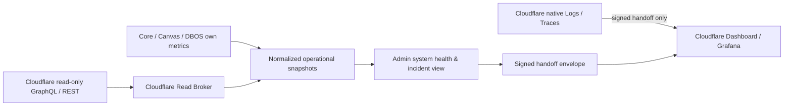

# Cloudflare 与我方管理后台的能力边界研究

> 日期：2026-07-19
>
> 状态：支撑 D-052 / D-053 的研究基线；涉及生产账号和权限的项目仍需上线前实测  
>
> 范围：只讨论后端管理平台中的 Cloudflare 运行与基础设施可视化；不讨论运营后台，也不把 Cloudflare 资源按工作区、门店或终端用户拆分。

## 一句话结论

我方后台应当成为“业务语义化的运行指挥台 + Cloudflare 技术台交接入口”，而不是 Cloudflare Dashboard 的复制品。按 D-053 的严格只读 Token 约束，第一版只持有按用途拆分的只读凭据；严格意义上的 Cloudflare 控制面写操作为 **零**。后台可触发的 C 类动作仅限重新拉取只读聚合、我方健康探针和安全深链。

## 研究方法与来源边界

- 已先执行 `opencli web --help -f yaml`。当前本机适配器只暴露 `opencli web read`，没有 `opencli web search`。
- 主要事实均通过 `opencli web read` 读取 Cloudflare 官方文档、API Reference、Changelog 或 Cloudflare GitHub。
- OpenCLI 直接读取若干猜测地址时返回 404，包括旧的 R2 metrics、WAF GraphQL 和 billing API 路径。仅为定位这些已迁移的官方页面，以及新发布的 Workers Observability API，使用了限定 `developers.cloudflare.com` / `github.com/cloudflare` 的 Web Search；找到地址后又回到 OpenCLI 读取原文校验。
- 没有使用社区文章、供应商博客或二手定价汇总。官方未承诺的延迟、无限历史和价格，不作推断。

## 当前仓库中的 Cloudflare 真相

| 项目 | 当前证据 | 裁决 |
| --- | --- | --- |
| Workers Shell | `mkfast-template-main/wrangler.jsonc` 的入口为 `./src/server.ts`，兼容日期为 `2025-09-02`；有每分钟 Cron | Cloudflare 指标只覆盖 TanStack App Shell，不覆盖 Node Core 或 Next Canvas |
| Observability | Logs、invocation logs、traces、`persist` 均启用，trace `head_sampling_rate: 1` | 提交配置是 100% trace 采样，存在事件量、费用和敏感数据风险；仍不是线上已部署证明 |
| Logpush | `logpush: true` | 只证明 Worker 启用了 Trace Event Logpush 能力，不证明已创建 Logpush job 或目的地 |
| R2 | `BUCKET` 绑定声明指向 `mkfast-template` | 是当前存储适配目标；未进行线上账号检查，不能把“配置声明”写成“桶已存在且健康” |
| Hyperdrive | `HYPERDRIVE` 绑定 ID 为全零占位值 | 架构要求 Workers 经 Hyperdrive 访问 Postgres，但仓库配置尚不能证明线上 Hyperdrive 已装配 |
| Custom domain | 路由仍为 `demo.tanstarter.dev` | 很可能是模板值；不能据此认定生产 zone、DNS 或 WAF 已在使用 |
| Cloudflare Queues | 没有 Queue binding | **未使用**。Core 的 DBOS / pg-boss / Postgres 队列不能显示成 Cloudflare Queues |
| Analytics Engine | 没有 Analytics Engine binding | **未使用**。它只能作为后续自定义指标候选，不是当前数据源 |
| 其他绑定 | 未发现 D1、KV、Durable Objects、Workers AI binding | 本轮不进入后台能力范围 |
| Core / Canvas | ADR-0006 规定单 Node Core + Postgres；Core 可部署到 CF Containers、Railway 或 Fly，但仓库没有已采用 CF Containers 的配置 | Workers CPU、错误、日志不能替代 Core、Runner、Canvas 的运行指标 |
| 发布链 | 只有本地 `pnpm deploy` 脚本，未发现生产 Cloudflare deploy workflow | 后台不可声称掌握生产发布事实；需先完成账号映射和真实部署验证 |
| API Token | `.env.example` 有通用 `CLOUDFLARE_API_TOKEN`，当前代码还可被 Cloudflare mail provider 使用 | 不可复用为后台观测 Token；必须新增用途单一、服务端保管、最小权限的凭据 |

因此，本文件中的“当前可接入”表示官方 API 能力与仓库拓扑匹配，不表示已经有可用生产 Token、账号、zone、Worker script 或数据。

## A / B / C 三分矩阵

定义：

- **A：留在 Cloudflare Dashboard、Wrangler、CI/CD 或专业观测工具。** 这些操作需要基础设施上下文，误操作影响面大，或原始数据过于敏感。
- **B：可只读投影进我方后台。** 只展示能支持判断和行动的归一化状态、趋势和异常，不复制完整 Cloudflare 页面。
- **C：可从我方后台安全触发。** 第一版仅含非控制面写动作；若把“控制动作”严格定义为改变 Cloudflare 资源，则第一版 C 为零。

| 能力域 | 仓库相关性 | A：留在 Cloudflare / 技术工具 | B：我方后台只读投影 | C：我方后台可安全触发 |
| --- | --- | --- | --- | --- |
| Workers 版本与部署 | Shell 相关；真实生产映射待验证 | 上传版本、发布、灰度调流、回滚、代码、bindings、compatibility 配置 | 当前部署版本、最近部署、来源、操作者、时间、最多两个版本的流量比例；显示“非数据回滚”提示 | 刷新部署快照；打开已定位的部署/版本页面。**不执行发布或回滚** |
| Workers 请求、CPU、错误 | Shell 相关 | 完整 Metrics Explorer、Query Builder、源码映射、CPU profiling | 请求、错误率、invocation status、CPU P50/P99、内存分位、部署前后变化；明确“只覆盖 Shell” | 重新拉取限定时间窗的聚合；运行我方 Shell 健康探针 |
| Workers Logs | 已在配置中开启 | 原始日志搜索、Real-time Logs、Tail Workers、任意字段查询、批量导出 | 第一版只用 GraphQL 展示错误数、invocation status 与部署时序，不接原始日志；默认不展示 message、URL query、用户内容或 IP | 刷新 GraphQL 聚合、打开 Cloudflare Logs 深链。Observability Query API 因要求 Write 权限而排除 |
| Workers Traces / OTel | Trace 已配置 100% 采样；无 destination 证据 | trace 查询与 waterfall、OTel destination 创建/更新/删除、采样率修改、Logpush job | 第一版只展示配置 readiness、采样风险与只读 destination 健康；不把 span 或 trace 明细搬进产品后台 | 打开 Cloudflare trace / 外部观测深链；**不查询原始 trace，不修改 destination 或采样率** |
| Cloudflare Queues | **未使用** | Queue 创建、consumer、retry、retention、DLQ 配置 | 不显示 Cloudflare Queue 卡片；继续显示 Core 自己的 DBOS / pg-boss / Postgres 队列健康 | 无 Cloudflare Queue 动作 |
| Hyperdrive | 架构相关，但 ID 仍为占位值 | 创建/更新/删除配置、origin host/port/database、凭据、连接上限 | 装配状态（不暴露 origin）、query/error、cache status、query/connection latency、pool size、available slots、waiting clients | 运行我方数据库连通性与读探针；刷新 GraphQL 数据。**不修改 Hyperdrive** |
| R2 | 当前有 `BUCKET` 绑定声明 | 桶创建/删除、通用对象浏览器、CORS、生命周期、加密、jurisdiction、批量删除 | 桶映射是否存在、storage class / jurisdiction、对象数、payload/metadata size、multipart pending、操作量与 user/internal error 趋势 | 仅通过既有“产品资产生命周期”执行有业务授权的上传/读取/删除；不提供通用 R2 管理动作 |
| WAF / Security Events | zone 尚未验证 | 规则创建/修改/禁用、Managed Rules、rate limiting、IP list、DDoS 与 Bot 配置、原始安全日志调查 | 只有完成生产 zone 映射后，才展示 block/challenge/log 趋势、来源类型与高层异常；默认隐藏 IP、User-Agent、完整 path/query | 刷新聚合、打开带时间窗的 Security Events 深链；**不创建或改规则** |
| DNS / Zone | custom domain 当前疑似模板值 | DNS 记录增删改、proxy 开关、zone pause、nameserver、SSL/TLS 与域设置 | 只有验证生产 zone 后，展示 zone active 状态、关键记录是否存在/是否 proxied、最近修改时间；不显示全部 record content | 运行域名解析、TLS、HTTP health check；打开 DNS/zone 深链。**不写 DNS** |
| Worker Secrets | Shell 必然需要运行密钥，但配置与 Core provider secret 不是同一域 | secret 创建、替换、删除、值查看；这些动作会产生新 Worker version，并可能立即部署 | 只展示“必需名称是否已配置”的 readiness、类型和最后验证时间；产品 UI 不展示 secret 值，默认也不暴露完整 secret 名单 | 无。轮换通过 Cloudflare/CI 的专门流程完成 |
| Cloudflare Billing / Usage | 平台成本相关，不是产品订阅/用户账单 | payment method、billing profile、invoice、退款、套餐订阅变更、预算策略 | 可选展示 Workers/R2 等平台成本与用量摘要、账期和来源；必须标“估算/Alpha/受账号覆盖限制”，不与 Stripe 商业账本合并 | 刷新账期摘要、打开 Billing 深链；**不做任何账单写操作** |
| Analytics Engine | **未使用，候选能力** | binding 创建、schema/字段约定、数据回填与采样策略 | 若后续接入，可承载任务/模型/能力模块的高基数聚合指标；不能承载审计日志、账本或精确事件序列 | 只查询固定报表；写入由生产运行时按事件发生写入，不由管理员手工补写 |

## B 类数据源与权限设计

浏览器永远不直接调用 Cloudflare。由服务端 `Cloudflare Read Broker` 统一请求、去敏、缓存、记录来源与失败；App Shell 只消费我方稳定合同。

| 用途 | 官方接口 / dataset | 最小建议权限 | 重要边界 |
| --- | --- | --- | --- |
| Worker 趋势 | `POST /client/v4/graphql`；`workersInvocationsAdaptive` | `Account Analytics Read`，限制到确定账号/zone、来源 IP 与 TTL | GraphQL 默认每用户 300 queries / 5 分钟；一个 account 查询只能含一个账号，zone 查询最多十个 zone；字段与窗口按套餐变化，应读 `settings` node |
| 部署与版本 | `GET .../workers/scripts/{script}/deployments`、`GET .../versions` | `Workers Scripts Read` | API 没有承诺无限历史；Wrangler / Dashboard 的操作视图围绕最近 100 个版本/部署。长期发布审计应落我方事件库 |
| 日志/trace 聚合 | `POST .../workers/observability/telemetry/query` | 官方当前要求 `Workers Observability Write` | **第一版排除。** “查询”却需要 Write，与 D-053 严格只读 Token 冲突；原始日志与 trace 留在 Cloudflare 原生页面，通过 handoff 深链交接 |
| OTel destination 状态 | `GET .../workers/observability/destinations` | `Workers Observability Read` | 只读 destination 健康可投影；create/update/delete 需要 Write，留在技术台 |
| Hyperdrive 指标 | GraphQL：`hyperdriveQueriesAdaptiveGroups`、`hyperdrivePoolSizesAdaptiveGroups` | `Account Analytics Read` | 保留 31 天；先以配置 ID 验证真实映射。REST inventory 另用 `Hyperdrive Read`，不要返回 origin 细节 |
| R2 指标 | GraphQL：`r2OperationsAdaptiveGroups`、`r2StorageAdaptiveGroups` | `Account Analytics Read` | 保留 31 天；jurisdiction bucket 查询名有前缀规则；object name 不应进入产品级后台 |
| R2 inventory | `GET /accounts/{account}/r2/buckets` | `Workers R2 Storage Read` | 返回桶名、地区、jurisdiction、storage class；不授予 Write |
| WAF 摘要 | GraphQL：`firewallEventsAdaptive` | `Account Analytics Read` + 精确 zone resource | 数据可能采样；Free/Pro 24 小时、Business 3 天、Enterprise 30 天保留。原始 IP/path/query 属敏感安全数据 |
| Zone / DNS 状态 | `GET /zones`、`GET /zones/{zone}/dns_records` | `Zone Zone Read`、`DNS Read` | 只在显式生产域名映射后启用；不从仓库模板 route 猜测 zone |
| Secret readiness | `GET .../workers/scripts/{script}/secrets` + 我方 required-secret manifest | `Workers Scripts Read` | 官方保证 secret 值在定义后对 Wrangler/Dashboard 隐藏；后台只比较元数据，不请求、不记录值 |
| Cloudflare 平台费用 | `GET /accounts/{account}/paygo-usage` | 独立 `Billing Read` | 当前为 Version 1 Alpha 且只覆盖 PayGo。V2 `billable/usage` 为 Alpha Restricted，成本字段尚未完整；不能作为财务真相 |
| 自定义指标（未来） | `POST .../analytics_engine/sql` | `Account Analytics Read` | 只有绑定和生产埋点落地后才启用；SQL API 查询本身也计入 read query |

不建议创建“一枚万能 Token”。第一版只配置 analytics-read、inventory-read、optional-billing-read 三类只读用途；**不创建 observability-query Token**。全部只存服务端，浏览器、URL、localStorage、错误栈和审计详情中均不得出现。

## 采样、保留、延迟、成本与不可用边界

| 数据源 | 采样 / 保留 | 延迟与可用性 | 成本边界 |
| --- | --- | --- | --- |
| Workers Metrics / GraphQL | Adaptive / reservoir sampling；Worker 数据最多回看 3 个月，单次 GraphQL 查询最多一个月 | 最近数分钟可能因聚合投递延迟呈现“下跌”；官方无数字化 SLA | 未发现独立按次价格，但有 GraphQL 与通用 API 限流；不能作为计费账单 |
| Workers Logs | head sampling `0..1`；Free 3 天、Paid 7 天；单条 256 KB，账号日上限 50 亿，超限后余量强制 1% | 无持久查询新鲜度 SLA；Real-time Logs 会在高流量下采样且不存储 | Free 20 万事件/日；Paid 含 2,000 万/月，超出约 `$0.60 / 百万` |
| Workers Traces | 每个 span 按 observability event 计；Free 3 天、Paid 7 天；当前仓库采样率 1 | 未采样请求无 tracing 开销；官方无数字化持久查询 SLA | Trace 文档与 OTel export 文档的 2026 额度/价格口径不完全一致；上线前以真实账号账单或 Cloudflare 支持为准，不硬编码预算 |
| OTel export | 当前产品文档只支持 logs 与 traces，**不支持 Workers infrastructure metrics 或 custom metrics** | Beta；送达外部目的地可能需数分钟；无 destination 时不可用 | Workers Free 不可用。可用 `persist:false` 避免 Cloudflare 原生存储，但实际计费口径需账号验证 |
| Hyperdrive GraphQL | 31 天 | 无数字化新鲜度 SLA；绑定为占位 ID 时整体不可用 | Paid Workers 中 pooling/cache 无额外收费、无 egress；Free 每日 10 万数据库查询，超限操作失败 |
| R2 GraphQL | 31 天 | 无数字化新鲜度 SLA；桶未真实验证时不可用 | Standard `$0.015/GB-month`，Class A `$4.50/百万`、Class B `$0.36/百万`；IA 另有 retrieval 与最低存储期。后台刷新也应缓存，避免无意义操作量 |
| WAF Security Events | 可能采样；`firewallEventsAdaptive` 保留按计划为 24h / 24h / 3d / 30d | 窗口过大会加剧采样；未验证 zone 时不可用 | 套餐决定字段和窗口；不承诺全量安全事件证据 |
| Analytics Engine | 写入与读取均可能采样，须用 `_sample_interval` 加权；保留 3 个月 | 写入非阻塞；官方没有查询新鲜度 SLA；不能重建精确单条事件 | 文档列 Free 10 万写/日、1 万读/日；Paid 含 1,000 万写/月和 100 万读/月，超出有单价。官方计费启用状态需账号确认 |
| Billing APIs | V1 Alpha / V2 Alpha Restricted；V2 最大 31 天且成本字段尚未完整 | 账号可能不在覆盖范围；接口失败不能转成“费用为 0” | 只作为趋势与预算提醒，发票与最终金额以 Cloudflare Billing 为准 |

以下内容当前不可从上述来源可靠获得，后台必须显示 `unavailable` 或 `not verified`，不能补零：

- 生产 Cloudflare account、zone、script 与仓库配置的已验证映射。
- 真实 R2 bucket / Hyperdrive config 是否存在，及当前套餐。
- Logpush job 或 OTel destination 是否已经配置。
- Cloudflare 上的 Core / Canvas 指标；当前拓扑没有这项事实。
- Cloudflare Queues 与 Analytics Engine 数据；仓库没有 binding。
- 原生日志 7 天之外、Worker metrics 3 个月之外的历史。
- Cloudflare billing 的最终发票金额、折扣和成本分摊真相。

## Cross-console 体验

### 我方后台展示什么

每张 Cloudflare 来源的卡片都必须包含：

1. 业务语义，例如“用户创建入口错误率”，而不是 API dataset 名。
2. 覆盖范围，例如“仅 App Shell，不含 Core / Canvas”。
3. `observed_at`、查询时间窗、数据源和 freshness：`fresh / stale / unavailable / not_verified`。
4. sampled 标记、保留窗口和套餐限制；没有数据与零值分开。
5. 当前异常影响、关联部署版本、下一步动作。
6. “到 Cloudflare 调查”或“到 Grafana 调查”的明确交接按钮。

我方后台不展示 Cloudflare 导航树、通用查询构建器、全部资源清单、原始日志流、任意 DNS/WAF/R2/secret 编辑器。

### Deep link / handoff envelope

不要在前端拼接携带 Token、原始日志或敏感 filter 的 Cloudflare URL。服务端生成短期 `handoff_id`，把下面的 envelope 存在我方审计域，再解析为官方 Dashboard 链接：

```json
{
  "provider": "cloudflare",
  "resource_kind": "worker_observability",
  "resource_ref": "internal-mapped-ref",
  "from": "2026-07-19T10:00:00+08:00",
  "to": "2026-07-19T10:15:00+08:00",
  "signal": "error_rate_spike",
  "incident_ref": "internal-incident-id",
  "snapshot_at": "2026-07-19T10:16:00+08:00",
  "return_to": "/admin/system-health"
}
```

约束：

- `resource_ref` 使用我方映射 ID；account ID、zone ID、script name 由服务端解析。
- 只允许预定义 `resource_kind`、时间窗与信号类型；不接受任意 URL 或 Cloudflare query。
- envelope 不含 API Token、secret、IP、User-Agent、prompt、用户内容、完整 path/query、日志正文。
- `handoff_id` 建议 10 分钟过期、单次使用、记录发起管理员与 incident；Cloudflare 本身仍要求用户用自己的 Cloudflare 身份登录。
- Dashboard URL 变化时只更新服务端 resolver，不改所有前端卡片。

## 推荐的第一版数据流



- Broker 在服务端执行固定查询、退避、限流和 1–5 分钟缓存；页面刷新不直接放大为 Cloudflare API 请求。
- 存入我方数据库的是归一化聚合、freshness、source metadata 和 incident 关联，不是原始日志副本。
- 需要 3 个月以上趋势时，保存按小时/日聚合；精确事故证据进入独立持久化观测系统，不能依赖 Analytics Engine 采样数据。
- Cloudflare 与 Core 指标在 UI 上并排但不混算；任何总错误率都必须说明覆盖组件。

## 已采用边界与实施前门槛

### CF-ADM-01：后台定位

**对应 D-052：** 我方后台只承载“能力模块运行状态、业务影响、关联变更、下一步交接”，Cloudflare Dashboard / Wrangler / CI/CD 继续承载基础设施资源管理与原始调查。

### CF-ADM-02：第一版写权限

**对应 D-053：** 第一版不向管理后台配置 Cloudflare control-plane write token；部署、回滚、DNS、WAF、R2 bucket、Hyperdrive、secret、billing、OTel destination 的写操作全部留在 Cloudflare 或 CI。

### CF-ADM-03：第一版 C 类动作

**对应 D-053：** 仅开放三类动作：刷新 GraphQL / REST 只读快照、执行我方健康探针、生成带审计的外部控制台 handoff。它们都不改变 Cloudflare 资源；不通过 Observability Query API 执行所谓“只读诊断”。

### CF-ADM-04：数据源优先级

**D-053 的数据源细化：**

1. Workers 请求/CPU/错误趋势优先用 GraphQL Analytics。
2. 近 3/7 天日志与 trace 明细只在 Cloudflare 原生控制台或外部专业工具下钻；由于 query API 要求 `Workers Observability Write`，第一版明确排除。
3. OTel 只承载 logs/traces 外发，不能承担 CPU、错误率等 metrics。
4. Analytics Engine 等真实 binding 与埋点落地后再启用，不提前做空图表。

### CF-ADM-05：本轮落地门槛

在写开发票前，先完成一次只读连接验证并记录：production account/zone/script 映射、实际 plan、R2/Hyperdrive 是否存在、token 权限、GraphQL `settings` 可用字段、当前日志/trace 事件量与 Billing 覆盖状态。验证失败的能力显示 `not_verified`，不做假数据兜底。

## 建议拆票

| Ticket | 内容 | 验收重点 |
| --- | --- | --- |
| CF-01 | 建立 Cloudflare resource mapping 与 readiness probe | 能明确区分 configured / verified / unavailable；不把全零 Hyperdrive ID 当可用 |
| CF-02 | 服务端 read broker + 三类只读凭据隔离 | 浏览器无 Token；每次查询有调用者、用途、时间窗、来源与错误审计 |
| CF-03 | Worker deployment + GraphQL metrics projection | 显示覆盖范围、freshness、sampled、部署关联；处理 429 与部分 dataset 不可用 |
| CF-04 | R2 + Hyperdrive readiness/metrics | 仅在真实资源验证后展示；不泄露 origin、object name 或 secret |
| CF-05 | Admin system-health Cloudflare section | 异常优先，不复制 Dashboard；Core/Canvas 与 Shell 分层呈现 |
| CF-06 | Signed handoff resolver | allowlist、10 分钟 TTL、无敏感查询参数、可审计、官方链接变化只改服务端 |
| CF-07 | Logs / traces 原生 handoff | 第一版不配置 `Workers Observability Write`；从异常卡片安全跳转到 Cloudflare 原生时间窗与资源上下文 |
| CF-08 | 采样与成本基线 | 在真实账号核对当前 100% trace 的事件量、费用与 PII，决定生产采样率；不由产品后台直接修改 |

## 官方来源

- [Workers observability](https://developers.cloudflare.com/workers/observability/)
- [Workers metrics and analytics](https://developers.cloudflare.com/workers/observability/metrics-and-analytics/)
- [Querying Workers Metrics with GraphQL](https://developers.cloudflare.com/analytics/graphql-api/tutorials/querying-workers-metrics/)
- [GraphQL limits](https://developers.cloudflare.com/analytics/graphql-api/limits/)
- [GraphQL API token](https://developers.cloudflare.com/analytics/graphql-api/getting-started/authentication/api-token-auth/)
- [Workers Logs](https://developers.cloudflare.com/workers/observability/logs/workers-logs/)
- [Workers Traces](https://developers.cloudflare.com/workers/observability/traces/)
- [Workers Observability Query API](https://developers.cloudflare.com/api/resources/workers/subresources/observability/subresources/telemetry/methods/query/)
- [Exporting OpenTelemetry data](https://developers.cloudflare.com/workers/observability/exporting-opentelemetry-data/)
- [Workers versions and deployments](https://developers.cloudflare.com/workers/configuration/versions-and-deployments/)
- [List Deployments API](https://developers.cloudflare.com/api/resources/workers/subresources/scripts/subresources/deployments/methods/list/)
- [List Versions API](https://developers.cloudflare.com/api/resources/workers/subresources/scripts/subresources/versions/methods/list/)
- [Hyperdrive metrics and analytics](https://developers.cloudflare.com/hyperdrive/observability/metrics/)
- [List Hyperdrives API](https://developers.cloudflare.com/api/resources/hyperdrive/subresources/configs/methods/list/)
- [R2 metrics and analytics](https://developers.cloudflare.com/r2/platform/metrics-analytics/)
- [List R2 buckets API](https://developers.cloudflare.com/api/resources/r2/subresources/buckets/methods/list/)
- [R2 pricing](https://developers.cloudflare.com/r2/pricing/)
- [Queues metrics](https://developers.cloudflare.com/queues/observability/metrics/)
- [Security Events](https://developers.cloudflare.com/waf/analytics/security-events/)
- [Querying Firewall Events with GraphQL](https://developers.cloudflare.com/analytics/graphql-api/tutorials/querying-firewall-events/)
- [List zones API](https://developers.cloudflare.com/api/resources/zones/methods/list/)
- [List DNS records API](https://developers.cloudflare.com/api/resources/dns/subresources/records/methods/list/)
- [Workers secrets](https://developers.cloudflare.com/workers/configuration/secrets/)
- [List script secrets API](https://developers.cloudflare.com/api/resources/workers/subresources/scripts/subresources/secrets/methods/list/)
- [Cloudflare Billing API](https://developers.cloudflare.com/api/resources/billing/)
- [Workers Analytics Engine](https://developers.cloudflare.com/analytics/analytics-engine/)
- [Analytics Engine SQL API](https://developers.cloudflare.com/analytics/analytics-engine/sql-api/)
- [Analytics Engine limits](https://developers.cloudflare.com/analytics/analytics-engine/limits/)
