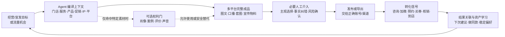
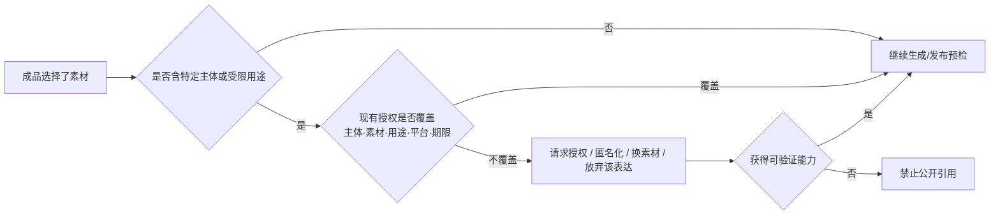

# 美业宣发责任、事实边界与可选权利门

- 日期：2026-07-17
- 目标：把 HITL 放回美业“广告曝光 + 到店引流”的真实任务中，明确 Agent、经营事实、表达身份、平台账号与素材权利各自的边界
- 证据状态：产品行为与平台规则已有一手来源；中国美业门店的宣发分工、任务频率和转化链路仍需用真实任务日志验证
- 范围说明：本文“广告”指广义门店宣发；不把未经验证的付费媒体投放写成首发默认能力

## 先纠正一个错误前提

此前把以下链路设成默认主链：

> 技师采集 → 顾客逐次授权 → Agent 生产 → 技师专业核验 → 店长策展 → 账号责任人发布

这是不成立的外推。它只可能描述“使用顾客案例素材做公开宣传”这一种特殊场景，而且即使在该场景中，各门店也未必按这些岗位分工。它不能代表美业内容生产，更不能作为产品信息架构、首页入口或默认工作流。

美业内容产品的默认目标是持续获得曝光、承接平台流量、塑造品牌或个人 IP，并把注意力导向私信、加微、预约、买券、核销和到店。默认主链应是：



核心原则：

1. 产品围绕宣发任务和转化目标组织，不围绕店内岗位流转组织。
2. Agent 默认交付可判断、可修改、可发布的完整成品，不让用户接力填写一串表格。
3. 经营事实、表达身份、素材权利、平台账号和付费投放是不同约束，按需命中，不能串成人人必经的审批链。
4. 门店岗位只映射“谁对某个动作负责”，不预设老板、店长、技师、运营一定是不同的人。
5. 顾客不属于日常内容生产链。只有成品要使用特定顾客的肖像、案例、声音、评价或服务记录时，才进入相应权利门。

项目既有研究已经把 P0 场景包定义为“案例种草、团购优惠、专业科普、顾客口碑、同城引流”，并把结果信号定义为私信、评论、加微、预约、团购券、核销和到店。见 [CreatOK 产品化差距分析](../../creatok/reports/creatok-productization-architecture-gap-analysis.md) 与 [试点手册](../15-pilot-playbook.md)。本文以这条业务闭环为准。

## 一、先按宣发任务组织，而不是按人组织

同一家店的内容工作不会只有一条流水线。产品至少要支持以下任务族：

| 宣发任务族 | 典型触发 | Agent 组合的主要资产 | 典型成品 | 目标信号 |
| --- | --- | --- | --- | --- |
| 日常项目/服务曝光 | 本周主推、素材更新、内容断更 | 项目事实、服务流程、环境、作品、技师/门店身份 | 项目介绍、案例卡、流程卡、口播、平台图文 | 曝光、收藏、咨询、预约 |
| 热点与同城流量承接 | 平台热点、季节需求、节日、同城事件、流行款式 | 热点结构、平台语境、本店项目与差异、可售时段 | “热点 + 本店”成品、多平台变体、跟拍清单 | 推荐流量、进主页、私信、到店 |
| 品牌/个人 IP 经营 | 品牌栏目、门店故事，或老板/主理人/专业人员的观点与经验 | 品牌定位与视觉；或对应个人的经历、声音、专业边界和授权素材 | 品牌故事、观点/科普、口播、问答、幕后日常、系列视觉 | 认知、关注、搜索、信任、点名咨询/预约 |
| 促销与到店转化 | 团购上新、限时活动、新品、空档、周年节点 | 当前价格、权益、适用范围、门店、预约与库存事实 | 促销套图、价格卡、朋友圈、团购引导、门店物料 | 买券、预约、核销、到店 |
| 日常宣传物料 | 门店展示、价目更新、活动执行、私域触达 | 品牌规范、项目菜单、活动事实、渠道尺寸 | 海报、价目表、预约卡、屏幕图、朋友圈长图 | 现场咨询、私域触达、活动执行 |

“顾客案例/口碑”是这些任务中可能使用的一类内容资产，不是所有任务的起点。没有顾客素材时，Agent 仍可使用门头、环境、项目流程、产品、团队、价目、专业知识、活动信息和已授权历史内容生产大量宣发成品；不能为了凑“真实案例”伪造顾客经历或 before/after。

### Agent 的上下文编译维度

每次任务由六个维度组合，不要求用户逐字段填写：

```text
为什么发：宣发目标 / 转化目标
什么时候发：日常节奏 / 经营变化 / 平台机会 / 节点
拿什么说：门店 / 服务 / 产品 / 促销 / 素材 / 历史表现
谁在表达：品牌官方 / 老板或主理人 / 专业人员 / 其他获授权身份
发到哪里：小红书 / 抖音 / 点评或美团 / 微信私域 / 线下物料
让用户做什么：关注 / 私信 / 加微 / 预约 / 买券 / 导航到店
```

前端只需要让用户从示例、场景入口、当前机会或已完成候选起步；资产检索、事实拼接、平台适配、缺料回退、权利检查、版本与任务恢复留在后端。

## 二、责任帽子按动作分配，不写死门店组织

产品只需要知道“谁能对这个不可替代的判断负责”，不应假设某个职位必然存在或必然负责。建议的责任帽子：

- `choose_marketing_goal`：确认当前主推目标或流量机会；
- `verify_business_truth`：确认价格、权益、时段、适用范围等经营事实；
- `own_expression_identity`：决定某个品牌/个人 IP 可以如何表达；
- `choose_subjective_output`：在完整候选中做审美、角度和语气选择；
- `record_subject_rights`：在使用特定主体素材时记录授权证据；
- `approve_publication`：确认精确成品、账号、平台和时间；
- `approve_spend`：确认付费投放或预算；
- `record_conversion_signal`：把咨询、预约、买券、核销、到店与内容关联；
- `own_reusable_asset`：确认某个表达、模板或系列是否沉淀为长期资产。

一个单店经营者可以同时拥有全部帽子；连锁、代运营或多人门店可以分别配置。系统不应为单店强制多级审批，也不应因为“同一个人兼任”就丢失每次动作的版本与责任记录。

| 动作 | Agent 默认完成 | 需要人工的情况 | 应留下的证据 |
| --- | --- | --- | --- |
| 发现宣发机会 | 汇总经营变化、日历节点、平台信号和历史表现，给出完整选题 | 是否值得跟、是否符合本店定位 | 选中的目标/机会及放弃原因（可选） |
| 编译经营上下文 | 从权威资产读取服务、产品、促销、门店和预约事实 | 来源冲突、缺失或已过期 | `BusinessFactSnapshot` |
| 生成完整成品 | 自动选配场景策略、素材、身份和平台结构 | 审美、语气、主推角度的主观选择 | 精确 `ContentPackage revision` |
| 事实纠错 | 自动校验结构化事实和合规规则 | 无法自动判定的本店事实、专业边界 | 修正来源、作用域和责任人 |
| 权利检查 | 检测成品是否引用特定主体素材及现有授权 | 授权缺失、用途变化、撤回或匿名化取舍 | `RightsRevision`，仅在命中时产生 |
| 发布/导出 | 准备平台变体、文案、素材和发布说明 | 最终版本、账号、时间、费用等不可逆选择 | `ApprovalReceipt` 与发布结果 |
| 复盘与资产化 | 汇总采用、修改、发布和转化信号，提出做同款或偏好建议 | 是否真的代表长期偏好/品牌资产 | `PreferenceRevision` / `AssetRevision` |

## 三、人应该在哪些节点介入

### 1. 主观喜好选择

审美、角度、人设和语气没有唯一正确答案。Agent 默认先给一个最推荐的完整成品；当主观方向确有明显分歧时，再按需展开 2–3 个差异明确的备选，让用户按“哪个更像本店、哪个更敢发、哪个更适合这次目标”选择，而不是让用户先选模型参数。

候选差异可用以下自然语言说明：

- 表达身份：品牌官方、主理人、专业人员；
- 受众：熟客、新客、某项目需求人群、价格敏感人群；
- 印象：真实日常、专业可信、精致审美、轻促销；
- 流量打法：搜索承接、热点借势、同城曝光、系列追更；
- 转化动作：私信、加微、预约、买券、到店。

### 2. 临时纠偏

“这条不要太促销”“这次突出轻薄感”“今天不推低价项目”默认只修改当前任务。Agent 应直接改成品并显示改了什么，不应静默写入全局偏好。

### 3. 事实纠错

价格、优惠、可约时段、服务时长、适用门店、材料、人员资质和活动期限不是偏好。修正时必须追问或选择作用域：只改当前成品、更新当前活动、更新某门店事实，还是替换长期项目档案，并保留来源与生效时间。

### 4. 可复用资产沉淀

只有当用户明确确认，或同一稳定模式经过多次采用后由 Agent 提议确认，才沉淀为：

- 某个 IP 的表达边界与口吻；
- 某类项目的高采用内容配方；
- 某个平台的稳定版式或 CTA；
- 某个品牌栏目/系列；
- 某次活动的可复用宣传物料包；
- 已验证的“热点结构 + 本店事实”做同款配方。

### 5. 不可逆动作确认

公开发布、付费投放、使用受限素材、改变账号成员权限等动作必须绑定精确版本和明确责任人。仅改文案草稿或切换候选不需要走审批流。

## 四、经营事实必须与审美分离

[美团服务零售履约规则](https://rules-center.meituan.com/m/detail/guize/102?commonType=3)要求按交易快照履约，商品组成、价格、预约、节假日限制、使用人数、时长和可用时间不能被宣传内容随意改变。

因此以下信息必须从经营系统、门店档案或其他权威来源读取，发生冲突时才询问对应责任帽子：

- 当前售价、原价、优惠幅度和活动期限；
- 团购适用门店、节假日规则、使用人数和附加费用；
- 是否预约、可约时间、接待能力和空档；
- 服务次数、时长、材料、产品和注意事项；
- 项目能力、人员资质、排班与门店关系；
- 医疗美容资质、专业资格和功效宣传边界；
- 订单、评价、核销量、案例与到店转化的真实性。

用户可以决定“今天主推哪个套餐”“用更精致还是更日常的表达”，但不能通过审美选择改写套餐事实。事实缺失时，Agent 应降级为不含该事实的安全成品、提示补充来源或 abstain，不能用行业常识补全本店事实。

建议每次成品绑定 `BusinessFactSnapshot`：记录使用了哪些事实、来源、适用门店、生效时间和最后核验时间。事实变化只使受影响的成品或发布批准失效，不牵连无关内容。

## 五、顾客权利是条件触发的素材门，不是默认流程

### 什么时候触发

当候选成品使用以下内容时，才进入主体权利检查：

- 可识别顾客的照片、视频、声音或姓名；
- before/after、服务过程或能关联具体顾客的案例；
- 顾客评价、聊天记录、消费记录或个人故事；
- 由预约、订单或服务记录推导出的个体信息；
- 已授权素材被用于新的平台、用途、活动或付费投放。

门店环境、门头、价目、项目流程、产品、品牌自有视觉、获授权员工内容和不涉及顾客的专业科普，不应因为系统存在“顾客授权模块”而被强制拉入顾客流程。它们仍需各自的版权、员工身份、经营事实和合规检查，但不是顾客逐次授权。

### 条件式权利门



建议把权利建模为“能力”，而不是备注：

```text
internal_only
→ anonymous_public_allowed
→ identified_public_allowed

任一允许状态
→ revoked
→ pending_reauthorization
```

至少记录：

- `source_asset_id` 与派生素材 revision；
- 主体类型与最小必要引用；
- 是否可识别、是否完成匿名化；
- 允许的用途、平台、活动、有效期和是否允许付费投放；
- 授权采集方式、记录人、时间和证据引用；
- `appointment_id / service_episode_id`（仅素材确实来自某次服务时记录，不作为所有素材的必填项）；
- 关联的待发布 `ContentPackage revision`。

传播规则：

1. 权利不明的主体素材默认 `internal_only`，不能进入公开成品。
2. `anonymous_public_allowed` 必须使用完成匿名化后的派生素材 revision。
3. 新平台、新用途、付费投放或超出有效期时重新计算能力，不能沿用模糊的“已授权”。
4. `revoked` 立即使所有未发布引用失效；已发布内容进入人工处置任务，不能伪装成系统已自动撤回。
5. 资产化必须继承权利边界，不能把一次活动或一次服务的授权升级为全局模板素材。

### Phorest 能证明什么，不能证明什么

[Phorest 预约照片](https://support.phorest.com/hc/en-us/articles/360018118860-How-do-I-add-photos-to-a-client-s-appointment-PhorestGo-Portfolio)把照片加入具体预约，并依据该次预约的分享许可决定是否显示 Share 能力。它能支持的产品判断是：授权可以绑定具体服务事件，未授权时应从能力层移除公开分享，授权撤回应传播到待发布引用。

它不能证明：

- 中国美业普遍由技师在服务后发起内容生产；
- 所有宣发都从预约或顾客照片开始；
- 每次内容生产都需要顾客参与；
- “同一预约统一授权”足以覆盖露脸、局部、匿名对比、跨平台和付费投放等不同用途；
- 该产品行为等同于中国法律意见。

因此 Phorest 只应作为“顾客案例素材命中后的可选权利门”参考，不能作为默认产品主链的依据。

## 六、个人 IP、品牌 IP 与发布账号需要分开

[抖音生活服务职人账号协议](https://lf3-cdn-tos.draftstatic.com/obj/ies-hotsoon-draft/local_bussiness/126d8262-0a60-43ff-9a7d-de945c13e942.html)区分个人职人号与商家职人号：个人账号由个人持有，商家职人号由商家持有并可更换运营人。[小红书企业员工账号说明](https://school.xiaohongshu.com/helper/detail/2051)也区分企业员工账号与个人授权账号，解绑和运营人变更能力不同。

这支持把以下对象分开，而不是支持固定岗位审批链：

### `ExpressionIdentity`

- 身份类型：品牌官方、主理人、专业人员或其他获授权身份；
- 所有人：个人、门店或品牌；
- 可使用的平台、场景与转化目标；
- 可以谈什么、不能代表谁、哪些私人信息不可用；
- 声音、肖像、昵称、经历、历史内容与示例的授权来源；
- 离职、解绑、停用和替代流程。

### `PublishingAccount`

- 平台与账号 ID；
- 账号所有人、当前运营人和授权来源；
- 登录态或平台授权的持有位置；
- 可发布、可投放、可管理成员的能力；
- 离职/解绑策略与最后核验时间。

“小林 IP 的表达偏好”不等于“本店默认”；“小林负责运营账号”也不意味着该账号或 IP 归小林所有。离职时需要分别处理登录权、表达身份、门店素材、顾客权利、历史内容和待发布草稿。

## 七、发布交接按风险收口，不制造多级审批

[Buffer 通知发布](https://support.buffer.com/article/658-using-notification-publishing)允许系统准备完整内容，再把发布通知交给拥有权限的手机，由人在原生平台完成最后操作。[Planable 审批流程](https://help.planable.io/hc/en-us/articles/21715469772188-Approve-a-post)支持指定审批人、一键批准并记录批准人和时间，同时把多级审批留给复杂组织。[TikTok Business Center 安全实践](https://ads.tiktok.com/help/article/best-practices-for-securing-your-business-center)强调最小权限、清理无效成员和监控非授权变更。

据此可采用：

- Agent 在产品内完成多平台变体、事实预检、素材权利计算和发布包准备；
- 由持有平台授权或登录态的账号责任帽子完成最后交接，不要求共享主账号密码；
- 小店默认一次明确确认，不强制“技师审—店长审—老板审—运营发”；
- 仅在付费投放、高风险行业、多人组织或商家主动配置时启用额外批准；
- 手机发布失败、成功或结果未知都回传任务状态，支持异步恢复。

一次发布批准至少绑定：

- `expression_identity_revision`
- `publishing_account_revision`
- `content_package_revision`
- `business_fact_snapshot`
- `rights_revision_set`（仅当使用受限主体素材时）
- 发布时间、用途和费用

其中任一相关对象变化，旧 `ApprovalReceipt` 失效；无关对象变化不应造成全局阻塞。

## 八、Fresha 只能作为窄场景参考

[Fresha 团队专业档案](https://www.fresha.com/help-center/knowledge-base/team/611-put-your-team-in-the-spotlight-with-enriched-profiles)允许团队成员上传自己的作品照片，门店再选择哪些图片进入 marketplace 页面。

它可以支持：

- 作品产生者和品牌资产选择者可以不是同一人；
- 已上传素材可在权限允许的前提下被门店复用；
- 员工作品、个人 IP 与门店官方展示需要明确归属和使用范围。

它不能支持：

- 技师采集是所有门店或所有内容的默认起点；
- 技师、店长和账号运营必然是三个不同角色；
- 门店日常宣发必须走逐级策展；
- 海外垂直软件的组织模型代表中国美业普遍现状。

因此 Fresha 只用于验证“特定员工素材的归属与复用边界”，不能用来设计默认首页、默认内容链或中国门店组织架构。

## 九、应验证的 AI 原生原型

### 1. “今天值得发什么”机会入口

Agent 根据本周主推、活动、素材、历史内容、季节与平台机会给出少量已完成成品。用户直接选择“发这个”“更像我一点”“换成本店项目”“暂不跟”，不先配置工作流。

### 2. “热点 + 本店资产”做同款

用户转发一个热点、平台内容或选择系统发现的机会；Agent 提取可借鉴的结构和流量机制，再用本店服务、项目、促销与 IP 身份重新生成，不复制受版权保护的表达，不编造本店事实。

### 3. 一次生成完整宣发包

同一宣发任务输出小红书图文、抖音口播/拍摄清单、朋友圈文案、项目套图和预约引导卡等必要变体。用户在成品上快捷修改，后端保留共同事实、素材谱系和平台差异。

### 4. 手机发布交接与转化回收

把精确成品交给正确账号或手机，记录发布结果；随后以轻量方式登记私信、加微、预约、团购券、核销或到店，让 Agent 能观察“哪些内容之后关联到了哪些生意信号”，不把时间上的关联写成因果归因。

## 十、实地研究应观察真实宣发任务

### 样本

- 8–12 家门店；
- 组织形态覆盖老板亲自经营、店长带团队、连锁门店、代运营协作；
- 品类分开记录：美发、美甲美睫、生活美容/皮肤管理、医疗美容；
- 医疗美容与生活美容分开分析，因为资质、功效宣称、顾客素材与广告审查边界不同。

### 观察链路

不再把“服务结束”当统一起点。对每个真实任务观察：

```text
经营目标或流量机会
→ 怎么决定发什么
→ 从哪里找门店/项目/IP/热点素材
→ 谁写、谁改、改什么
→ 如何适配不同平台和线下物料
→ 谁持有账号并完成发布
→ 如何看到咨询、预约、买券、核销或到店
→ 什么会被复用为下次模板或做同款
```

顾客案例、员工出镜或评价素材只在实际命中时额外记录权利取得、匿名化、用途变化和撤回，不强迫所有任务经过该步骤。

### 必问判断

- 门店每周最常做的宣发任务是什么，各占多少时间与预算？
- 选题主要来自本周经营目标、平台热点、同行内容、员工临场素材还是代运营安排？
- “蹭热点”时，什么结构值得借，什么表达会显得不像本店或有侵权风险？
- 品牌 IP、老板/主理人 IP、技师 IP 分别由谁定义，哪些表达可以长期复用？
- 用户希望一次拿到哪些完整成品，而不是哪些中间参数？
- 哪些修改只是本条纠偏，哪些会成为长期口吻、栏目或场景配方？
- 当前如何把发布内容与私信、加微、预约、买券、核销和到店关联？
- 哪些事实最常出错，权威来源在哪里，更新后谁负责确认？
- 顾客、员工或第三方素材实际占多少内容；授权证据现在存在哪里、能否追溯？
- 平台账号与登录态由谁持有；发布交接最常在哪一步失败？

### 指标

- 从目标/机会出现到首个可发布成品的时间；
- 直接采用、小改、大改、拒绝比例；
- 每周实际发布数量与跨平台复用率；
- 每条成品人工审阅/修改耗时；
- 经营事实错误、无来源事实和越权素材进入公开链路次数，目标均为 0；
- 发布交接成功率、漏发率和结果未知率；
- 内容关联的私信、加微、预约、买券、核销和到店信号；
- 做同款、IP 口吻、栏目和宣传物料的复用率；
- 用户拒绝热点或成品的原因，尤其是“不像本店”“不敢发”“没有转化动作”。

## 十一、证据边界与上线门禁

1. Phorest 与 Fresha 只证明某些产品怎样处理预约照片、员工档案和 marketplace 展示，不能证明中国美业普遍的内容生产组织。
2. 抖音、小红书等账号规则可以约束账号、身份与解绑模型，不能据此推导门店内部岗位分工。
3. 美团履约规则可以约束交易事实，不能替代门店当前价格、库存、时段和活动来源。
4. 国内平台热点机制、账号能力和发布能力上线前必须重新核验；结构借鉴不等于复制他人内容。
5. 顾客照片、肖像、评价、医疗美容、功效宣称和付费投放需要本地法律与合规专项审查。
6. 任何无法验证的经营事实都应 abstain 或安全降级，不得用“行业常见”补全。
7. 未获得覆盖当前主体、素材、用途、平台和期限的权利时，从能力层禁止公开使用。
8. 默认体验首先优化单个经营者快速完成宣发任务；多人组织能力通过责任帽子扩展，不反向污染单店主链。

来源和 OpenCLI 快照见 [`SOURCE-REGISTER.md`](./SOURCE-REGISTER.md) 与 [`raw/`](./raw/)。
