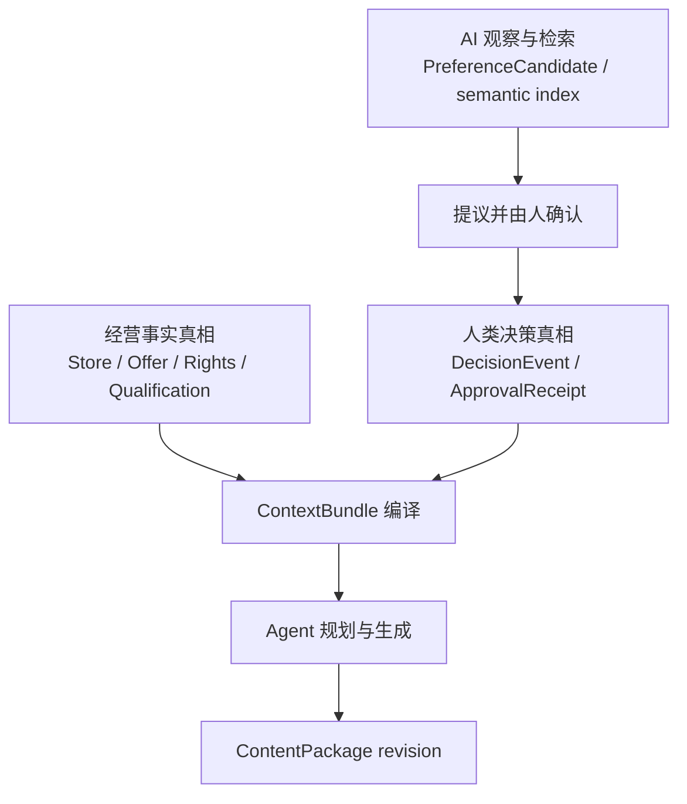
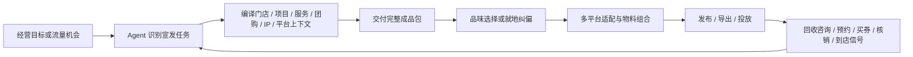

# AI 原生美业宣发 Agent：Human-in-the-loop 与组件选型研究

- 研究日期：2026-07-17
- 研究状态：可用于产品方案修订；宣发任务频率、平台机会判断与转化归因仍需门店实测
- 研究范围：广告曝光与到店引流、人机协作切入点、反馈与学习、异步恢复、不可逆授权、可复用组件、个性化与行业资产匹配
- 对应决策日志：[`docs/design/beauty-marketing-agent-product-design-2026-07-17.md` 第二部分](../../../docs/design/beauty-marketing-agent-product-design-2026-07-17.md)（原独立决策日志已于 2026-07-17 并入该文件）
- 当前产品设计：[`docs/design/beauty-marketing-agent-product-design-2026-07-17.md`](../../../docs/design/beauty-marketing-agent-product-design-2026-07-17.md)；本机 gstack 源路径为 `/Users/bin/.gstack/projects/leelv007-cmd-meiyeweb-agent/bin-main-design-20260717-162033.md`
- 前一版工程设计快照：[`raw/design-baseline-bin-main-design-20260717-130101.md`](./raw/design-baseline-bin-main-design-20260717-130101.md)

> ⚠️ **2026-07-17 深夜更新横幅**：本文「组件策略」与部分工程结论已被权威文档 D-034~D-038 取代——编排层 durable 载体主选 DBOS Transact 进 PoC 定案制，pg-boss 由「业务工作流主底座」收窄为存量队列（D-034）；Langfuse 由「隔离评测」转正为线上 trace/回放/实验/prompt 版本承载，合规留痕双写自建 PG 审计表（D-036）；非代码可变层 = 扩展存量 admin-config + Langfuse prompt management 先行，Mastra Port 绑四项 spike gate（D-037）。「下一轮观察 8–12 家」单波口径已被 D-026 两波进场合同取代（第一波 4–7 家），医疗美容按 D-025 仅作独立研究探针。本文 HITL 决策分类、五类前台节点、三条真相链、验收指标等其余结论仍与现行权威一致。权威：`docs/design/beauty-marketing-agent-product-design-2026-07-17.md`；最新选型证据：`../harness-research-2026-07-17/`。

## 研究要回答的问题

1. 哪些判断必须交给人，哪些应由 Agent 自动完成？
2. 主观选择、临时纠偏、事实纠错、长期偏好、资产化和不可逆批准如何避免混成同一种“确认”？
3. 如何把门店事实、IP 表达、行业场景、素材权利和历史反馈编译成一次任务所需的最小上下文？
4. 哪些成熟组件可以复用，哪些会与现有工程重复或形成第二套真相源？
5. 在日常曝光、热点借势、品牌/IP 经营、促销转化和宣传物料生产中，人应在什么时刻介入？

## 结论

行业主链必须从美业门店的经营目标出发，而不是从假定的岗位交接出发。产品服务的是“持续宣发曝光，并把兴趣承接到咨询、预约、买券、核销和到店”：Agent 应主动把门店、项目、服务、产品、团购、品牌/IP 与平台内容机会编译成可直接使用的成品包，人只在品味、异常事实、资产晋升和外部行动上介入。这里的“广告”是广义门店宣发；付费媒体投放只有账号、预算、平台和回执真实验证后才条件出现。

工程层不需要再增加一套通用 Agent、工作流或记忆框架。按本轮能力项盘点，现有 AI SDK、PostgreSQL、pg-boss、可恢复工作流、ContentPackage 版本和高风险授权已经足以承载这条宣发主链。真正要补的是统一产品语义，以及两个已知断点：`creation-assistant` 的接受/编辑动作仍是 local-only，异步任务中心又把 `awaiting_quality_review` 映射为故障语义的 `recoverable`。工程价值应收进后台的上下文编译、资产匹配、任务恢复、事实来源和审计，不反向变成前台表格或岗位泳道。

需要统一的产品语义包括：

- 什么是当前版本的临时决定；
- 什么是有来源和时效的经营事实；
- 什么只是值得询问的偏好候选；
- 什么可以晋升为可复用资产；
- 哪一张批准只允许哪一次外部行动。

前端因此不应显示 ContextBundle 表、节点图或审批流水线。用户只看到：已经替他匹配好的成品、少数可比较方案、就地修改、事实冲突卡、记忆提议和最后一刻的发布卡。工程复杂度留在后端，产品复杂度不能留给商家。

## 本轮收敛出的产品原则

### 1. 默认临时，明确晋升

“这条少一点广告感”默认只改当前版本。“以后小林的小红书科普都这样”才有资格进入偏好提议。重复行为只能产生候选，不能静默成为长期规则。

这与 [Google PAIR 的反馈与控制指导](https://pair.withgoogle.com/guidebook-v2/chapter/feedback-controls/)一致：一次点击可能只是临时好奇，产品必须说明反馈改变什么、何时改变、作用到哪里，并允许用户查看或退出隐式学习。

### 2. 局部反馈和全局控制分离

就地修改解决当前成品；长期偏好改变以后行为；事实纠错改变权威数据；批准只允许一次外部副作用。四者不能共享一个“记住我的选择”开关。

[Microsoft HAX](https://www.microsoft.com/en-us/haxtoolkit/ai-guidelines/)把细粒度反馈、全局控制、谨慎适应、解释反馈影响和高效纠错分别列为不同设计要求，支持这种分流。

### 3. 只有人能解决的判断才打断

- 审美、身份表达和经营取舍：默认给一个主推荐，主观分歧明显时按需展开 2–3 个差异清楚的成品。
- 可靠系统已有的价格、团购、预约、授权事实：自动读取，不重复询问。
- 来源冲突、过期或用途升级：只问一个最关键问题。
- 发布、扣费、投放、外部发送：在最后可逆时刻绑定精确版本授权。

### 4. 数据库保存真相，AI memory 只提出可能值得记住的模式

产品必须分开三条链：

检索不等于强化，重复不等于事实，模型抽取出的关系也不等于已验证来源。

### 5. 美业主链由宣发任务驱动，不由岗位交接驱动

首期至少覆盖以下经营任务：

- 日常项目与服务曝光：把项目效果、服务过程、环境、专业知识和真实案例持续转成可发内容；
- 平台热点与本店信息借势（“蹭流量”）：把平台热点、同城话题、节日节点和流行表达，与本店真实项目、库存、档期、案例和身份结合，形成有门店依据的“热点 × 本店”；
- 品牌 IP 与个人 IP：围绕品牌主张、老板/主理人、技师等真实身份形成连续栏目、稳定表达和可复用系列；
- 日常宣传物料：一次任务同时产出封面、海报、项目卡、服务流程卡、价格/优惠卡、预约引导卡及平台尺寸变体；
- 促销与本地转化：围绕团购、上新、节日活动、限时优惠和同城曝光，明确私信、预约、买券、导航、核销或到店动作。

默认链路应改为：

顾客授权、素材权利和专业事实核验仍然重要，但它们只是某些任务的条件门禁。例如使用顾客案例做项目展示时才检查对应素材的公开权利；不能把这条窄分支扩张成所有美业内容都必须经过的默认流程。[Phorest](https://support.phorest.com/hc/en-us/articles/360018118860-How-do-I-add-photos-to-a-client-s-appointment-PhorestGo-Portfolio)与 [Fresha](https://www.fresha.com/help-center/knowledge-base/team/611-put-your-team-in-the-spotlight-with-enriched-profiles)只支持这类局部权利与素材管理模式，不支持推导中国美业的通用宣发组织链。

## 产品前台只保留五类 HITL 节点

| 节点 | 何时出现 | 默认动作 | 是否阻塞 |
| --- | --- | --- | --- |
| 品味选择 | 内容角度、画面、身份、口吻或促销力度存在合理差异 | 先采用主推荐；需要时展开备选并可混搭 | 否 |
| 临时纠偏 | 当前成品不符合这次意图 | 默认“仅这版”，支持 diff/undo | 否 |
| 事实/权利冲突 | 价格、团购、档期、身份、来源、时效或素材用途冲突 | 只确认一项事实及影响范围 | 是 |
| 资产晋升 | 用户明确要求做同款、形成栏目或记住稳定表达 | 预览固定项、变量槽、作用域、来源和权利 | 是，仅保存前 |
| 发布/投放批准 | 公开发布、投放、扣费、外发前 | 绑定精确成品、平台、账号、时间和费用的一次性授权 | 是 |

“本次将使用”的上下文摘要仍可用一行 chips 被动展示，但它不是一次需要用户通过的 HITL。任何页面级“下一步确认”都应被审查：如果它不能归入上述五类，默认不应该存在。

## 组件策略

### 立即复用

- AI SDK 7：继续作为流式消息、结构化工具调用和审批响应通道。
- 现有 Base UI/shadcn、Sonner、ToggleGroup、Drawer：承载领域卡片，不再加第二套 UI 壳。
- PostgreSQL：经营事实、决策账本、偏好投影、资产版本和授权凭证的权威存储。
- pg-boss：持久任务、等待后续跑、超时、重试/DLQ 和确定性 Job ID。
- 现有 ContentPackage、视频 pause/select/resume、抖音 snapshot invalidation、飞书 immutable intent：抽取为通用模式。

### 有条件验证

- assistant-ui：借鉴 Tool UI、human/resume、approval options 和 host-owned persistence；不整体替换当前领域工作台。
- OpenTelemetry + Langfuse：前者作为可替换的 trace 标准，后者用于数据集、实验、人工标注和回归评测；都不能充当业务决策账本。
- pgvector：当偏好与案例候选量确实需要语义召回时再加；作用域优先级仍由确定性查询决定。
- LangMem 或 Mem0 OSS：只允许二选一做候选抽取/检索 spike，输出 `PreferenceCandidate`，不得直接写正式偏好或事实。

### 暂不引入

- Temporal、Inngest、Trigger.dev、Cloudflare Workflows：能力成熟，但会与现有 Postgres + pg-boss 形成第二套工作流状态。只有出现被证实的跨服务补偿、长期版本治理或 Core 整体迁移，才重新评估。
- LangGraph、Mastra、OpenAI Agents SDK：可借鉴 interrupt/RunState 模型，但当前会叠加新的 Agent runtime。
- CopilotKit、ChatKit：会把领域化创作工作台重新拉回通用聊天壳。
- Letta、Zep、Graphiti：分别意味着完整 Agent runtime、商业记忆平台或额外图数据库运维，不适合首期偏好学习。

完整比较见 [`02-component-fit-matrix.md`](./02-component-fit-matrix.md)。

## 对原设计方案的修正

原方案的问题不是后端能力不够，而是把工程对象过多投影到产品界面。修订时需要从“对象齐全”改成“结果与决定齐全”：

| 原工程视角 | 修订后的产品视角 |
| --- | --- |
| 用户填写 Store、Offer、Persona、Asset 表 | Agent 自动提取并只展示本次匹配摘要 |
| 用户先选模型、参数、节点 | 用户先看适合本店的完整成品 |
| 每一步任务都要求确认 | 仅事实冲突和外部副作用阻塞 |
| 一次修改直接写偏好 | 当前版本 delta；稳定模式只生成候选 |
| 保存整篇成品为模板 | 抽取固定结构、变量槽、来源、权利和禁继承项 |
| 聊天记录就是上下文 | 后台编译不可变 ContextBundle，历史只作证据来源 |
| 工作流状态直接露出 | 前端只显示“正在准备、需要你选、已完成、可继续” |
| 先设计岗位采集与逐级审核链 | 从曝光、借势、IP、促销和物料任务起步，按需要触发局部门禁 |

## 当前应进入方案的最小领域层

这不是要求立刻重写代码，而是后续工程设计必须拥有的语义边界：

- `DecisionEvent`：记录选择、临时修改、事实确认、拒绝、撤销和作用域。
- `PreferenceCandidate / Preference`：保存证据、最窄作用域、确认、撤回和 supersede。
- `ReusableAssetCandidate / AssetRevision`：保存固定骨架、变量槽、来源、权利、示例和版本。
- `ApprovalRequest / ApprovalReceipt`：绑定动作信封、版本、账号、平台、时间、费用、过期、消费和失效。
- `ContextBundle`：每次任务实际使用的事实、偏好、行业配方、素材权利和来源快照。

不建议为了这些对象全量改成 Event Sourcing。当前状态继续保存在普通领域表，只有关键决定与来源使用 append-only ledger。

## 下一轮仍需真实研究的内容

一手产品文档可以证明交互模式存在，但不能代替中国美业门店的宣发行为研究。下一轮应观察 8–12 家门店，分开覆盖美发、美甲美睫、生活美容/皮肤管理和医疗美容，并至少包含老板亲自经营、内容由员工兼任和连锁集中运营三种形态。

重点不是再问“你想要什么功能”，而是按连续 2–4 周的真实内容日历观察：门店每天为什么发、从哪里发现热点、如何把热点改成本店内容、哪些店铺/IP/活动事实最难找、哪些物料最高频、成品在哪里返工、发布后如何承接咨询与到店。

应优先验证四个前台原型：

1. “今天值得发什么”：Agent 基于经营目标、近期素材与内容机会直接给完整成品。
2. “热点 × 本店”：只需选择可借势方向，Agent 自动匹配本店事实和合适 IP。
3. “一事多用”：同一项目、活动或观点同时生成平台内容与门店宣传物料包。
4. “做同款 / 续写系列”：在预览固定项和变量槽后晋升为可复用资产。

宣发任务、资产组合与研究假设详见 [`04-beauty-marketing-jtbd-and-asset-orchestration.md`](./04-beauty-marketing-jtbd-and-asset-orchestration.md)；顾客案例等特定素材的权利边界仍见 [`03-beauty-roles-rights-workflows.md`](./03-beauty-roles-rights-workflows.md)。

## 验收指标

- `false_persistence_rate`：临时纠偏被错误沉淀的比例，目标 0。
- `critical_fact_memory_contamination`：价格、授权、资质进入偏好记忆的次数，硬门槛 0。
- `critical_confirmation_recall`：需要确认的高风险动作实际确认比例，目标 100%。
- `confirmation_precision`：所有打断中确实必须由人判断的比例，用于控制确认疲劳。
- `resume_success_rate`：人工决定后从原状态恢复且没有重复副作用的比例。
- `asset_stale_value_leakage`：做同款时泄漏旧价格、日期、顾客信息等临时值的次数，目标 0。
- `exact_scope_accuracy`：偏好只作用于正确门店、IP、平台和场景的比例。
- `time_to_first_usable_draft`：从最少素材到首个可用成品的时间。
- `publishable_package_rate`：首轮成品无需大改即可发布或导出的比例。
- `store_asset_match_accuracy`：热点、场景、IP 与本店真实资产匹配正确的比例。
- `multi_format_completion_rate`：同一宣发任务所需平台内容与物料是否一次成包交付。
- `lead_signal_capture_rate`：已发布内容能否回收到咨询、预约、买券、核销或到店信号。
- `unauthorized_media_publication`：未授权素材进入公开链路次数，目标 0。

## 资料索引

- [`01-human-in-the-loop-best-practices.md`](./01-human-in-the-loop-best-practices.md)：通用人类决策分类、交互模式、反模式和指标。
- [`02-component-fit-matrix.md`](./02-component-fit-matrix.md)：前端、工作流、记忆、评测组件对比与项目适配结论。
- [`03-beauty-roles-rights-workflows.md`](./03-beauty-roles-rights-workflows.md)：顾客案例等特定内容的素材权利、账号权属与责任边界。
- [`04-beauty-marketing-jtbd-and-asset-orchestration.md`](./04-beauty-marketing-jtbd-and-asset-orchestration.md)：广告曝光与到店引流任务、个性化/行业资产组合、Agent 宣发工作流与验证计划。
- [`SOURCE-REGISTER.md`](./SOURCE-REGISTER.md)：一手来源、证据强度、可支持结论与边界。
- [`raw/`](./raw/)：OpenCLI 于 2026-07-17 抓取的一手页面快照。

## 证据边界

- HAX、PAIR、Apple、NIST、AI SDK 等资料支持通用人机协作原则，不直接证明某个美业界面一定有效。
- Phorest、Fresha 只能证明特定顾客案例的授权/展示模式，不能推导美业内容生产的默认岗位链；Buffer、Planable 等证明成熟产品存在相应发布协作模式，不代表中国平台能力或本地合规结论。
- 抖音、小红书、美团规则会变化，上线前必须重新核验当期官方规则。
- “3 个独立任务后提议记住”是实验默认值，没有权威研究证明 3 是最佳数字。
- 当前推荐基于 2026-07-17 的代码与依赖快照；外部包版本和商业许可在采用前必须再次锁版核验。
