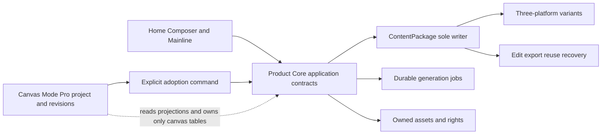

# Design: 从真实视频主链到双线商业验证的产品与架构升级

Generated by /office-hours on 2026-07-17
Branch: main
Repo: leelv007-cmd/meiyeweb-agent
Status: APPROVED
Mode: Startup
Supersedes: bin-main-design-20260714-185628.md

## Decision Summary

选择 **Approach C：双线商业验证**，但不是同时公开发布两套产品，也不是让两条线各自建设架构。

- **产品主线**：先完成真实视频端到端链路，使单店用户获得可播放、可修改、可入库、可导出、可恢复的完整 ContentPackage。
- **Pro Studio 验证线**：把 Pro Studio 定义为同一产品内的“画布模式 · Pro”，只对白名单目标工作区验证复杂创作价值、无协助可用性与付费意愿。
- **共同架构脊柱**：采用 Approach B 的 Product Core 收口方案。ContentPackage 是唯一成品事实和唯一写入边界；Canvas 只能通过显式 adoption 命令把结果写回它。
- **一层共享工程 Gate、两层独立产品 Gate**：真实 generation、owned asset custody、sole writer 与 Release Contract 是两线共同底座；主线和 Pro 分别证明自己的用户价值与商业条件。主线可以在 `Pro disabled` 状态发布，Pro 停用也不能影响主线。

## Problem Statement

当前代码已经具备较深的 Product Core、ContentPackage、模型供应、Canvas、Agent、权限与恢复基础，但“代码模块很多”和“用户能完成完整产品任务”仍不是同一件事。

对单店用户而言，最大可见缺口是真实视频主链尚未形成可重复交付：用户需要从真实门店资料和授权素材出发，获得可播放的视频、三平台变体、合规/AIGC 信息、编辑确认、入库或导出，并能在刷新、重启和供应商失败后继续工作。真实图文链已有证据，但单个成功样本不能代表完整产品。

对 Pro Studio 而言，工程能力已经超过商业证据：Canvas 有 project、revision、generation、Agent、entitlement、audit 与 adoption 等基础，但入口仍偏技术化，Postgres adoption 仍直接写 `p1_content_packages`，且尚无 3 个目标工作区的无协助使用与付费行为证明。若继续把它当独立产品面推进，会同时制造第二交互壳、第二写入边界和第二套“完成”口径。

因此本轮要解决的不是“再增加多少能力”，而是：

1. 用一条真实视频主链证明完整产品成立。
2. 用同一个 Product Core 收口主线与画布的内容生命周期。
3. 用白名单商业验证判断 Pro Studio 是否值得公开销售。
4. 把本地可运行系统变成可构建、可迁移、可发布、可回滚的发布单元。

## Demand Evidence

### 已有证据

- 既有方案确认品牌体系内有 200 多家加盟门店，决策人可直接指定 1–3 家门店参与试点；独立门店同样需要低门槛内容生产。
- 当前仓库已存在真实图文 ContentPackage 链路与一条真实图片/文本结果证据，说明产品不是纯原型。
- 2026-07-17 对小云雀真实登录态的复核显示，成熟产品可以在同一创作壳中同时容纳中心 Composer、场景化结构表单和可选 project 画布；研究证据见 `references/benchmark/interaction-study-2026-07-07/interaction-patterns-xyq-creatok.md` 与 `sources/xyq-2026-07-17-live.md`。
- 当前 HEAD `aa81e9c` 已把 runtime assembly、reference delivery、ContentPackage lifecycle、adoption rules 与 Core remote transport 深化，说明增量收口比推倒重写更合适。

### 仍未获得的证据

- 一条可重复的真实视频从提交到永久资产、三平台变体、编辑确认、ContentPackage、导出与恢复的完整证据。
- 真实操作者在无协助状态下完成上述任务的浏览器与设备证据。
- Pro Studio 在 3 个目标工作区的持续使用、愿付价格、付费或明确拒绝原因。
- 可从不可变制品部署、迁移、烟测、观测到回滚的 Release Contract 证据。

结论：产品方向证据足以继续建设，公开销售证据不足。主线先进入封闭 beta；只有真实 offer、收款与退款/取消责任闭合且至少一位真实用户付款后，才能标记为“封闭付费 beta”。Pro Studio 只进入白名单可用性与商业验证。

## Status Quo

### 用户可见产品

- 四项一级导航、中心 Composer、三平台、小红书/抖音/视频号、三选一主媒介、ContentPackage 与单店用户边界已经决定，本轮不重开。
- 图文链比旧文档描述更接近真实产品，但视频仍缺少同等级 LIVE 证据。
- Pro Studio 当前更像可单独访问的高级工程面，而目标形态应是 Composer 内的“画布模式 · Pro”。

### 代码与写入边界

- `apps/core/src/p1/operations/content-package.ts`、`content-package-lifecycle.ts` 与相关测试已经表达统一内容生命周期。
- `apps/core/src/pro-studio-runtime/postgres-adoption-service.ts` 虽复用了 ContentPackage 构建与状态转换规则，但仍直接 `SELECT/INSERT/UPDATE p1_content_packages`，因此存在第二个物理写入者。
- `OperationsRepository` 仍以 `loadWorkspace/saveWorkspace` 持久化 `OperationsWorkspaceState`，`OperationsApplicationService` 以 workspace 级锁执行多数 mutation。这会扩大冲突域、放大读写量，也让聚合所有权不清晰。
- `apps/canvas/src/server/runtime.ts` 一方面通过 HTTP client 调用 Core generation/adoption，另一方面直接导入 `@meiye/core/pro-studio` 与 `@meiye/core/pro-studio-runtime` 实现，并共享同一个 Postgres。边界同时存在“远程契约、实现导入、共享表”三种风格。

### 运行与交付

- 本地完整拓扑由 Web Worker、Core HTTP、Core Worker、Canvas Node 组成；`pnpm dev:live` 才包含数据库与服务间环境变量。
- Canvas 会在启动时执行 schema/workspace migration；多个进程启动时迁移会把发布顺序与进程生命周期耦合。
- Canvas 已产出 Next standalone 制品；Core 的 `build` 仍是 `tsc --noEmit`，生产 `start` 依赖 `tsx` 直接运行源码，尚无不可变 Core artifact。
- `.github/workflows/core-quality.yml` 只覆盖 contracts/Core typecheck 与 Core Postgres tests；没有 Web/Canvas 全仓质量门、发布制品、staging migration、浏览器 smoke 或 rollback rehearsal。
- Canvas object storage 默认可落本地 `.data/canvas-assets`；这不满足多实例、跨设备恢复和不可变发布的持久资产要求。

### 当前最值得保留的增量

- `runtime-assembly.ts` 已把模型供应装配收口。
- `reference-asset-delivery.ts` 已集中处理参考素材交付。
- `content-package-lifecycle.ts` 已承载编辑、回滚等深层生命周期。
- `adoption-rules.ts` 已把 Canvas adoption 的规则、幂等和选择逻辑拆出。
- `core-remote-call.ts` 已形成 Canvas → Core 的统一远程调用入口。

这些模块应成为下一步边界收口的接缝，而不是重新建设同功能框架。

## Target User & Narrowest Wedge

### 产品主线用户

一个单店内容操作者：独立门店或加盟门店的店主、店长、前台、员工或内容人员。他不需要理解模型、节点、Agent 框架或供应商，只需使用真实门店信息与授权素材完成内容任务。

### Pro Studio 验证用户

已经遇到“普通 Composer 不够用”的高级操作者：品牌内容人员、代运营/内容服务方、内部高频制作人员。只有这类用户明确需要复杂拼版、局部精修、多分支探索、音频或节点式生成时，才出现“画布模式 · Pro”。

### 最窄产品切口

`一个真实门店 → 一个真实视频主题 → 一个可播放 owned video → 小红书/抖音/视频号变体 → 修改确认 → 同一个 ContentPackage → 内容库或导出 → 刷新/重启/失败后可恢复`

这条链路达到本文六次任务阈值，才允许主线进入封闭 beta；再满足非零收款条件才升级为封闭付费 beta。Pro Studio 的最窄验证切口是在同一个 ContentPackage 上打开画布、生成/编排一个高级结果、显式采用回原包，并由真实目标用户给出使用与价格判断。

## Constraints

- 不重开四项一级导航、三平台、三选一主媒介、Composer、ContentPackage 与单店产品边界。
- 对外只交付一个完整产品；研发内部可分工，但中间工程状态不能成为外部“已完成”版本。
- 采用模块化单体与一个 Product Core/Postgres；不引入微服务、Kubernetes、Redis、Inngest、Mastra 或新的通用工作流平台。
- ContentPackage 必须是唯一成品事实、唯一生命周期入口和唯一物理写入边界。
- Canvas project/revision/graph 是高级编辑状态，不是第二内容库；Canvas 不拥有发布包、内容版本或最终合规事实。
- 主线用户默认不进入画布；Pro Studio 只按任务复杂度与 entitlement 渐进出现。
- 真实供应凭证、区域与模型 deployment activation 可以晚于功能记录完成，但未激活能力不得被呈现为可提交。
- 发布必须使用不可变制品、独立 migration step、外部对象存储、严格 secrets、readiness、smoke 与 rollback。
- 不做整个 Operations 模块的“大爆炸重写”；以唯一写入边界和高冲突路径为顺序增量替换。
- 用户现有 `.scratch` 与 evidence 工作成果不属于本设计，不得被清理或并入无关提交。

## Confirmed Premises

1. 目标是完整的单店内容产品先通过封闭 beta Gate；满足本文真实收款证据后升级为封闭付费 beta。不再讨论用户、导航、三平台、三选一主媒介、Composer 或 ContentPackage 是否成立。
2. 真实视频是当前最大的用户可见缺口。
3. `ContentPackage count = 1` 是必要条件，但不是可播放、可导出、可恢复、可跨设备继续的充分条件。
4. 架构采用模块化单体、一个 Product Core 和一个 Postgres；不通过增加基础设施掩盖边界问题。
5. ContentPackage 只能有一个写入者；改造以 aggregate-level transaction 增量推进，不做全模块重写。
6. 可重复发布、迁移、观测和回滚是产品完整性的一部分。
7. Pro Studio 是同一产品内的白名单 add-on lane；它与主线共享工程发布 Gate，但拥有独立的安全、权限、价格、商业与产品放行 Gate。

## Approaches Considered

### Approach A: Video-first beta

只修通真实视频供应、播放、平台变体、入库与导出，尽快获得用户可见成果；架构与发布只补最低阻塞项。

- **Effort**: M
- **Risk**: Medium to High
- **Pros**: 最快解决最大用户缺口；容易形成直观演示和试点内容。
- **Cons**: 第二写入者、workspace superaggregate、启动迁移和 Core 无制品等问题会继续累积；一次成功容易被误当成产品完成。
- **适用条件**: 只适合短期内部证据，不适合作为封闭付费 beta 的完整发布策略。

### Approach B: Product Core closure

先把 ContentPackage writer、aggregate repository、Core/Canvas seam 与 Release Contract 完整收口，再继续任何产品功能。

- **Effort**: L
- **Risk**: Medium
- **Pros**: 架构长期最干净；交付、恢复和所有权清晰。
- **Cons**: 若把所有收口当串行前置，会延后真实视频与用户验证；容易演变成“架构完成但产品还不可用”。
- **适用条件**: 作为所有产品线的共同架构脊柱，而不是独立商业路线。

### Approach C: Dual-lane commercial validation — Chosen

主线完成真实视频并准备封闭 beta；Pro Studio 同时只对白名单目标工作区做价值和付费验证。两线共享 B 的架构脊柱与工程 Release Gate，但各自有独立的产品/商业 Gate。

- **Effort**: Foundation L；Mainline M；Pro validation M。外部关键路径是视频 commercial account、对象存储/SecretRef、部署平台和真实用户排期。
- **Risk**: Medium
- **Pros**: 同时回答“完整产品能否成立”和“高级画布是否值得卖”；保留当前 Canvas 工程资产；不会为了等待商业验证停住主线。
- **Cons**: 若 Gate、owner 或写入边界不清，会退化成两套产品同时施工；需要严格限制 Pro 的公开入口和发布声明。
- **选择理由**: 这是唯一同时利用已有工程深度、解决真实视频缺口、避免第二事实源并获取付费证据的路径。

## Recommended Product Shape

### 首页：同一创作壳

首页继续以本周建议与中心 Composer 为主。模型、比例、时长和素材默认自动；美业场景 chips/卡片负责替普通用户把 prompt 编译成领域字段。

“画布模式 · Pro”只以两种方式出现：

1. Composer 参数条里的可选 mode switch。
2. 场景卡中的“自由画布 · Pro”入口。

它不是一级导航、独立 Dashboard 或通用工具市场。普通用户完成图文/视频任务时无需看见节点、模型目录或 entitlement 术语。

### 结构化启动门

进入画布前，在同一壳中确认：

- 来源 ContentPackage 或授权素材。
- 目标：复杂拼版、局部精修、视频成片或音频。
- 起点：继承当前内容或空白画布。
- 输出方向：原平台、比例、品牌与合规设置。
- 当前 entitlement：白名单、试用、已购或申请验证。
- 价格：只有真实 price 与 billing path 激活后才显示；否则显示“申请验证”，不展示假价格。

从现有 ContentPackage 进入时 adoption 使用 `update`；从授权素材或空白画布进入时，打开 Canvas 不创建成品，首次显式 adoption 才通过 Core 的 `create` 命令幂等创建一个初始 ContentPackage，并返回新包。两种路径都不允许 Canvas 直接建包。

### 画布模式 · Pro

视觉与交互依据 2026-07-17 小云雀 LIVE 复核：

- 浅色点阵无限画布，不另建深色“专业产品”品牌壳。
- 顶部：标题、已保存状态、全局比例、额度、分享、采用回原内容。
- 左侧浮动 rail：添加节点、项目资产、帮助。
- 基础节点：视频、图片、文本、音频；后续能力通过节点或 Agent 动作渐进出现。
- 底部：缩放、重置、小地图、网格吸附等视口工具。
- 右侧 Agent 面板默认与画布同屏，可调整宽度、左右停靠、收起；支持多会话，但不产生第二套内容事实。
- 只有显式“采用回原内容”才创建新的 ContentPackage version；重复采用同一 revision/selection 必须幂等且不重复扣费。

权威页面状态直接保留在本文，临时 HTML 不作为交接依赖：

```text
HOME / COMPOSER
┌──────────────┬──────────────────────────────────────────────────────────┐
│ primary nav  │ weekly guidance + one centered Composer                 │
│              │ scene chips | assets | auto model/ratio/duration        │
│              │ [Canvas Mode · Pro] (hidden when ineligible) [Generate] │
└──────────────┴──────────────────────────────────────────────────────────┘

CANVAS MODE · PRO
┌─────────────────────────────────────────────────────────────────────────┐
│ title · saved · ratio · quota                   share · adopt to source │
├──────┬───────────────────────────────────────────────┬──────────────────┤
│ rail │ light dotted infinite canvas                 │ Agent panel      │
│ add  │ video / image / text / audio nodes           │ resizable/dock  │
│asset │ viewport tools: zoom/minimap/snap/reset       │ multi-session   │
└──────┴───────────────────────────────────────────────┴──────────────────┘
```

## Target Architecture



### Module ownership

| Module | Owns | Must not own |
|---|---|---|
| Product Core / ContentPackage | package identity, versions, status, platform variants, source refs, compliance, adoption, export/reuse lifecycle | Canvas graph layout, UI panel state |
| Generation | durable jobs, route snapshot, provider refs, usage/cost, generated owned assets | final package acceptance |
| Canvas | project, revision, node graph, edges, viewport, checkpoints, Canvas Agent conversations | `p1_content_packages`, final content status, publication truth |
| Assets/Rights | owned bytes, hashes, technical metadata, authorization and custody | Canvas-only layout |
| Release | artifact digests, schema/config/catalog revisions, migration/smoke/rollback evidence | runtime business writes |

### ContentPackage sole writer

Target adoption interface separates trusted context from untrusted command data:

- **Trusted server context**: `workspaceId`, `actorId`, authenticated role/entitlement revision, correlation ID. These values are derived after session/service-token authentication; payload copies are rejected and never authorize access.
- **Command**: `mode=create|update`, `projectId`, immutable `revisionId`, `revisionHash`, selected text node and ordered media node IDs, `idempotencyKey`, payload hash and `expectedOfferRevision`. For `update`, `targetPackageId` and `expectedCurrentVersionId` are required; for `create`, both are absent and Core allocates the package/initial-version IDs exactly once under the idempotency key.
- **Authoritative lookup**: Product Core uses a `CanvasRevisionSnapshotReader` port to load an immutable snapshot containing workspace/project/revision identity, revision hash, selected node snapshot, resolved asset/job references, authorization version and creator. The first Postgres adapter has read-only access to a versioned Canvas snapshot view; it cannot write Canvas tables. A later internal HTTP adapter may replace it without changing the application contract.
- **Core validation**: membership, action entitlement, snapshot ownership/hash, selected nodes, generation completion, owned asset custody, rights/compliance, expected package version and billing receipt are all rechecked by Core.

The Core transaction locks the command receipt and, for update, the target package version; it then creates or updates exactly one package and writes the initial/new version, adoption receipt, audit event and local usage ledger/outbox records atomically. Create-mode tests prove replay returns the same package/version and cannot create an orphan. `PostgresAdvancedCanvasAdoptionService` is retired at R1; its allowed replacement is a Canvas-side `CoreAdoptionClient` that only translates the typed command to `core-remote-call.ts` and has no database dependency.

### Physical ownership and database roles

The modular boundary is enforced by PostgreSQL grants, not convention alone:

- `core_runtime`: read/write on Core-owned ContentPackage, generation, asset/rights, ledger, receipt and audit tables; read-only on the Canvas revision snapshot view.
- `canvas_runtime`: read/write only on Canvas project/revision/graph/Agent tables; no `INSERT`, `UPDATE`, `DELETE` or ownership rights on `p1_content_packages` and related Core tables.
- `migration`: DDL and grant changes, used only by the dedicated migration job; never by application processes.

An integration test connects as `canvas_runtime` and proves a package-table write is rejected by PostgreSQL; the release receipt records the permission-denied result. Static SQL/import inventory remains a secondary guard. Physical cutover is complete only after direct SQL is deleted, grants are active, production manifests name the three roles, and a canary proves Pro can be disabled without changing mainline writes.

### Billing and adoption consistency

The initial Pro validation offer is entitlement-based, not per-adoption billing. Core derives `billingMode` from trusted workspace entitlement, active SKU and the server-side offer revision; the command may only assert `expectedOfferRevision` for stale-offer detection. Before a real SKU is approved, Core derives `validation_zero`, creates exactly one zero-value usage receipt, and never counts it as payment evidence. Real paid-beta evidence comes from an order/invoice/payment receipt bound to the workspace and offer revision.

If a metered SKU is later activated, Core first persists a `pending` billing intent keyed by the same idempotency key, then `BillingSettlementPort` performs an idempotent reserve. The adoption transaction locks that intent with the package/receipt, commits the version and a finalization outbox, and a reconciler queries the provider by idempotency key until it finalizes, reverses or reaches the provider-declared reservation TTL. Release tests must cover duplicate request, reservation timeout, Core commit followed by finalization timeout, and reservation success followed by package-write rollback. No failed or replayed adoption may create a second version or settled charge; an orphan reserve is recoverable from the durable intent plus provider query/TTL, never process memory.

### Aggregate-level persistence

Introduce narrow repositories alongside the current superaggregate:

- `ContentPackageRepository`
- `GenerationJobRepository`
- `CommandReceiptRepository`
- `CanvasProjectRepository`
- `AssetCustodyRepository`

Each use case owns one transaction and locks only its aggregate rows or idempotency record. Canonical aggregate tables become the sole source of truth. During migration, `OperationsWorkspaceState` may remain only as a rebuildable, read-only compatibility projection: the same Core transaction advances a monotonic projection checkpoint, a backfill rebuilds it from canonical package/receipt facts, and reconciliation compares counts, version IDs and digests. No command may write package/receipt truth through the projection or load and rewrite the entire workspace merely to append one package version.

Reader cutover order is: backfill → shadow-read/digest compare → switch one reader cohort → canary → switch all readers → hold two release windows → delete legacy package/receipt projection fields and writer code. A lagged checkpoint fails readiness and falls back to the canonical query, never stale projection data. Retirement requires zero legacy reads/writes in telemetry and a successful from-zero projection rebuild.

### Core/Canvas seam

- Cross-boundary execution uses typed contracts and `core-remote-call.ts`.
- Canvas may import shared types/contracts, but not Product Core implementations that can write Core-owned tables.
- Both can remain in the monorepo, use one Postgres cluster and deploy together; table ownership and application ports define the modular boundary. This is a modular monolith, not a microservice program.
- Canvas may write only Canvas-owned project/revision/agent tables. Core provides read projections needed by Canvas and owns generation/adoption commands. Core reads immutable Canvas revision facts only through `CanvasRevisionSnapshotReader`; neither side imports the other's runtime implementation.

## Release Contract

Every candidate release produces one manifest containing:

- Git SHA and lockfile hash.
- Web Worker artifact digest.
- Core HTTP artifact digest and Core Worker artifact digest.
- Canvas standalone artifact digest.
- Database schema revision and migration digest.
- model catalog/config/template revision.
- required secret names and non-secret config schema.
- browser/runtime evidence manifest and smoke result.
- rollback target and data compatibility statement.

Release order:

1. Build immutable artifacts once.
2. Restore a production-like backup into staging and run migrations as a dedicated job.
3. Run contract, Core, Canvas, Web, Postgres and browser smoke gates against those exact artifacts.
4. Verify owned object storage, queue recovery, readiness and provider activation.
5. Deploy Core/Worker, Canvas and Web with compatible manifest.
6. Run post-deploy smoke and one safe real-provider canary where activation permits.
7. If a gate fails, freeze new submissions and roll future traffic back; already accepted jobs remain owned by the runtime that created them.

Migrations must not depend on ordinary process startup. Core must emit executable immutable artifacts instead of relying on `tsx` production source execution. Local filesystem may remain a development adapter, but production assets require external object storage with hash/receipt evidence.

### Compatibility and rollback protocol

- Database changes follow `expand → migrate/backfill → contract`; destructive contract steps ship only after the previous runtime is fully drained and the N-1 compatibility window has expired.
- Sole-writer cutover uses two release boundaries. **R0** deploys `CoreAdoptionClient`, routes 100% of adoption remotely and leaves legacy grants temporarily intact; it drains in-flight requests and reconciles package/receipt/ledger digests. **R1** then revokes Canvas package grants and deletes the old service. R1 may roll back only to the remote-adoption R0 artifact, never to a pre-cutover direct-writer artifact.
- Every candidate proves N and N-1 application compatibility against the expanded schema. A failed partial deploy stops new submissions, keeps the expanded schema, routes traffic back to the prior artifact digests, and never restores an old database over newer accepted facts.
- Each `GenerationJob` stores `jobSchemaVersion`, owning worker artifact digest and route/catalog revision. Old workers drain only jobs they own; new workers may claim an old job only through an explicit compatible upgrader. Unknown callbacks enter reconciliation rather than resubmission.
- Rollback rehearsal must inject failure after migration, after Core, after Canvas and after Web. It passes only when new submissions are fenced, accepted jobs are neither lost nor duplicated, prior artifacts serve read traffic, and package/ledger/object digests reconcile.
- The release repository owns a repeatable rehearsal command and a hashed receipt. The manifest records the command, injected stage, observed drain time and resulting artifact/schema revisions.

### Durable generation lifecycle

Generation is a shared capability, not a lane-specific shortcut. Its state machine is `queued → leased → submitted → running → succeeded|failed|unknown|cancelled`. A lease has owner, expiry and attempt number; retry policy is operation-versioned and only safe states retry automatically. Provider callback and polling results use a unique provider-attempt key, callbacks are idempotent, timeouts enter `unknown`, and a reconciler resolves unknown/dead-letter work before any resubmit. Restart transfers ownership only after lease expiry and preserves route snapshot, quote, cost ledger and asset custody.

### Observability minimum

One correlation ID must join browser action, Core request, generation attempt, provider reference, owned asset, adoption receipt, ContentPackage version, usage ledger and audit event. The release manifest attaches dashboards and alerts for queue age, lease expiry, provider failure/unknown rate, callback duplication, adoption/version conflict, orphan assets, ledger/package mismatch, readiness and rollback. A canary is observed for at least 60 minutes and two completed real jobs; any data-loss, duplicate-charge, cross-workspace access or unreconciled orphan alert blocks promotion.

## D0 Implementation Readiness Gate

These decisions do not reopen product foundations. Dates below are proposed deadlines; before dependent work starts, each DRI role must be bound to one named accountable person, and the decision artifact must record that person's acceptance timestamp. A team alias alone is not an accepted owner.

| ID | Decision and acceptance artifact | DRI | Due | Blocks |
|---|---|---|---|---|
| D0-V | exact live video operation, commercial account, region, quota and safe canary; activation receipt in staging | Model Supply DRI | 2026-07-21 | G1, M1, P4 |
| D0-I | deployment platform, versioned object storage, SecretRef/KMS and PostgreSQL role plan; ADR plus staging connectivity proof | Platform DRI | 2026-07-21 | F1b, F1c, F4, F5 |
| D0-C | mainline and Pro offer revisions, order/payment path, invoice/receipt format, cancellation/refund owner and response SLA | Product/Founder DRI | 2026-07-22 | paid-beta label, P5 |
| D0-U | three named mainline operators and three Pro workspaces/operators, real tasks, consent and scheduled windows | Pilot Operations DRI | 2026-07-22 | M5, P5 |
| D0-S | N2 target declaration, security threat model, production drill owner and manual approval channel | Security + Platform DRI | 2026-07-23 | Pro security/public-purchase Gate |

An unresolved row permits design, contract and fixture-test work only; it blocks live, production or user-validation work named in its `Blocks` column.

## Workstreams and Dependencies

### Shared foundation and capabilities

| ID | Workstream | DRI / timebox | Exit evidence | Depends on |
|---|---|---|---|---|
| F1a | Freeze adoption command, trusted context and table/command ownership matrix | Core Architecture / 1–2 days | versioned schemas, identity rules and one owner per table/command | none |
| F2 | Add ContentPackage/receipt repositories and transaction port | Core / 4–6 days | adoption/package paths use aggregate locks and no workspace-wide rewrite | F1a |
| F2b | Backfill and cut over legacy read projection | Core / 2–4 days | from-zero rebuild, shadow digest, checkpoint fallback and zero legacy writer pass | F2 |
| F3 | Add typed Core/Canvas seam and `CanvasRevisionSnapshotReader` | Core + Canvas / 3–5 days | shared contract tests; no runtime implementation import; server context cannot be forged | F1a |
| F1b | R0 remote-adoption cutover | Core + Canvas / 2–3 days | 100% remote adoption; in-flight drained; package/receipt/ledger digests reconcile; legacy grants retained only for rollback | F2, F3, D0-I |
| F1c | R1 physical sole-writer enforcement | Core + Platform / 1–2 days | grants revoked; direct SQL/service deleted; `canvas_runtime` write rejected; rollback target pinned to R0 | F1b, F2b |
| F4 | Immutable Core artifacts and dedicated migration job | Platform / 3–5 days | manifest contains runnable Core HTTP/Worker digests and migration digest | D0-I |
| F5 | Production assets, secrets and readiness | Platform / 3–5 days | object version/hash receipt, SecretRef-only startup and cross-device restart pass | F4, D0-I |
| G1 | Durable generation lifecycle and one live video operation | Model Supply / 5–8 days + provider wait | state/lease/retry/reconcile suite and real submit/result/cost evidence | F4, D0-V |
| G2 | Owned asset custody | Core + Platform / 3–5 days | generated bytes leave temporary URLs, pass ffprobe/hash and survive restart/device change | G1, F5 |
| F6 | Shared engineering Release Gate | Release / 3–5 days | exact artifacts pass full CI, migration, security baseline, observability canary and rollback rehearsal | F1c, F4, F5, G1, G2 |

### Mainline video lane

| ID | Workstream | DRI / timebox | Exit evidence | Depends on |
|---|---|---|---|---|
| M1 | Mainline real video submission/playback | Product Core / 2–3 days | Composer submits one real job and plays the owned result without fixture | G1, G2 |
| M2 | Versioned three-platform output contract | Product + Core / 2–3 days | all three variants validate against `PlatformOutputV1` | M1 |
| M3 | Accept into sole-writer package, edit/export/reuse | Core + Web / 3–5 days | one accepted package; edit/export/reuse and replay/CAS tests pass | F1c, F2, M2 |
| M4 | Recovery and interruption | Core + Release / 2–3 days | refresh/restart/timeout/duplicate callback/unknown reconciliation preserve work | F4, F5, G1, M3 |
| M5 | Mainline validation window | Pilot Operations / 14 calendar days | six real task receipts meet the threshold below | M1–M4, F6, D0-U |

`PlatformOutputV1` is a version-controlled contract to be added under `packages/contracts`. Each variant must declare platform, ordered owned asset IDs, primary video and cover, ratio/dimensions/duration/container/video/audio codec, subtitle mode, title/body/hashtags, AIGC label, watermark policy, rights refs and contract revision. The three platform profiles hold explicit validated limits and fixtures; M2 cannot exit on the phrase “platform-correct” alone.

### Pro Studio validation lane

| ID | Workstream | DRI / timebox | Exit evidence | Depends on |
|---|---|---|---|---|
| P1 | Same-shell entry, allowlist and kill switch | Web + Canvas / 2–3 days | no first-level Dashboard; ineligible hidden; `Pro disabled` mainline smoke passes | none |
| P2 | Adoption through sole writer | Core + Canvas / 3–5 days | create/update replay yields one package version, one receipt and one zero-value validation ledger entry | F1c, F2, F3 |
| P3 | Action-level entitlement and security | Security + Canvas / 3–5 days + drill wait | frozen matrix, production drill and named approval pass | P1, P2, D0-S |
| P4 | Real Canvas generation/assets | Canvas + Model Supply / 2–3 days | selected node outputs use G1/G2, remain recoverable and adoptable | G1, G2, P2 |
| P5 | Three-workspace usability/commercial window | Product + Pilot Operations / 21 calendar days | task, offer, paid/declined and return-use evidence meets the threshold below | P1–P4, F6, D0-C, D0-U |

F1a/F4/P1 may start in parallel. F1b (R0) must stabilize before F1c (R1) revokes permissions. M1 and P4 independently consume G1/G2; neither is evidence for the other. M3 and P2 both wait for F1c and cannot invent separate schemas. If Pro commercial evidence misses its threshold, P3–P5 freeze, new Pro grants stop, existing Canvas projects remain owner-visible/read-only/exportable under policy, and mainline artifacts continue with `Pro disabled`.

## Release and Validation Gates

### Shared engineering Release Gate

Both lanes must use the same exact release candidate. Promotion requires:

- `core_runtime`, `canvas_runtime` and `migration` grants prove sole-writer ownership; Canvas package-table writes fail at the database;
- G1/G2 durable generation and owned-asset evidence is bound to artifact/catalog/config revisions;
- immutable build, dedicated migration, N/N-1 compatibility, readiness, full smoke and rollback rehearsal pass;
- correlation tracing, dashboards and alerts pass the 60-minute/two-real-job canary with no data-loss, duplicate-charge, IDOR or orphan alert;
- `Pro disabled` is the default, mainline smoke passes in that state, workspace allowlist and kill switch are audited, and disabling Pro does not change mainline generation/package/export behavior.

### Mainline closed beta Gate

Within one 14-day window, three named operators across 1–3 real stores each attempt two distinct real video tasks. All must hold:

- at least 5 of 6 tasks complete end-to-end without support takeover, and every operator completes at least one;
- each accepted result is playable, permanently owned, hashed and technically verified;
- one ContentPackage per task contains the accepted video and three `PlatformOutputV1` variants;
- edit, accept, save, export, reuse, rights/compliance/AIGC retention and recovery checks pass;
- zero lost package versions, duplicate settled charges, cross-workspace access or unreconciled owned assets;
- the shared engineering Release Gate passes for the exact candidate.

Passing this Gate earns **closed beta**, not automatically “paid.” The label becomes **closed paid beta** only when all three operators receive the same versioned real offer and at least one completes a non-zero payment through the approved manual or automated path. The receipt, terms acceptance, cancellation/refund owner and any refund are attached; verbal willingness or a zero-value ledger entry does not count.

### Pro Studio whitelist usability Gate

All three named eligible workspaces must complete one representative advanced task without support takeover using the same release candidate. The Gate also requires:

- same-Composer discovery and default-hidden behavior for ineligible users;
- action-level permission and audit for enter/view/edit/generate/adopt/export/share;
- no direct Canvas package write, idempotent/version-aware adoption and validation-zero billing receipt;
- generated files are owned/recoverable; update-mode returns to the source ContentPackage, create-mode returns to the one idempotently created package;
- disabling the entitlement preserves project history and leaves the mainline fully usable.

### Pro Studio public-purchase decision Gate

Engineering or one-task usability cannot open public sale. Within the 21-day validation window:

- all three workspaces receive the approved real offer and record paid or declined state plus reason;
- each attempts a second real task, or records a specific non-return reason;
- at least 2 of 3 accept a non-zero paid continuation and complete the second task before public checkout is scheduled;
- N2 recovery and the complete production security matrix pass with named approvals;
- cancellation/refund behavior is exercised once or explicitly waived by the approving owner with reason.

If the 2-of-3 threshold is missed, Pro remains hidden and the commercial workstream stops; that result does not block mainline closed beta.

### N2 and security definition

N2 means the checked-in production recovery runbook at `docs/evidence/n2-recovery/README.md`: declared positive RPO/RTO, PostgreSQL PITR, versioned object inventory restore, schema/config revision, KMS-backed SecretRefs, source/restored invariant reconciliation, old-credential rejection, injected negative scenarios, failed-instance destruction and quarterly owner/on-call policy. `pnpm n2:recovery:verify` must exit `0` on a real redacted production drill manifest.

The security matrix is default-deny across actors (ineligible, eligible editor, workspace admin, cross-workspace user, internal service), actions (enter/view/edit/generate/adopt/export/share) and resources (workspace/project/revision/asset/job/package/grant/share). Authorization is rechecked at request and async completion; expired/revoked grants fail closed; cross-workspace resources remain opaque; every denial and privileged success produces a durable audit. Production adapters and named manual approval are mandatory, not fixture-only evidence.

## Acceptance Glossary

- **owned / permanently owned**: bytes have been copied from provider URLs into product-controlled versioned object storage, with object version, byte length, SHA-256, MIME/magic verification, rights/provenance and retrieval receipt.
- **repeatable**: the same release candidate completes at least 5 of 6 mainline tasks across three operators in one 14-day window, with every operator succeeding at least once.
- **unassisted**: the operator may use shipped help text but receives no screen control, prompt writing, hidden admin repair or step-by-step human instruction.
- **support takeover**: a human or agent outside shipped UX performs or dictates any required task step, changes data/config, retries a hidden operation or repairs state. Passive observation and post-task interview do not count.
- **representative Pro task**: a real business deliverable requiring at least two media nodes, one generation action, one edit/Agent action and explicit update-mode adoption to its source ContentPackage or create-mode adoption to one new package; demo/fixture tasks do not count.
- **validation window**: the fixed 14-day mainline or 21-day Pro interval beginning with the first recorded real attempt and pinned to one artifact, schema, catalog, config and offer revision tuple. Any tuple change, including an emergency patch, closes the old window and starts a new denominator; evidence is never pooled across candidates.
- **price decision**: a versioned real offer followed by paid or declined state and reason. Hypothetical willingness alone is not a price decision.
- **N2**: the production recovery Gate defined above and by the checked-in verifier/runbook, not a generic “backup exists” claim.

## Measurement Protocol

### Mainline

- time from confirmed brief to playable accepted package;
- real generation success, retry and terminal failure rate;
- direct/small-edit adoption rate;
- export/reuse success;
- recovery success after refresh/restart/provider interruption;
- support takeover count;
- complete-package integrity rate across three platform variants.

Primary threshold: at least 5/6 unassisted complete tasks, 3/3 operators with one success, zero integrity/security/duplicate-charge failures in 14 days.

### Pro Studio

- eligible entry discovery and successful launch rate;
- time to first useful canvas result;
- number of node/Agent actions before adoption;
- adoption replay conflicts and duplicate charge count;
- unassisted completion rate;
- price offered, willingness-to-pay response and actual paid/declined state;
- whether users return to Canvas for a second real task within the validation window.

Primary thresholds: 3/3 workspaces complete the first representative task unassisted; public purchase requires at least 2/3 non-zero paid continuations plus second-task completion in 21 days.

No metric may mix fixture, recorded mode, assisted completion or public-demo traffic with real activation evidence.

## Distribution Plan

1. Keep external product positioning as one complete single-store content product.
2. Use three named operators across 1–3 real stores for the six-attempt mainline window; do not publish a half-product landing claim.
3. Expose Pro Studio only to named whitelist workspaces through entitlement; do not add it as first-level navigation or public checkout.
4. Preserve the same ContentPackage, asset, model, audit and release evidence across both lanes.
5. Publish release notes only for gates actually passed. Conditional provider operations remain visible as inactive or internal-only, never as completed.

## Decision Closure Rule

The former open questions are now D0-V/I/C/U/S with DRI, deadline, artifact and blocked work. A DRI may change a proposed date or vendor through an explicit decision record, but implementation may not silently infer an account, platform, storage product, price, operator or recovery target from local defaults.

## Success Criteria

### Product completeness

- Three real target operators produce six attempts and meet the 5/6 unassisted threshold in one 14-day window.
- Image/text success and video success converge on the same ContentPackage lifecycle.
- Mainline UX never requires understanding Canvas nodes or provider models.

### Architecture

- one physical writer owns `p1_content_packages`;
- Canvas owns only project/revision/graph/agent state and calls Core for generation/adoption;
- aggregate writes replace workspace-wide rewrites on package/adoption paths;
- trusted identity is server-derived, Core revalidates immutable Canvas snapshots, and PostgreSQL roles reject Canvas package writes;
- no second content library or duplicated final-status truth exists.

### Delivery

- all production processes run immutable artifacts from one manifest;
- migrations run once as a release step;
- owned assets survive process restart and device change;
- staging migration, N/N-1 compatibility, observability canary, smoke and rollback evidence are attached to the exact release candidate.

### Commercial validation

- mainline reaches closed beta after the six-attempt Gate and earns the “paid” label only with non-zero payment evidence;
- Pro remains whitelist-only until 3-workspace usability, 2-of-3 paid continuation, second-task, N2 and security evidence exist;
- a failed Pro commercial hypothesis can be stopped without destabilizing the mainline or deleting Canvas-owned project history.

## Dependencies and Risks

| Dependency/Risk | Failure mode | Mitigation |
|---|---|---|
| Real video account/credential | recorded tests pass but user submission is inactive | deployment-level activation state; choose one operation first |
| Second ContentPackage writer | lost update, duplicate version/charge, inconsistent lifecycle | sole-writer cutover before Pro adoption release |
| Workspace superaggregate | lock contention and accidental unrelated rewrites | migrate high-conflict aggregates incrementally |
| Mixed Core/Canvas boundary | Canvas bypasses Core policy despite HTTP client | package-level dependency rule and table ownership test |
| Startup migration | concurrent instances race or deploy becomes non-repeatable | dedicated migration artifact/job |
| Local filesystem assets | restart/device change loses media | external object storage with hash and receipt |
| Generation ownership after restart | duplicate provider submission or lost callback | leased state machine, versioned retry policy and unknown reconciliation |
| External billing split-brain | package commits without settlement or replay charges twice | validation-zero first; idempotent reserve/outbox/finalize/reverse before metered activation |
| Pro public exposure too early | engineering novelty mistaken for demand | whitelist entitlement and independent commercial Gate |
| Dual-lane scope drift | two teams create two schemas/products | one architecture owner, one ContentPackage contract, shared release manifest and lane stop rule |

## The Assignment

在 2026-07-22 前完成 D0-U/C：指定三位 mainline 操作者与三个 Pro 目标工作区/操作者，排定 14 天六次视频任务和 21 天两轮 Pro 任务；同时冻结真实 offer、非零收款路径、条款及 cancellation/refund owner。没有名单、时间表和 offer revision，任何 fixture、演示或单次 30 分钟任务都不得进入“付费 beta”或 Pro 公开销售排期。

## What I noticed about how you think

- 你明确说“原历史记录和方案中已有基础信息，不用重复确认”，说明你要的是在既有产品权威上继续推进，而不是把已决定事项重新包装成访谈问题。
- 你选择“C 双线商业验证”，但同时强调“pro studio 就是画布模式”，说明你接受并行验证，不接受把高级能力包装成第二个割裂产品。
- 你提出“小云雀可以在内置浏览器做深度抓取分析”，说明你更信真实交互证据，而不是只凭静态竞品描述做信息架构判断。
- 你要求 Agent Team 并发，适合把产品事实、架构、运行交付和商业 Gate 分开审视；最终仍需要一个统一的写入边界和发布结论，不能把并行意见直接当成并行产品。

## Handoff

本文件是产品与架构设计，不授权自动实现。批准后建议依次使用：

1. `/gstack-plan-eng-review`：把 D0、F1a→F2/F3→F1b(R0)→F1c(R1)、F2b 投影退役、G1/G2 与共享 Release Gate 转成可验证工程计划。
2. `/gstack-plan-design-review`：把已确认的同壳首页、结构化启动门与浅色画布交互转成屏幕/状态规格。
3. `/gstack-autoplan` 或 `/gstack-ship`：仅在实现计划和 Gate owner 明确后进入编码与提交。
