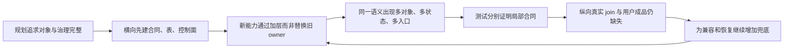

# 轻量个性化生成主干综合：偏差机制、候选方案与收缩边界

- 日期：2026-07-24
- 对应票据：`lpgs-07-synthesize-lightweight-spine-options`
- 性质：六份前置研究的决策综合，不是最终架构规格，不修改产品代码
- 审计基线：`main`，`HEAD=f2b8c3aadb89c96d43f84381c2c34c18dec51ab0`
- 工作区状态：`tracked_modified=20`、`untracked=28`
- 证据边界：结论代表上述 **dirty workspace**；HEAD 不包含全部当前实现与研究资产
- 外部检索：本综合没有新增外网研究；供应商、框架、交互、隐私的一手研究沿用 03–06 资产

## 1. 决策摘要

当前项目不是缺少架构，而是已经拥有多套局部正确、彼此没有收敛为唯一产品真相的架构：

- 新 Composer、服务端准入、不可变执行快照和文案到 `ContentPackage` 的结构已成立；
- `MarketingIdentity`、`StoreFact`、`ContextBundle`、Prompt、Provider attempt、OwnedAsset 和双账都有可复用基础；
- 图片、视频能进入供应商任务和资产托管路径，但当前公开 Composer 的异步结果没有可靠回到原 Harness、写入 `ContentPackage` 并统一任务终态；
- StoreProfile/StoreFact、三套 Prompt revision、多个任务状态、两套文案流和多种资产/反馈对象仍在竞争同一语义；
- 代码、测试和治理主要验证了横向合同是否存在，尚未证明“一句话/素材 → 个性化三模态成品 → 调整/复用”的纵向产品闭环。

因此，“个性化上下文编译”没有成为唯一主干，并不是因为 Context Compiler 不够复杂，而是因为项目长期采用了 **新增一层解决一个局部问题、旧层继续兼容、横向框架先于纵向闭环** 的演进方式。

本综合明确推荐 **方案 B：复用优先、边界受限的轻量主干**：

1. 保留现有 TypeScript、Zod/AI SDK、确定性 Context 编译、最小 Provider 证据、OwnedAsset、双账语义和 `ContentPackage` revision；
2. 把在线主链收缩为 `输入 → ContextSnapshot → 结构化指令 → GenerationTask → 同步/异步 adapter → OwnedAsset/文本 → ContentPackage → ResultSignal`；
3. 普通文案和首发同步图片走普通应用服务；DBOS 只允许用于异步视频和超出请求生命周期的长等待；
4. 同一任务只允许一种 durable 机制；不再让 DBOS、媒体 job、其他 queue/interval 同时拥有终态；
5. Langfuse 只做 Prompt 管理、异步 trace 和数据集，不进入在线可用性的关键路径；
6. 首发只实现真实需要的 capability，不建设万能 DSL、通用 Agent/graph 或全供应商控制平台；
7. 长期偏好激活 **deferred**：先闭合事件血缘、确认/撤销、删除不复活和评测门，再单独决定开放范围。

该推荐仍不是用户最终拍板。首发范围、领域对象命名、五阶段 Harness 去留、供应商数量、成品合同、插件边界和迁移顺序必须留给 `lpgs-08` 至 `lpgs-15` 逐项决定。

## 2. 证据索引与综合用途

后文使用 `E01`–`E06` 标记证据来源。

| ID | 前置资产 | 已证明的事实 | 本综合采用的决策输入 |
| --- | --- | --- | --- |
| E01 | [01 当前真实主链、代码规模与退役面](./01-current-flow-complexity-retirement-audit.md) | 文案结构闭环；媒体缺 terminal join；Work/Task/Package、DBOS/media job、双 stream 分叉；生产源码约 339,354 行、测试约 211,101 行 | 先闭合唯一运行真相，再迁移/删码；不能用仓库总行数或绿色 stub 测试证明产品完成 |
| E02 | [02 个性化上下文、资源与 Prompt 实现](./02-personalization-context-prompt-implementation-audit.md) | StoreProfile/StoreFact 双真相；Recipe Prompt 未绑定执行；媒体复用 copy Prompt；身份、反馈、dataClass、媒体血缘不完整 | 一个事实 owner、一个 Prompt binding、三模态独立 Prompt、确定性身份/权利/dataClass 门 |
| E03 | [03 供应商 API 与最小适配合同](./03-supplier-api-adapter-contract-research.md) | 同步/异步、素材角色、取消、进度、成本、TTL 不可伪统一；接单三态、receipt、ProviderAttempt、OwnedAsset、双账值得保留 | 小公共内核、同步/异步双端口、能力按部署版本表达、托管完成后才可进入产品成功 |
| E04 | [04 Prompt Compiler 与 Harness 模式](./04-lightweight-harness-prompt-compiler-research.md) | 现有 TS/AI SDK/Zod/DBOS/Langfuse/promptfoo 基础足够；只需薄 PromptBinding/CompilationReceipt；新 graph/Agent/Temporal 重叠 | Compiler 是纯编译边界；DBOS 限权；receipt 是附着于 task/attempt 的小投影，不是新聚合 |
| E05 | [05 小白创作 UX 与质量闭环](./05-novice-creation-ux-quality-loop-research.md) | 一句话、示例、素材应汇入业务 Brief；最多一个普通阻塞问题；一个主推荐；编辑/重做/采用含义不同 | 小白只看可检查 Brief 和成品；高风险事实不得默认；反馈先做精确事件，不静默长期化 |
| E06 | [06 上下文记忆、隐私与评测边界](./06-context-memory-privacy-evaluation-research.md) | 六类数据边界、来源/作用域/版本/期限/权利、撤权/删除不复活、32 例与八项零容忍 | 六类是逻辑分类而非万能表；确定性筛选优先；偏好 fail-closed；删除与评测不能因轻量化取消 |

### 2.1 综合时裁决的四个表面矛盾

1. **“媒体已接 Provider”不等于“媒体产品闭环”。** E02 证明素材和请求可进入 Provider；E03 证明 Worker 可得到并托管结果；E01 证明当前缺少回装 `ContentPackage` 和统一任务终态的 join。产品完成条件必须是：

   `provider terminal → OwnedAsset custody → result assembly → ContentPackage revision → GenerationTask terminal`

2. **“使用 DBOS”不等于“长任务可靠”。** E04 证明 DBOS 具备恢复能力；E01 证明当前 DBOS Harness 和媒体 job 没有收敛。是否保留 DBOS必须由故障测试，而不是依赖名决定。
3. **Preference inactive 同时是能力缺口和正确安全状态。** E02 说明反馈没有改善下一任务；E06 说明在确认、撤销、评测和删除未闭合前，保持 inactive 是正确的 fail-closed。结论是 deferred，不是直接激活。
4. **轻量 adapter 与可靠供应证据并不冲突。** E01 支持 fixed provider + 小 adapter；E03 证明接单不确定性、Route/Attempt、资产托管和双账不能删除。应收缩控制面，不删除可靠性语义。

## 3. 偏差是怎样形成的



### 3.1 形成机制，而不只是症状

| 形成机制 | 代码/产品表现 | 影响 | 证据 |
| --- | --- | --- | --- |
| 概念完整度先于纵向闭环 | Context、Recipe、Harness、Model Supply、Package、治理均先成体系，媒体 terminal join 仍缺失 | “结构很多”但用户拿不到完整三模态成品 | E01、E02 |
| 替换采用叠加而非退役 | legacy/P1 ProductService、旧/new copy stream、旧/新入口和测试叙事并存 | 每次改动跨更多层，状态与恢复难以推理 | E01 |
| 把三模态相似性误当生命周期同构 | 文案、图片、视频复用五阶段和 copy Brief；同步图片与异步视频被同一媒体形态处理 | 产生假 task、假 cancel、pending 被当 failure、Prompt 串模态 | E01、E02、E03 |
| 把“有 schema/表/测试”当成“被主路使用” | Recipe Prompt、Preference、历史复用、媒体 lineage 都有结构但未进入正式 UI/执行 | 产品完成度被高估，测试和运行事实分离 | E01、E02 |
| 控制面前置 | 大型 supply/admin/governance/integration 在主进程装配，首发主链只需少数 provider | 启动、依赖、排障和权限面膨胀 | E01、E03 |
| 兼容没有退出条件 | 410 handler、cutover service、旧 stream 和未挂载 UI 长期作为“保险” | 旧路径永不死亡，测试继续监听旧语义 | E01 |
| 可用性兜底掩盖事实缺口 | 盲选第一身份、默认 public、浮动 Prompt/fallback、Package 版本覆盖任务状态 | 产生看似成功但不可解释或不合规的结果 | E01、E02、E04 |
| 反馈对象先分散、学习规则后补 | Result local state、Harness decision、Package audit、PreferenceSignal 并行 | 采用/编辑不能精确改善下一次，错误学习风险反而上升 | E02、E05、E06 |

核心因果结论：

> 行数多不是因为“生图、生视频、客户管理天然需要几十万行”，而是因为项目同时承担了生成产品、供应平台、迁移兼容、治理平台、专业编辑器和运营集成，并且新旧 owner 没有按垂直闭环完成后退出。E01 的规模审计也证明，最大文件集中在 Operations、ModelSupply、Integrations、legacy Product 和管理控制面，而不是 Composer 本身。

## 4. 推荐的唯一产品真相

推荐主干只保留下面一条可解释路径：

```text
UserIntent + explicit selections/assets
  -> ContextAssembler
  -> immutable ContextSnapshot
  -> PromptCompiler
  -> CompiledGenerationInstruction + CompilationReceipt
  -> GenerationTask
  -> sync adapter OR async video adapter
  -> normalized text / OwnedAsset
  -> ContentPackage revision
  -> ResultSignal
  -> evaluation dataset / optional preference candidate
```

### 4.1 四个唯一 owner

1. **`GenerationTask` 是执行真相。** 接单、运行、等待、失败、取消、资产摄取和终态只能由它投影；Work、CreativeJob、DBOS workflow、provider task 都是内部引用或读模型。
2. **`ContentPackage` 是唯一用户可见成品真相。** 文案、图片、视频保留模态差异，但只通过同一 revision/lineage/采用语义展示；是否改名或进一步收缩由 `lpgs-12` 决定。
3. **`ResultSignal` 是唯一反馈入口。** 保留 adopt/export/publish/edit/regenerate/reject/save 等原始动作，评测层再派生 adopted/edited/regenerated/rejected 四类；不建第五套反馈域。
4. **`ContextSnapshot + CompilationReceipt` 是一次生成的唯一编译血缘。** Receipt 只保存 Prompt/schema/context projection/dataClass/rights/instruction hash 等小投影，附着于 task/attempt；不成为可独立编辑的新聚合。

### 4.2 不新造万能领域模型

- E06 的六类记忆是 **逻辑分类与解析规则**，可以继续落在身份、事实、素材、任务、偏好和反馈各自仓储；不实现一个 `ContextMemoryRecord` 万能表。
- `ContextSnapshot` 只包含本任务需要的最小投影和 record/revision 引用，不复制完整历史聊天。
- `PromptBinding` 保存不可变版本/hash；若为恢复短期保存完整编译输入，必须加密、限期、分权并纳入删除合同。
- capability 只表达首发真实差异，例如一个同步 LLM、一个同步图片、一个异步视频所需的输入角色、结果交付和取消语义；不做任意参数 DSL。
- ProductUsage 与 ProviderCost 的 **双账语义保留**，但供应商池、BYOK、复杂路由治理和后台控制面不自动进入在线主干。

## 5. 三套足够不同的候选

下表的数字是后续 `lpgs-14` 应验证的 **目标预算**，不是当前仓库实测结果。运行角色按可独立部署的角色类型计，不按副本数；状态存储按在线关键数据系统计，不把同一 PostgreSQL 的不同 schema 重复计数。

| 维度 | A. 固定供应商极简 | B. 复用优先、边界受限（推荐） | C. 平台路线 |
| --- | --- | --- | --- |
| 产品主张 | 首发每模态固定一个 provider，直接完成生成 | 复用可靠资产，但所有通用能力有硬上限 | 保留多 provider、五阶段 Harness、完整控制/治理平台 |
| 首发完整度 | 文案、同步图片完整；视频用单一异步执行 | 文案、图片、视频、恢复、证据、成品与反馈均可闭合 | 功能面最宽，但主链仍需先修 |
| 运行角色预算 | 无视频 2；含视频最多 3：Web/BFF、Core、video worker | 最多 3：Web/BFF、Core、唯一 durable worker | 4–6：在线 API、多个 worker/control/observability 角色 |
| 在线状态存储预算 | 2：PostgreSQL + object storage | 2：PostgreSQL + object storage | 允许 2–4；完整观测/控制面可能自带额外状态系统 |
| 在线关键依赖 | 现有 TS/Zod/AI SDK；视频可选唯一 durable engine；0 个新框架 | 现有 TS/Zod/AI SDK + 1 个 durable engine；Langfuse 异步出站；0 个新框架 | 3 个以上编排/控制/观测家族，接受较高升级与运维成本 |
| 持久 owner/核心对象预算 | 最多 8 个 | 最多 10 个；receipt/route 是投影，不计新聚合 | 14 个以上，保留 Work/Task/Package/Workflow/Job/Control 等多层 |
| 产品状态机预算 | 最多 2：GenerationTask、Package revision/adoption | 最多 2；provider 原生状态只作为 Attempt 证据 | 4–6 个状态 owner，继续承担跨状态对账 |
| durable 机制 | 恰好 1 或 0；不得并存 | 恰好 1，只服务异步视频/长等待 | 可能并存 DBOS、job runtime、回调/轮询协调器 |
| 迁移共存预算 | 0 双写；每次最多 1 个只读兼容适配器；按模态硬切 | 0 双写；最多 2 个只读兼容适配器；入口和结果各只有 1 个 writer | 接受 3 条以上路径长期共存，退役收益不确定 |
| 迁移风险 | 最高的供应商锁定；最低的模型/运行复杂度 | 中等；需切单一状态、媒体 join 和模块依赖 | 表面迁移最小，实际长期修复与维护风险最高 |
| 代码规模方向 | 最小，但会放弃大部分供应平台能力 | 明确下降；不先承诺比例，以依赖图和 owner 数验收 | 主要修正确性，生产代码规模不会显著收缩 |
| 适用条件 | 用户接受固定 provider、有限后台和较弱 failover | 既要三模态可靠，又明确不做平台化 | 业务目标就是供应/Agent/治理平台，而非轻量内容副驾 |

### 5.1 方案 A：固定供应商极简

优点：

- 最少路由、Catalog、capability 和后台；
- 可以最快验证个性化 Prompt 与用户成品是否真正创造价值；
- 失败边界清晰，代码预算最容易约束。

代价：

- provider 故障或成本变化时切换依赖发版；
- 审计/成本仍要保留，但不提供运营可配置的多供应商治理；
- 如果首发必须包含异步视频，仍需要一个可靠 durable 机制，不能完全退化为同步请求。

它不是“删掉所有供应证据”。接单三态、ProviderAttempt、OwnedAsset custody 和双账仍是正确性底座。[E03]

### 5.2 方案 B：复用优先、边界受限（推荐）

该方案保留已付出且能直接保护用户价值的部分，但不保留它们当前的无限扩张权：

- Composer/准入继续存在，但只写一个 `GenerationTask`；
- Context 编译继续使用现有确定性骨架，修正 StoreProfile/StoreFact owner、身份选择、dataClass 与权利；
- Prompt Compiler 使用纯 TypeScript + Zod/AI SDK；三模态 Prompt 分开；
- 首发 adapter 只覆盖已选 provider 的真实 capability；RouteSnapshot 只保留能力、数据、价格和 binding revision；
- 文案和同步图片不进入 durable workflow；
- DBOS 只服务异步视频和真正的长等待；
- 成功必须越过资产托管、Package revision 和 task terminal 三道边界；
- Langfuse registry 通过发布/同步生成本地不可变 Prompt artifact，在线读取本地已发布版本；trace 经 outbox 异步发送，Langfuse 故障不阻断生成。

选择 B 的理由：

1. 相比 A，它保留视频恢复、供应证据和小范围可替换性；
2. 相比 C，它删除“平台完整性”作为首发前提；
3. 它复用 E01–E04 已证实的正确结构，不要求重写为新框架；
4. 它能直接承载 E05 的小白旅程和 E06 的隐私/删除边界。

### 5.3 方案 C：平台路线

该方案修媒体 join、Prompt binding 和反馈，但继续保留五阶段 Harness、多 provider 路由、重控制面、完整治理、专业画布与集成边界。

它不是错误架构；如果目标是“AI 供应与内容运营平台”，它有合理性。但它与本地图的“轻量个性化生成主干”目的地冲突：

- 主要复杂度不会退出主进程依赖图；
- 仍需维护多状态、多后台和多兼容路径；
- 用户价值验证继续被平台建设拖慢。

因此 C 只应作为反事实基线，或用户明确改回平台产品定位时选择。

## 6. DBOS 的保留门，不是默认保留

推荐 B 选择 DBOS 作为 **唯一** durable 机制，但仅限异步视频和长等待。它必须通过以下六类故障测试：

1. 重复提交和进程崩溃不会重复调用供应商或重复扣费；
2. 供应商可能已接单但响应丢失时进入 `acceptance_unknown`，不得盲重提；
3. receipt 已持久化后崩溃，重启可继续 observe/fetch；
4. callback/轮询重复、乱序或漏投最终收敛到同一终态；
5. 用户取消后供应商晚成功，资产、任务和 ProviderCost 能正确对账；
6. 供应商成功但资产下载/托管失败时可恢复，且产品不误报完成。

若 DBOS 不能通过，允许后续选择另一种 durable 机制；不允许同时保留两种机制“互相兜底”。E01 已证明当前最大问题正是 Harness 与 media job 都存在但没有 join。

## 7. 保留、收缩、插件化、冻结与退役

| 分类 | 能力/对象 | 边界 |
| --- | --- | --- |
| **保留** | Composer 的自然语言/素材入口与服务端准入 | 保留一个入口和一个提交合同 |
| **保留** | MarketingIdentity、有效事实、素材 rights、source revision | 合并事实 owner，授权成为确定性门 |
| **保留** | Context 编译、hash、freeze、revision fence | 只编译本任务最小投影 |
| **保留** | Zod/AI SDK structured output | 不因 typed output 再引入 DSL/runtime |
| **保留** | acceptance 三态、ProviderAttempt、OwnedAsset custody | 缩小字段暴露，保留原生证据 |
| **保留** | ProductUsage / ProviderCost 双账语义 | 账本可在内部，不要求重后台 |
| **保留** | ContentPackage revision sole writer、历史/任务可找回 | 收敛为唯一用户成品，不再由多个状态猜成功 |
| **保留** | promptfoo/Vitest 与隐私/权利红线测试 | 重建为真实主入口和最终可见结果的门 |
| **收缩** | CreationExecutionSnapshot | 改为产品字段和精确 context/prompt binding；供应商运行细节下沉 |
| **收缩** | Recipe/Surface/Lens | 只保留用户可理解的技能、模态、交付预设；不做通用配置平台 |
| **收缩** | 五阶段 Harness | 收缩为 context/compile、generate、normalize/deliver；Question 仅在真实阻塞时出现 |
| **收缩** | Catalog/RouteSnapshot | 只保留首发 capability、数据策略、价格和 provider binding revision |
| **收缩** | Work/Task/Package | 一个 GenerationTask + 一个 ContentPackage；其余只读投影迁移后删除 |
| **收缩** | Result Center | 一个进度通道、一个成品版本、一个反馈入口 |
| **插件化** | Pro Studio/Canvas | 只通过 Package/OwnedAsset 合同接入 |
| **插件化** | composed-video 高级分镜/编辑 | 不作为基础 `video.generate` 的隐式依赖 |
| **插件化** | CRM/线索、自动发布、integrations | 独立部署、权限和数据 owner；不在首发主链启动 |
| **插件化** | 多供应商/BYOK/供应池/运营后台 | 控制面不进入在线 data plane |
| **冻结** | legacy ProductService、旧 copy stream、未挂载入口 | 停止新增，先统计消费者和在途数据 |
| **冻结** | 新 provider、新 Recipe DSL、新 agent/graph、向量记忆/知识图谱 | 真实主链和评测未闭合前不投入 |
| **冻结** | 长期 Preference 激活 | 事件、确认、撤销、不复活和离线门完成后再决定 |
| **退役候选** | 410 handler、重复 Web/Core schema、旧 E2E 叙事 | 有替代门禁且调用遥测归零后删除 |
| **退役候选** | CreativeJob copy stream、CreationShelf、VideoWorkflowLauncher | 确认无真实入口/深链消费者后删除 |
| **退役候选** | legacy/P1 双 ProductService、旧状态 writers | 消费者、数据和 in-flight task 迁移后删除 |
| **退役候选** | recorded adapter 的生产语义 | 仅保留为 fixture，不得作为 live proof |

**插件化只有在模块从主进程 import/boot、依赖注入、数据库迁移、权限和故障域中移除，主链只保留稳定合同后才算减负。** 仅隐藏菜单、加 feature flag 或换目录不算插件化。

## 8. 不必要的兜底行为

| 兜底 | 为什么有害 | 处理 |
| --- | --- | --- |
| 无选择时取第一条 active identity | 多身份结果不确定，授权/场景可能错误 | 必须显式选择或唯一可证明默认 |
| StoreProfile 已确认就假设 StoreFact 已进入 Prompt | UI 可提交与执行事实脱节 | 一个事实 owner；缺失时显示/追问，不猜 |
| `dataClass=[]` 再解释为 public | 身份、人脸、医疗/顾客素材可能被错误路由 | 服务端按实际输入派生并 fail closed |
| Recipe 保存 Prompt ref，但运行取浮动 production label | 同一任务无法精确回放 | 提交时冻结本地已发布 Prompt version/hash |
| Langfuse 不可用就静默换不明 builtin Prompt | 结果语义和审计发生漂移 | 本地 immutable artifact 是正式部署物；无合法版本则失败 |
| 媒体复用 copy Prompt 或 hardcoded instructions | 模态语义和评测错位 | copy/image/video 独立 Prompt identity |
| capability 缺失就假定 compatible/structured output 可用 | 供应商差异被运行时 400 才发现 | 未声明组合在上游调用前拒绝 |
| 默认配置多供应商自动 fallback 链 | 质量、价格、数据策略和接单语义可能在用户不知情时改变 | 首发每模态固定一个已验证 binding；是否增加单个 fallback 留给 `lpgs-11` |
| 给同步 provider 伪造 task/cancel，给无进度 provider 伪造百分比 | UI 承诺虚假能力 | stage 必有，fraction/cancel 仅在观测事实存在时提供 |
| 默认生成三候选再用 LLM 评分 | 增加调用、成本、延迟、状态和评测面，却把模型不确定性转成用户不需要的内部选稿 | 首轮只生成一个可判断的主推荐；备选和再生成按用户动作触发 |
| `ContentPackage` 出现版本就覆盖所有任务状态为成功 | Work/Task/job 可永久悬挂 | terminal observer 原子投影 task + package |
| `MEDIA_RECONCILIATION_PENDING` 当 terminal failure，再期待其他 worker 补救 | 两套 owner 不会自动 join | 一个 durable owner 完成 observe→assemble |
| 旧/new 双写、双 stream 长期保留为保险 | 状态漂移、测试面和迁移永不结束 | 只读兼容 + 明确退出条件；禁止长期双写 |
| fixture/recorded success 作为生产兜底 | 只能证明合同，不证明 provider/worker/live chain | 测试层显式分级，生产模式禁止启用 |
| 单次 edit/retry 自动写长期偏好 | 会把临时需求、事实错误变成永久记忆 | 只形成事件；候选确认后仍保持 deferred |
| 检索不到事实时用模型知识补价格、身份、权利 | 真实性和合规不可接受 | `unknown/needs_confirmation` 或降低交付 |

## 9. 不够优雅的框架与实施方式

1. **固定五阶段被当成三模态共同生命周期。** 五个语义名可以保留为观测标签，但不应强制同步文案、同步图片和异步视频共享相同步骤与异常语义。[E01][E03]
2. **DBOS Harness 与 durable media job 双层耐久。** 两者都能持久化，却没有一个 terminal owner；这是“框架存在但可靠性缺失”的典型。[E01][E04]
3. **三套 Prompt revision。** Recipe ref、Langfuse frozen prompt、schema revision 没有一个可执行 binding，且媒体拿到 copy Prompt。[E02]
4. **StoreProfile/StoreFact、Work/Task/CreativeJob/Package、多种 OwnedAsset 与反馈对象重复。** 对象不是多就更严谨；没有 owner 规则时只是扩大写入与迁移面。[E01][E02]
5. **Langfuse 在线解析 + builtin fallback。** Prompt registry 与 trace 不应决定在线可用性；应在发布时同步不可变 artifact，在线只读本地版本。[E04]
6. **通用 control plane 与在线生成主进程强绑定。** Catalog/admin/supply pool/integration 即使用户未使用也参与 boot、配置、权限和故障域。[E01][E03]
7. **巨大 application service 和并行 transport schema。** 领域边界集中在少数大文件，Web/Core 又复制 DTO，导致任何小改动都跨层。[E01][E02]
8. **静态/fixture/E2E 证明层混用。** 旧入口 E2E、recording starter 和 `completedResult()` 能绿，但不能证明真实数据库、worker、provider 和最终用户成品。[E01]
9. **把六类记忆做成万能表或先上知识图谱。** 会重新制造一个通用平台，弱化来源、权利、删除和各领域 owner。[E06]
10. **再引入 LangGraph/Mastra/Temporal/BAML 全链。** 当前问题是 binding、join 和 owner，不是缺少 graph/DSL；新 runtime 只会复制状态和观测。[E04]

## 10. 可删除复杂度与删除顺序

### 10.1 可在替代门禁建立后优先删除

- Web/Core 重复 Composer transport schema，改由共享 contract 生成/导入；
- 仍宣称 `CreationShelf` 是主入口的 E2E 和静态叙事；
- recorded adapter 的任何生产注册，只保留 conformance fixture；
- 已有明确替代且遥测归零的 410 handler/parser/专属测试。

### 10.2 主链闭合后可删除

- 旧 CreativeJob copy stream 和结果页双 stream 合并逻辑；
- media pending 抛错后依赖另一 worker“可能完成”的分叉路径；
- Work/Task/Package 的重复 terminal writers 和 UI 猜测逻辑；
- 五阶段 Harness 中仅为强制阶段对称而存在、没有独立业务不变量的 wrapper。

### 10.3 消费者与数据迁移后可删除

- legacy/P1 `ProductService` 双装配与 cutover；
- 旧 `/state`、`/commands` 消费路径；
- 未挂载 `CreationShelf`、`VideoWorkflowLauncher`；
- 从主进程拆出的 CRM、publishing、integrations、Pro Studio 和 supply control wiring；
- 已完成且不再承担运行回滚的数据迁移/兼容代码。

### 10.4 不应作为主要瘦身目标

- 保护身份、授权、租户隔离、删除和成本对账的边界；
- 覆盖真实主入口、异步恢复和最终可见结果的测试；
- 不可变数据迁移记录；
- 仅占仓库体积、但不进入运行依赖图的 research/evidence/history。

本综合不承诺删码比例或工期。E01 的 339,354 行生产源码和 211,101 行测试只是当前 dirty workspace 的分类基线；实际预算必须按运行依赖、writer、状态机、部署角色和消费者迁移验收，而不是以“删了多少 Markdown/截图/测试”衡量。

## 11. 推荐迁移顺序

1. **先冻结扩张。** 停止给 legacy、重控制面、未挂载 UI、新 provider 和长期偏好增加能力。
2. **建立唯一合同。** 锁定 GenerationTask、Context/Prompt binding、ContentPackage 和 ResultSignal；共享 transport DTO。
3. **先修文案真相。** Store fact owner、身份选择、三模态 Prompt、dataClass、最终可见红线走同一 compiler/receipt。
4. **闭合一个同步图片路径。** 真实 provider、OwnedAsset custody、Package revision、task terminal 全部通过。
5. **闭合一个异步视频路径。** 只用 DBOS 或唯一替代机制，通过六类故障测试。
6. **切单一状态和 stream。** UI、history、async task center 全部读取同一 task/package projection。
7. **建立反馈但不激活偏好。** 先收敛 ResultSignal、固定评测集、撤销和删除不复活。
8. **按真实消费者插件化/退役。** 先断主进程依赖，再删 route、service、migration compatibility 和测试。

每一步的退出条件应是可运行的垂直证据，不是“相关类、表或测试文件已经存在”。

## 12. 用户仍需逐项拍板

本票只推荐方向，以下项目必须在后续票据逐项确认：

| 后续票据 | 用户需要决定 |
| --- | --- |
| `lpgs-08` | 首发是否必须同时含文案、同步图片、异步视频；CRM、发布、Pro Studio、供应后台各自保留/插件化/冻结/退役 |
| `lpgs-09` | StoreProfile/StoreFact 的最终 owner；最少领域对象和术语；六类逻辑数据如何落到现有实体；删除/撤权范围 |
| `lpgs-10` | 五阶段仅作观测标签还是保留执行结构；DBOS 是否通过保留门；Prompt artifact 发布/缓存/恢复策略 |
| `lpgs-11` | 每模态首发 provider 数、真实 capability、是否允许一个已验证 fallback、Route/Attempt/双账最小字段 |
| `lpgs-12` | `ContentPackage` 保留/改名/收缩；草稿、采用、导出与版本语义；ResultSignal 原始动作集合 |
| `lpgs-13` | Brief 可见字段、最多一个问题的例外、一个主推荐与备选展示、失败/等待/费用 UX |
| `lpgs-14` | 最终进程/角色、模块、对象、状态机、公共 seam 和代码预算；插件是否真的退出依赖图 |
| `lpgs-15` | 数据迁移、按模态切换、兼容读取窗口、回滚、消费者遥测、工期和每批退出条件 |

另外仍需产品、法律和供应商共同确定：

- 数据保留天数、备份清理窗口、删除 SLA；
- 供应商输入/输出/日志保留、训练使用、子处理方和跨境边界；
- 已公开历史内容在人员离开、主体撤权和平台不可撤回时如何处置；
- 长期偏好首发保持完全 inactive，还是只开放少量低风险表达字段。

## 13. 最终裁定

最值得保留的不是当前所有框架，而是其中已经能保护用户价值的语义：服务端事实准入、不可变 Context、精确 Prompt/schema binding、供应接单证据、资产托管、双账、唯一成品 revision、反馈与删除血缘。

最应收缩的不是安全和测试，而是重复 owner、横向控制面、强制阶段对称、在线 Prompt 依赖、长期兼容和未进入用户主路的专业能力。

因此建议把方案 B 作为 `lpgs-08` 之后的讨论基线：

> **复用现有可靠资产，但只保留一条产品主干、一个执行真相、一个成品真相、一个反馈入口、一套编译血缘和一种 durable 机制；所有额外能力必须证明用户价值，并真正退出主进程依赖图后才能称为插件。**

在用户逐项拍板前，不应开始不可逆删码、数据迁移、长期偏好激活或新框架引入。
