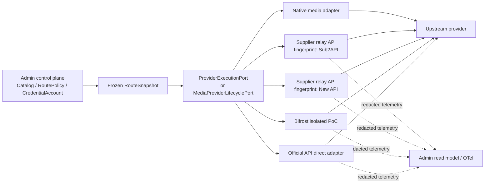

# 多模型网关、路由与观测组件选型边界

> 研究快照：2026-07-19
>
> 适用决策：D-058「模型、交易方、执行渠道与部署分层」、D-059「版本化路由策略 + 运行时健康护栏」、D-060「独立 Credential Account + 写入式密钥版本」
>
> 精确仓库补充：[QuantumNous/new-api](https://github.com/QuantumNous/new-api)、[Wei-Shaw/sub2api](https://github.com/Wei-Shaw/sub2api)

## 结论先行

本项目不应整体采用任何外部 AI Gateway 作为供应商管理中枢。外部组件只能是可替换的 `ExecutionChannel`、隔离的数据面 PoC，或非关键路径的脱敏观测出口；Product Core 继续持有模型供应链、路由、接受态、DBOS 任务、凭据元数据、产品权益、供应商成本和审计真相。

| 候选 | 本项目结论 | 可以吸收 | 不交给它 |
| --- | --- | --- | --- |
| Bifrost | **只借鉴控制面/数据模型，并继续一个隔离的数据面 PoC**；四个通用候选中的第一顺位 | Provider/Key 配置、虚拟 Key、预算护栏、标准遥测、统一同步推理入口 | 多节点 HA、跨 Deployment 路由、接受态、媒体任务、账本、密钥真相 |
| LiteLLM | **只借鉴控制面/数据模型，可保留为对照 PoC** | 广泛 Provider 适配、路由配置、预算层级、OpenTelemetry | 产品目录、路由发布、成本结算、DBOS 任务、媒体生命周期 |
| Portkey Gateway | **只借鉴配置 DSL 和 Cloudflare-native 数据面思路；暂不进入生产主链** | 条件/回退/负载配置表达、Guardrail 插槽、Workers 部署形态 | Hosted/Enterprise 控制面、持久观测、预算、Vault、异步视频任务 |
| Helicone | **不采用为战略网关或控制面**；如有需要只做可拔除的异步脱敏观测 | 请求诊断、延迟/错误/成本估算分析 | 路由真相、Credits、Prompt、Rate Limit、供应商目录、媒体执行 |
| New API | **不是我方组件候选；作为上游供应商渠道的技术指纹管理** | 识别协议、路由、计费和 HA 风险，形成供应商准入字段 | 不自行部署，不把软件名当 Provider，不信任其内部额度/成本/模型映射 |
| Sub2API | **不是我方组件候选；作为上游供应商渠道的技术指纹管理** | 识别账号池、重试、协议和合规风险，形成供应商准入字段 | 不自行部署，不把软件名当“官方渠道”，不接管其内部账号或商业化 |

没有一个候选得到“整套采用”结论。若本轮只做一个新增验证，推荐继续现有 **Bifrost 隔离 PoC**，同时保留官方 API 直连作为基准和一键回滚目标。对使用 New API/Sub2API 的上游供应商，只登记真实运营商及其渠道，把框架版本作为技术指纹；不要由我方再部署一套，也不要拿 Bifrost/LiteLLM 再包一层。

## 研究方法与证据边界

- 按要求全程优先使用 Open CLI 定位和读取官方材料；本轮未使用 Web Search。
- 事实只取自官方仓库、许可证、发布记录、官方文档、官方 API 或项目当前代码；营销数字不等同于经过本项目验证的能力。
- “支持图片/视频/音频”只表示上游存在某个入口，不自动证明满足本项目 `submit/recover/poll/download/cancel`、接受态、幂等、资产托管和成本对账合同。
- 本文是组件选型证据，不替代法务意见、真实凭据探针、负载测试或上游合同。

## 本项目不可外移的所有权边界

当前代码并非空白网关项目，已形成需要保护的领域合同：

- `CatalogModel`、`ProviderProfileRevision`、`ExecutionChannelRevision`、`PublishedDeployment` 和 Catalog revision 已表达模型身份、交易方、渠道和部署；见 `apps/core/src/p1/model-supply/catalog.ts:56-140`。
- `RouteSnapshot` 已冻结 Catalog/Policy/Price/Credential/Provider/Channel/Endpoint/Fallback 信息；见 `apps/core/src/p1/model-supply/index.ts:294-356`。
- `ProviderAttempt` 明确区分 `rejected_before_accept`、`accepted`、`acceptance_unknown`；结果同时保留全部 attempts 与 provider costs；见 `apps/core/src/p1/model-supply/index.ts:358-367,565-586`。
- `ProviderExecutionPort` 是同步执行统一边界，`MediaProviderLifecyclePort` 则要求 `submit/recover/poll/download/cancel`；见 `apps/core/src/p1/model-supply/index.ts:679-722,745-787`。
- Product Core 已在 Foundation 账本结算产品用量与 ProviderCost，并区分平台付款和 strict BYOK；见 `apps/core/src/p1/model-supply/foundation-ledger.ts:246-285,328-356`。
- 当前 Bifrost/LiteLLM 实现被明确标为 recorded PoC、`productionDependency: false`，且不接管目录、Usage 或 Job；见 `apps/core/src/p1/model-supply/adapters.ts:2053-2092,2119-2123,2206-2257`。

因此组件边界固定如下：

| 真相或动作 | 唯一所有者 | 外部网关最多能做什么 |
| --- | --- | --- |
| 模型、交易方、渠道、Deployment 和能力目录 | Product Core Catalog | 返回可发现元数据，作为候选变更输入，不能自动发布 |
| RoutePolicy、硬约束、候选顺序、Fallback consent | Product Core | 对一个已冻结 Deployment 做传输，不再跨 Deployment 选路 |
| 接受态、幂等、DBOS replay、异步任务生命周期 | Product Core | 返回上游 task/request ID 和原始状态；不得隐藏重提 |
| CredentialAccount 元数据、版本、绑定和轮换 | Product Core + Secret Manager/KMS | 内部网关只获受控副本；外部供应商渠道只保存我方购买的渠道 Token，其内部上游凭据保持供应商不透明 |
| Product entitlement、额度和套餐 | Product Core | 仅可执行操作级安全限额，不能决定用户产品权限 |
| ProviderCost 和最终对账 | Product Core ledger | 返回 usage 与 `estimated_cost`；最终以实际合同交易方的账单/发票/结算导出为准 |
| 审计与可回放证据 | Product Core | 输出带 correlation ID 的脱敏 transport telemetry |
| Prompt/response 原文 | Product Core 数据策略 | 默认不得记录；逐数据类、逐用途显式开启 |



### 双重路由和双重重试是硬冲突

网关若在一个 Product Core attempt 内部自行 fallback、换 Key、换模型或换 Provider，Core 只会看到一个不完整的 attempt。其后果不是单纯“日志少一层”，而是：

1. Core 和网关各重试一次，实际调用次数与成本可能乘法放大。
2. Provider 已接受或接受状态未知时，网关可能静默重提，制造双任务、双扣费或双资产。
3. DBOS replay 无法判断副作用是否已经发生。
4. `RouteSnapshot` 记录的 Deployment 与实际交易方、凭据、价格和数据处理路径不一致。
5. 网关内部 cost/balance 看起来完整，却无法与每个真实 ProviderAttempt 对账。

生产默认必须关闭网关的 retry、fallback、模型别名漂移和跨 channel 负载均衡。若某个聚合渠道的核心价值就是池内调度，只能把整个池视为一个 opaque Deployment，并同时满足：仅对明确未接受的传输错误重试、固定上限、返回完整子尝试链、返回实际 account/channel/upstream request ID；否则 Core 将结果归为 `acceptance_unknown`，禁止再次跨渠道提交。

## 四个通用候选的事实矩阵

| 维度 | Bifrost | LiteLLM | Portkey Gateway | Helicone |
| --- | --- | --- | --- | --- |
| 开源许可 | Apache-2.0 core | 非 `enterprise/` MIT；Enterprise 专有，不能笼统称整仓 MIT | 稳定主分支 MIT；2.0 仍预发布 | 主平台 Apache-2.0；独立 Rust gateway 当前 GPL-3.0；Helm 另有 Commons Clause |
| 维护状态 | 2026-07 仍高活跃 | 2026-07 高活跃、高变更频率 | 稳定 OSS 最新版 2026-01、主分支最近提交 2026-05；企业 Helm 2026-07 仍活跃 | 2026-03 被 Mintlify 收购后进入 maintenance mode；Rust gateway 停在 2025 beta |
| 模态 | 文本/Responses、图像、TTS/STT，部分 Provider 视频 | Chat/Responses、图像/编辑、视频、Embedding、STT/TTS、Rerank 等 | 文本、Vision、Embedding、Image、Audio 等；稳定 OSS 未核实统一 `/v1/videos` | Registry 以文本/音频/图像为主，未见统一视频能力 |
| 路由/恢复 | Retry、fallback、加权 Key；adaptive LB 为 Enterprise | 多策略 router、retry/fallback/cooldown；多实例依赖 Redis | OSS 有 single/loadbalance/fallback/conditional/retry/timeout | 云端有最低价、同价 LB、手工 fallback；文档的 BYOK 优先级互相冲突 |
| 预算/密钥 | 层级预算、虚拟 Key；外部 Vault/KMS/轮换主要为 Enterprise | 丰富预算；外部 Secret Manager/KMS、轮换、RBAC/audit 主要为 Enterprise | 完整预算、KMS、Secret reference、组织治理主要在 Hosted/Enterprise | 简单请求/金额限额；成熟 Vault 证据不足 |
| 观测 | 内建日志、Prometheus/OTel；默认内容日志需主动关闭 | OTel v2、日志与成本估算；内容观测可关闭 | OSS 本地临时日志；持久分析/OTel 主要在 Hosted/Enterprise | 观测最强，但会引入托管数据路径或复杂自托管栈 |
| 生产部署 | Go gateway；SQLite 起步、PostgreSQL 生产；OSS 多节点存在明确限制 | Python gateway；管理能力需 PostgreSQL，HA/共享计数通常还需 Redis | OSS 可运行在 Node/Docker/Cloudflare Workers；Enterprise Hybrid 需私有镜像和数据栈 | All-in-one 仍需 PG/ClickHouse/MinIO；Kubernetes 依赖更多云资源 |
| 锁定风险 | 使用 Enterprise HA/Vault/adaptive LB 后升高 | Virtual Key、管理 DB、路由 DSL 和 Enterprise 特性形成中高锁定 | Hosted Model Catalog、Secret、Observability 和 Hybrid 私有镜像形成高锁定 | Hosted Gateway/Credits/Prompt/HQL 加维护模式，退出和演进风险都高 |

## 候选一：Bifrost

### 官方事实

- Core 为 [Apache-2.0](https://github.com/maximhq/bifrost/blob/dev/LICENSE)，官方仓库与插件在 2026-07 仍有提交/发布：[仓库](https://github.com/maximhq/bifrost)、[发布记录](https://github.com/maximhq/bifrost/releases)、[dev commits](https://github.com/maximhq/bifrost/commits/dev)。
- 官方 Provider 矩阵覆盖 OpenAI-compatible、Responses、图像/编辑、TTS/STT 和若干视频 Provider，但不同 operation 的 Provider 覆盖并不一致：[Supported providers](https://docs.getbifrost.ai/providers/supported-providers/overview)。未核实本项目 `audio.sfx` 的统一合同。
- OSS 支持自动 retry/fallback、加权 Key、Virtual Key、层级预算/限流和内建观测：[Fallbacks](https://docs.getbifrost.ai/features/fallbacks)、[Key management](https://docs.getbifrost.ai/features/keys-management)、[Budgets](https://docs.getbifrost.ai/features/governance/budget-and-limits)、[Observability](https://docs.getbifrost.ai/features/observability/default)。
- 默认 `max_retries=0`，对本项目反而是安全起点；启用 fallback 后仍必须重新验证接受态语义。
- 可用 SQLite 快速启动，生产配置使用 PostgreSQL；官方明确指出 OSS 多节点即使连接 PostgreSQL，也不能同步全部进程内关键状态。集群同步/HA 为 Enterprise：[Configuration](https://docs.getbifrost.ai/deployment-guides/config-json)、[Enterprise clustering](https://docs.getbifrost.ai/enterprise/clustering)。
- Adaptive load balancing、外部 AWS/GCP/HashiCorp Vault、企业集群和部分治理属于 Enterprise：[Adaptive load balancing](https://docs.getbifrost.ai/enterprise/adaptive-load-balancing)、[Secret management](https://docs.getbifrost.ai/deployment-guides/config-json/secret-management)。
- 内建日志会记录完整 prompt/response，生产必须设置 `disable_content_logging`，只输出脱敏属性和 OTel/Prometheus 指标。

### 项目判断

Bifrost 是最适合继续现有 PoC 的候选，原因不是“功能最多”，而是：Apache core、Go 数据面、当前项目已经预留 `bifrost` channel，迁移边界最小。它仍不能直接成为生产依赖：OSS HA 限制与 Enterprise Vault/集群锁定，意味着一旦把路由、预算和密钥真相迁进去，退出成本会快速上升。

建议采用方式：

- 只选一个低敏、同步文本 Deployment 做隔离 PoC。
- `max_retries=0`，不配置 fallback/adaptive routing；每个请求由 Core 固定 model、Deployment 和 credential version。
- 关闭内容日志，透传 correlation ID，输出 deployment/key alias/upstream request ID/usage/status。
- Bifrost budget 只作为实例级安全保险丝，不作为套餐、产品额度或成本账本。
- 保留 direct adapter，网关升级或异常时通过 Catalog revision 回滚，不在请求内静默旁路。
- 在 HA、版本滚动、状态一致性和完整 attempt evidence 通过前，维持 `productionDependency: false`。

## 候选二：LiteLLM

### 官方事实

- `v1.93.0` 中非 `enterprise/` 代码使用 [MIT](https://github.com/BerriAI/litellm/blob/v1.93.0/LICENSE)，`enterprise/` 使用[专有许可证](https://github.com/BerriAI/litellm/blob/v1.93.0/enterprise/LICENSE.md)；应描述为复合许可边界。
- 2026-07-19 发布 `v1.93.0`，项目高活跃也高变更；官方仅支持最新四个 minor line、按周发布 minor，没有 LTS 承诺：[Releases](https://github.com/BerriAI/litellm/releases)、[Production deployment](https://docs.litellm.ai/docs/proxy/prod)。生产必须固定版本和镜像 digest。
- `v1.93.0` 官方 model cost map 包含数千条路由，覆盖 Chat/Responses、图像/编辑、视频、Embedding、STT、TTS、Rerank 和 Moderation：[Model cost map](https://github.com/BerriAI/litellm/blob/v1.93.0/model_prices_and_context_window.json)。这只是 Catalog 覆盖，不等于协议完全一致。
- Router 支持 deployment pool、retry/fallback/cooldown/timeout，以及 shuffle、least-busy、latency、cost、usage 等策略；多实例共享状态需 Redis：[Load balancing](https://docs.litellm.ai/docs/proxy/load_balancing)、[Reliability](https://docs.litellm.ai/docs/proxy/reliability)。
- Budget 可按 global/key/user/team/member/provider/deployment/model 管理；Key/user/team 和 spend 管理依赖 PostgreSQL，严格的跨实例计数通常还需 Redis：[Users and budgets](https://docs.litellm.ai/docs/proxy/users)、[Provider budget routing](https://docs.litellm.ai/docs/proxy/provider_budget_routing)。
- Cost 由 LiteLLM pricing map 与 usage 估算，不是 Provider 最终账单：[Cost tracking](https://docs.litellm.ai/docs/proxy/cost_tracking)。
- OSS 可从环境变量取 Key，也可把加密 credential 放入 PostgreSQL；外部 Secret Manager/KMS、自动轮换、审计、RBAC/SSO 主要为 Enterprise：[Secrets](https://docs.litellm.ai/docs/secret)、[Encryption FAQ](https://docs.litellm.ai/docs/proxy/security_encryption_faq)、[Enterprise](https://docs.litellm.ai/docs/enterprise)。
- OTel v2 可观察 HTTP/auth/guardrail/LLM/PostgreSQL/Redis，prompt/response 默认可以关闭：[OpenTelemetry v2](https://docs.litellm.ai/docs/observability/opentelemetry_v2)。
- 单容器 YAML 可快速起步；完整管理与 HA 需要 Python gateway、PostgreSQL、Redis、迁移 Job、负载均衡和至少两个实例，不是 Cloudflare Worker 原生数据面：[Docker quick start](https://docs.litellm.ai/docs/proxy/docker_quick_start)、[Deployment](https://docs.litellm.ai/docs/proxy/deploy)。

### 项目判断

LiteLLM 的 Provider 适配与预算模型最值得借鉴，但整体部署重量、版本节奏、复合许可与 Enterprise 边界都高于当前需要。现有代码已经把它定义为 Bifrost 的 control PoC，继续保持即可。

建议采用方式：只保留固定 Deployment、零 retry/zero fallback 的对照探针；不要接入 Virtual Key、用户/团队、Product Budget 或管理数据库，不让 LiteLLM 成为新的组织、权益和凭据控制面。只有当某个官方 Provider 适配能显著减少自建维护，并且在真实协议 conformance 中胜过 direct adapter 时，才逐个 operation 晋级。

## 候选三：Portkey Gateway

### 官方事实

- 稳定主分支为 [MIT](https://github.com/Portkey-AI/gateway/blob/main/LICENSE)。最新稳定版为 [`v1.15.2`（2026-01-12）](https://github.com/Portkey-AI/gateway/releases/tag/v1.15.2)，主分支最近可核实提交为 [2026-05-25](https://github.com/Portkey-AI/gateway/commit/669825cbe89ee51569918b8f78a9db486fd69dd4)；企业 Helm 仓库在 2026-07 仍活跃。OSS 未废弃，但稳定网关节奏已慢于企业产品。
- Gateway 2.0 仍是 pre-release 合并期，没有稳定 tag 和与稳定主分支等价的许可/兼容承诺，不应作为当前生产基线：[Gateway repository](https://github.com/Portkey-AI/gateway)。
- 稳定 OSS 已包含 Chat Completions、Responses、Messages、Embeddings、Image、Audio、Files、Batch、Fine-tune、Realtime 等数据面路由，并有 `single/loadbalance/fallback/conditional/retry/timeout/cache/weight/guardrail` 配置：[Gateway entry](https://github.com/Portkey-AI/gateway/blob/main/src/index.ts)、[Config schema](https://github.com/Portkey-AI/gateway/blob/main/src/middlewares/requestValidator/schema/config.ts)。
- Fallback 默认可对非 2xx 触发，且可组合嵌套路由；这与本项目“只有 `rejected_before_accept` 才能跨渠道回退”的合同直接冲突：[Fallbacks](https://docs.portkey.ai/docs/product/ai-gateway/fallbacks)。
- Load balancing 支持 Provider/model/key 权重与 sticky；跨实例 sticky 依赖 Redis：[Load balancing](https://docs.portkey.ai/docs/product/ai-gateway/load-balancing)。
- OSS 可通过 Node、Docker 或 Cloudflare Workers 运行，这是其最有价值的部署特性；但本地日志 UI 只是临时调试能力。持久日志/分析、预算、Rate Limit、RBAC、审计、Model Catalog、外部 Secret Reference/KMS 和完整控制台主要属于 Hosted/Enterprise。
- Enterprise Hybrid 使用私有 `portkeyai/gateway_enterprise` 等镜像并依赖 Portkey 控制面；完整栈还需要 MySQL、Redis、ClickHouse。Chart 的开源元数据不代表企业镜像获得同样授权。
- 稳定 OSS 未核实统一的一等 `/v1/videos` 生命周期；Sora、Veo、fal.ai 等更多是 hosted/provider-specific 路径，不能覆盖本项目媒体合同。

### 项目判断

Portkey 的 Workers 形态很贴合 Cloudflare，但这只解决数据面部署，不解决本项目真正缺的供应链控制面和媒体任务合同。当前不应为了 Workers-native 而把 hosted Catalog、Secret、Budget 或 Observability 带入核心依赖。

建议采用方式：吸收其配置 DSL 和轻量 Workers adapter 设计；等待 2.0 稳定发布、许可证边界和兼容性明确后，再决定是否做单一同步文本 Deployment 的隔离 PoC。PoC 也必须禁止 fallback/retry，且不连接 Hosted 控制面。

## 候选四：Helicone

### 官方事实

- Helicone 于 2026-03-03 加入 Mintlify，官方宣布服务进入 maintenance mode，只承诺安全更新、新模型、Bug 和性能修复：[Official announcement](https://www.helicone.ai/blog/joining-mintlify)。
- 主平台为 [Apache-2.0](https://github.com/Helicone/helicone/blob/main/LICENSE)，但独立 Rust Gateway 当前是 [GPL-3.0](https://github.com/Helicone/ai-gateway/blob/main/LICENSE)，2025-11 从 Apache 改为 GPL，最近发行仍是 [`v0.2.0-beta.30`](https://github.com/Helicone/ai-gateway/releases/tag/v0.2.0-beta.30)。README 仍有 Apache 描述，存在文档漂移。
- Helm 仓库为 Apache-2.0 加 Commons Clause，商业部署前需单独审查：[Helm license](https://github.com/Helicone/helicone-helm-v3/blob/main/LICENSE)。
- 2026-07 实时 Registry 快照为 111 个模型、21 个 provider route，能力标签主要是 audio/image/cache/web_search；未看到统一 video capability：[Registry](https://api.helicone.ai/v1/public/model-registry/models)、[Image generation](https://docs.helicone.ai/gateway/concepts/image-generation)。
- 云 Gateway 支持最低价、同价负载均衡、手工 fallback 和若干错误切换，但官方页面对 BYOK/托管 Key 优先级描述冲突：[Provider routing](https://docs.helicone.ai/gateway/provider-routing)、[Error handling](https://docs.helicone.ai/gateway/concepts/error-handling)。
- Observability 是强项，包括请求、成本、延迟、错误、Token、Session、用户属性、告警与 HQL：[Alerts](https://docs.helicone.ai/features/alerts)、[HQL](https://docs.helicone.ai/features/hql)。异步接入能移出关键路径，但会失去网关 retry/cache/rate-limit：[Proxy vs async](https://docs.helicone.ai/references/proxy-vs-async)。
- 完整自托管包含 PostgreSQL、ClickHouse、MinIO；生产 Kubernetes 还需 Redis、对象存储、Grafana/Prometheus/ArgoCD 等，且自托管代理覆盖不等于云端 Gateway：[Docker](https://docs.helicone.ai/getting-started/self-host/docker)、[Kubernetes](https://docs.helicone.ai/getting-started/self-host/kubernetes)。

### 项目判断

维护模式、独立 Gateway 的 GPL/beta/停滞、视频能力缺口和自托管复杂度共同排除了战略采用。若后续确实需要成品观测 UI，只允许异步、抽样、脱敏输出，并保留本地规范化 telemetry；不采用 Helicone Credits、Prompt Management、Rate Limit 或专用 routing DSL。

## 上游供应商渠道的技术指纹：New API 与 Sub2API

### 先纠正采购对象与语义

用户不是要自建或接入 New API/Sub2API，也不是把它们选为我方战略网关。实际情况是：若干上游 API 供应商使用这两个框架向我方提供服务。因而：

- `ProviderProfile` / `apiCounterparty` 记录签约、运营、结算和数据处理的真实供应商；`New API`、`Sub2API` 只是该供应商渠道的 `gatewayFingerprint.product`。
- `ExecutionChannel` 记录该供应商给我方的 Base URL、协议、区域、账号/Token、模型映射、限流、余额、SLA 和 endpoint revision；不能把框架项目方误写成 Provider。
- 本项目中的“官方渠道”始终只指供应商官方 API。第三方供应商即使内部使用官方 Key，也仍是第三方中转渠道，不能在后台显示成官方直连。
- 我方 CredentialAccount 保存的是第三方供应商发给我方的渠道 Token；供应商内部使用什么上游账号和 Key 是采购尽调对象，不进入我方 Secret Manager。
- New API/Sub2API 的开源许可证首先是供应商运营连续性与合规风险。仅作为 HTTP API 客户不等于我方分发其代码，但仍应要求供应商证明有权长期运营，避免因许可证争议导致停服。

Sub2API 上游仓库包含订阅配额分发能力，这是上游项目事实，**不是对用户当前使用方式的描述**。本报告不把用户描述为使用消费者订阅转 API，也不从框架指纹推断供应商实际上使用了哪一种上游来源。供应商必须书面声明实际上游、授权链和数据处理方；未经证明的渠道标记 `provenance_unverified`。

当前 `ModelDeployment.channel` 只有 `direct | managed | bifrost | litellm`（`apps/core/src/p1/model-supply/index.ts:96-134`）。不要为每种供应商后台软件增加一个 channel enum，也不要只写一个含义模糊的 `managed`。目标 `ExecutionChannel` 至少应增加：

```text
kind = official_direct | third_party_relay | internal_gateway
operatorProfileId
supplierAccountRef
baseUrl / endpointRevision / region
gatewayFingerprint = { product, version, evidence, observedAt }
upstreamProvenance = verified_official | supplier_attested | unverified
modelMappingRevision
protocolCapabilities
retryTransparency
usageEvidenceLevel
balanceUnit / balanceObservedAt
dataPolicyRevision / slaRevision
```

`gatewayFingerprint` 只用于风险识别、协议测试和故障定位，不能替代运营商、合同版本或 Deployment 身份。框架升级、供应商配置变化、Base URL 或模型映射变化都应产生新的 endpoint/model-mapping revision，并重新跑 conformance。

### 每个第三方渠道必须采集的采购与运行字段

| 字段组 | 必须回答的问题 | 不可接受的替代信息 |
| --- | --- | --- |
| 运营与合同 | 法律主体、结算方、支持联系人、服务区域、SLA、停服/迁移条款是谁？ | 只给框架名、网站昵称或群聊联系人 |
| 上游来源 | 每个模型的制造商、官方 model ID/version、授权/转售链、区域和数据处理方是什么？ | `/models` 返回一个热门模型名或一次 200 |
| 渠道技术指纹 | New API/Sub2API 的精确版本、配置 revision、Base URL、升级窗口和回滚承诺是什么？ | “一直最新版”“OpenAI compatible” |
| 模型映射 | 我方 model alias 最终映射哪个上游 model/channel，何时会变，变更如何通知？ | 不可审计的后台手工改名 |
| 余额与额度 | 余额币种/单位、充值与赠送、过期、并发、RPM/TPM、日/月限额、余额查询 API 和新鲜度是什么？ | 把内部 quota 数字当人民币成本或我方产品额度 |
| Usage 与成本 | input/output/cache/media usage 如何计算，是否估算，失败/重试是否收费，能否导出结算明细和发票？ | New API/Sub2API 内部倍率后的单一 `cost` 字段 |
| 请求证据 | 是否返回 supplier request ID、upstream request/task ID、实际模型、实际 channel、usage 和每个 retry/failover？ | 只有 HTTP 200/500 和一段错误字符串 |
| Retry/接受态 | 哪些状态会重试、最多几次、是否换账号/模型、媒体是否会重复提交、能否为我方关闭？ | “自动容灾，无需关心” |
| 协议能力 | structured output、tools、reasoning、stream、usage、文件、多模态、异步任务、cancel 和错误码逐项支持到什么程度？ | 只写 OpenAI-compatible 或“全模型支持” |
| 数据与安全 | Prompt/素材/响应是否记录、留存多久、谁可访问、是否转交分包商、Token 如何保护、删除和事件通知如何做？ | 隐私政策首页或口头承诺 |
| 可用性 | 多节点、数据库/Redis 故障、备份恢复、升级回滚、区域灾备和余额不足告警如何实现？ | 只有 `/health` 进程存活 |

### New API 指纹：供应商渠道风险

框架官方事实：

- [AGPL-3.0 License](https://github.com/QuantumNous/new-api/blob/v1.0.0-rc.21/LICENSE)；[NOTICE](https://github.com/QuantumNous/new-api/blob/v1.0.0-rc.21/NOTICE) 依据 Section 7 要求修改版保留声明、显著归属和原仓库链接。采购时应由供应商确认其运行与修改方式满足许可证，而不是由我方部署。
- 2026-07 仍高活跃，最新发行是 `v1.0.0-rc.21`，没有已核实 LTS：[Releases](https://github.com/QuantumNous/new-api/releases)、[Commits](https://github.com/QuantumNous/new-api/commits/main)。供应商必须披露精确版本、固定升级窗口和回滚承诺，不能只回答“latest”。
- 支持 OpenAI Chat/Responses/Realtime、Claude Messages、Gemini、Embedding、Rerank、Moderation、图片、音频和视频入口：[README](https://github.com/QuantumNous/new-api/blob/main/README.en.md)、[API index](https://docs.newapi.pro/en/docs/api)。入口存在不等于供应商给我方的具体 channel 已开启且协议无损。
- 协议转换有明确缺口：Gemini→OpenAI 当前只支持文本且不支持 Function Calling，OpenAI↔Responses 转换仍标为开发中。工具调用、structured output、stream event、usage 和媒体任务必须逐 operation 验证。
- 路由按 Priority 分层、同层 Weight 随机；自动 Token Group 还能跨组重试。指定 `specific_channel_id` 时不重试：[Channel selection](https://github.com/QuantumNous/new-api/blob/5a6c53d4966b2e34690ab49f3dd19be01c88fdbe/service/channel_select.go)、[Relay](https://github.com/QuantumNous/new-api/blob/5a6c53d4966b2e34690ab49f3dd19be01c88fdbe/controller/relay.go)。
- 默认可重试状态范围很宽，覆盖大量 4xx/5xx；对非幂等生成任务有重复创建风险：[Retry status ranges](https://github.com/QuantumNous/new-api/blob/5a6c53d4966b2e34690ab49f3dd19be01c88fdbe/setting/operation_setting/status_code_ranges.go)。
- 集群依赖共享 PostgreSQL/MySQL、一致 `SESSION_SECRET`、外部 LB；跨节点一致限流/Session 常需 Redis，且原生只接受一个 Redis-compatible endpoint：[Environment variables](https://docs.newapi.pro/en/docs/installation/config-maintenance/environment-variables)、[Cluster deployment](https://docs.newapi.pro/en/docs/installation/deployment-methods/cluster-deployment)。这些是供应商的故障域，我方应索要 HA/备份/恢复证据，而不是替其运维。
- 内部 quota、group multiplier、预扣/退款、channel balance、used quota 和充值/订阅都属于供应商实例的授权与估算模型。官方文档还警告 relay timeout 可能造成“上游已扣费、本地计费失败”的不同步。

供应商准入要求：

1. 供应商为我方提供专用且映射稳定的 Token/Group，最好固定到一个可披露的 channel；若做不到，必须返回每次实际 channel/model 和 mapping revision。
2. 书面说明 `RetryTimes`、可重试状态和跨 channel 行为；优先为我方关闭内部 retry。若不能关闭，渠道标记 `opaque_retry`，Core 对该请求最多一次提交，图片/视频不准入。
3. 暴露 supplier request ID、upstream request ID（若可得）、实际模型、usage、错误和 retry chain；缺失的证据逐项标记，不用推测补齐。
4. 余额/Quota 只作为“该供应商渠道还能否调用”的运营信号；不得映射为 Product entitlement，也不得直接写成 ProviderCost。
5. 供应成本以该供应商给我方的结算明细、账单和发票为准。内部 Balance、UsedQuota、倍率和预扣日志只用于差异排查。
6. 图片/视频在 supplier task ID、幂等、query/cancel、TTL、重复提交与失败收费合同通过前，不进入主链。

渠道结论：**可以作为既有第三方供应商 ExecutionChannel 继续尽调和管理；New API 本身不是我方的组件选型或 Provider。**

### Sub2API 指纹：供应商渠道风险

框架官方事实：

- [LGPL-3.0-or-later](https://github.com/Wei-Shaw/sub2api/blob/main/LICENSE)，但 README 同时写有 “No Commercial Authorization”。两种表述的法律含义与维护者意图需要专业审查；采购时由供应商证明其运营连续性与许可合规。
- 最新稳定版 [`v0.1.161`（2026-07-18）](https://github.com/Wei-Shaw/sub2api/releases/tag/v0.1.161)，近期版本密集，活跃度和变更风险都高。供应商需披露精确版本、变更通知和回滚窗口。
- 框架可配置 Anthropic/OpenAI/xAI API Key、AWS Bedrock、Google Vertex AI Service Account、自定义 Base URL + API Key，也包含其他账号/订阅路径：[Account types](https://github.com/Wei-Shaw/sub2api/blob/d4b9797ff72024960a035cf22fdd8f213e149169/backend/internal/domain/constants.go)。仅凭 Sub2API 指纹无法判断某供应商实际用了哪种上游；必须由供应商逐模型声明并提供授权证据。
- 协议覆盖 Anthropic `/v1/messages`、OpenAI `/v1/responses`、`/v1/chat/completions`、WebSocket Responses、Gemini `/v1beta` 及若干协议转换；还有 Embedding、异步图片和 Grok API-key 图片/视频路径。音频/TTS/转录未核实，Sora 被 README 标为暂不可用。
- 调度含 priority + LRU、Sticky Session、模型能力/额度/窗口/RPM 过滤、同账号 retry、默认三次 fallback、异常账号摘除和换账号；Redis 承担分布式 sticky 与并发协调：[Scheduling](https://github.com/Wei-Shaw/sub2api/blob/d4b9797ff72024960a035cf22fdd8f213e149169/backend/internal/service/gateway_scheduling.go)、[Failover loop](https://github.com/Wei-Shaw/sub2api/blob/d4b9797ff72024960a035cf22fdd8f213e149169/backend/internal/handler/failover_loop.go)。
- 生产要求 PostgreSQL 15+、Redis 7+。Redis 是认证、限流、WebSocket 租约和协调的关键依赖；虽有多实例原语，未核实 turnkey Kubernetes、leader election、滚动升级和完整 HA。它们都是供应商外部故障域，应进入 SLA/连续性尽调。
- 内部 `TotalCost`、`ActualCost`、group/account multiplier、峰值倍率、批量折扣、图片/视频倍率、用户余额和订阅配额，来自本地/远程 LiteLLM price map 与 fallback price，再叠加内部商业规则：[Group schema](https://github.com/Wei-Shaw/sub2api/blob/d4b9797ff72024960a035cf22fdd8f213e149169/backend/ent/schema/group.go)、[Usage billing](https://github.com/Wei-Shaw/sub2api/blob/d4b9797ff72024960a035cf22fdd8f213e149169/backend/internal/service/gateway_usage_billing.go)、[Pricing service](https://github.com/Wei-Shaw/sub2api/blob/d4b9797ff72024960a035cf22fdd8f213e149169/backend/internal/service/pricing_service.go)。

供应商准入要求：

1. 供应商逐模型声明实际 upstream、账号类型、官方 model ID/version、区域、授权/转售权与数据处理链；任何消费者订阅/OAuth/Session 来源均不因框架支持而获得本项目授权。
2. 将供应商给我方的账号池视为一个 opaque Deployment；保存供应商账号、Token version、模型映射 revision 和 sticky/session 合同，不尝试管理其内部账号。
3. 要求供应商关闭或收窄默认三次 fallback，并返回每个内部 account/channel 的子 attempt。若不能提供，标记 `opaque_retry`；Core 对 `acceptance_unknown` 不跨 Deployment 重提。
4. 内部 `TotalCost/ActualCost` 只作为 supplier estimate 保存，并标记 `cost_source=sub2api_supplier_estimate`；ProviderCost 以供应商正式结算明细、账单和发票为准。
5. 要求余额查询 API 明确单位、币种、充值/赠送/过期和新鲜度；余额只是渠道可用性信号，不是我方产品额度。
6. 供应商提供 PostgreSQL/Redis HA、备份恢复、升级回滚、Token 保护和事件通知证据；无法证明时纳入渠道风险分和降级策略。
7. 媒体任务在完整生命周期、实际 task ID、重复提交和失败收费测试通过前，不进入图片/视频主链。

渠道结论：**可以作为既有第三方供应商 ExecutionChannel 继续尽调和管理；Sub2API 本身不是我方的组件选型、“官方渠道”或成本真相。**

## 内部网关 PoC 与外部供应渠道的统一晋级门禁

任何网关/聚合渠道从 `recorded` 晋级 `live_verified` 前，至少通过以下门禁：

### 版本与退出

- 内部网关固定 release、容器 digest、配置 revision 和 schema migration；外部供应商记录可核验的技术指纹并约定升级通知。两者都不能只写 `latest`。
- direct official adapter 或上一稳定渠道可一键回滚；网关不可用时不靠临时修改代码。
- 内部组件完成许可证、NOTICE/署名、Enterprise/Commons Clause 和商用边界复核；外部供应商提供合法运营与持续服务承诺。

### 单一选择和重试所有者

- Core 传入固定 Deployment/model/channel/credential version，网关不能换模型或交易方。
- 网关 retry/fallback 默认 0；对 401、403、429、5xx、timeout、断流分别验证接受态。
- 模拟“连接建立前失败”“响应头后断流”“stream 部分输出后断流”“异步任务已创建但响应丢失”，证明不会盲目双提交。
- 每个内部子 attempt 都能关联 correlation ID、gateway request ID、upstream request/task ID 和真实 account/channel；否则标记 `opaque_route` 并禁止自动二次提交。

### 协议与媒体

- 按 operation 验证 structured output、tool/function calling、reasoning、stream event 顺序、cache/usage、文件、多模态输入和错误归一化。
- 媒体逐项验证 `submit/recover/poll/download/cancel`、idempotency key、task ref、callback/poll fallback、输出 TTL、资产托管、取消后晚到结果和成本对账。
- “README 写支持”或 `/models` 返回模型名不能作为 Catalog capability 的发布证据。

### 数据、凭据与观测

- Prompt/response/body logging 默认关闭；Authorization、endpoint query、素材 URL、用户内容、PII/face/medical 数据完成脱敏和数据类门禁。
- Gateway 不可读取 Product entitlement，也不可导出 Secret；只持短期引用或可轮换的受控运行副本。
- OTel/日志仅作为 transport telemetry，Product Core audit/ledger 为权威；验证采样、保留期、访问权限与删除合同。

### 成本与可用性

- 同时保存 raw usage、估算方法、price revision、币种/单位和最终对账来源；网关 estimate 与正式 ProviderCost 分栏。
- 对实际合同交易方的 usage export/账单/发票做周期对账，覆盖失败、重试、异步晚到、合同折扣、税费和汇率。
- 单实例故障、数据库断连、Redis 断连、滚动升级和配置回滚均做故障注入；“进程存活”不能代替真实 upstream capability probe。
- Gateway budget 只做实例安全保险丝，不作为产品额度、套餐权限或会计真相。

## 推荐的下一步开发票

1. **MP-GW-01 — ExecutionChannel 类型化**：停止复用 `managed`，补 `channelKind/software/operator/trustTier/endpointRevision/credentialOwner`，提供历史 revision 前向读取。
2. **MP-GW-02 — 单一 retry owner 合同**：在 adapter 层强制 Core/Gateway retry matrix、接受态映射、子 attempt 证据和 `opaque_route` 处理。
3. **MP-GW-03 — Bifrost fixed-route PoC**：单一低敏同步文本 Deployment、零 retry/fallback、关闭内容日志、固定版本、direct rollback；不接 Enterprise 控制面。
4. **MP-GW-04 — Supplier channel inventory**：登记每个使用 New API/Sub2API 的上游供应商 operator、合同主体、技术指纹、版本、区域、upstream provenance、模型映射、余额/账单、数据策略、retry 透明度和供应商 Token binding。
5. **MP-GW-05 — Gateway conformance suite**：对官方直连、Bifrost、New API、Sub2API 跑同一 structured/stream/error/acceptance/usage 测试；媒体另跑生命周期测试。
6. **MP-GW-06 — 成本三方对账**：区分 Core estimate、gateway estimate、实际交易方账单，禁止 New API/Sub2API 内部余额或倍率进入 Product entitlement/ProviderCost truth。
7. **MP-GW-07 — 脱敏观测投影**：统一 OTel 属性与后台 read model；Helicone 如试用只能是可关闭的异步出口。

## 最终选型边界

- **整套采用：无。**
- **控制面/数据模型参考：Bifrost、LiteLLM、Portkey。** Bifrost 额外保留一个隔离、固定路由的数据面 PoC；LiteLLM 作为对照；Portkey 等 2.0 稳定后再评估。
- **不采用为战略网关：Helicone。** 仅可选异步脱敏观测。
- **作为上游渠道技术指纹管理：New API、Sub2API。** 二者不是我方组件候选，也不是“官方 API 渠道”，更不代表用户使用消费者订阅转 API；真正的 `ExecutionChannel` 是与我方签约并提供 endpoint/Token 的上游供应商渠道，需明确 operator、upstream provenance、模型映射、余额、协议、重试透明度、usage/request ID、账单和法律边界。
- **媒体主链：继续原生 Provider adapter + Product Core 生命周期。** 任何通用网关先从同步文本验证，不能因为宣称多模态而整体接管图片/视频任务。
