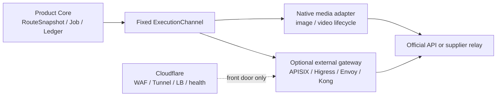

# AI Gateway / Control Plane 开源候选比选

> 研究快照：2026-07-19
>
> 来源复核截至：2026-07-19
>
> 本文只比较 AI 流量与供应控制面组件；通用后台 UI、密钥保险库、计量与权益组件另行比选。

## 结论先行

**首轮没有一个候选可以整套采用。** Apache APISIX、Higress、Envoy AI Gateway、Kong OSS 都能解决部分同步推理流量问题，但没有一个同时提供本项目已确认的：

1. 真实交易方、官方 API 与第三方中转渠道的独立供应链建模；
2. 文本、图片、视频三项首轮能力；
3. 图片/视频 `submit / recover / poll / download / cancel`、幂等、接受态与账务对账；
4. 凭据版本生命周期、产品权益、用户分配、供应商成本和统一审计；
5. 与 Cloudflare 部署形态相符、无需新增 Kubernetes 控制面的运行方式。

因此建议保持现有边界：**Product Core 是唯一供应控制面和跨 `Deployment` 路由/重试所有者；媒体生命周期继续由 `MediaProviderLifecyclePort` 管理。** 外部网关只能是可替换的 `ExecutionChannel`，不能成为 Provider、Credential、RoutePolicy、产品额度或成本账本的事实源。

| 候选 | 最终档位 | 最有价值的参考 | 首轮硬缺口 |
| --- | --- | --- | --- |
| Envoy AI Gateway 1.0 | **Reference；条件性 PoC** | 稳定 CRD、Provider Backend、上游身份、模型别名、租户 Token 配额 | Kubernetes + Redis；无管理 UI；无视频生成；无异步媒体生命周期 |
| Higress 2.2.3 | **Reference；本组第一 PoC 候选** | 供应商/多 Key/Consumer/Quota/路由/观测的一体化控制台，以及图片/视频协议适配 | K8s 运行面；Console 尚未覆盖 Kling；异步媒体恢复、取消、资产和账务仍归 Product Core；内部 Fallback 冲突 |
| Apache APISIX 3.17 | **Reference** | Apache 治理、插件边界、嵌入式 Dashboard、声明式发布、Token 限流 | AI 协议核心仍偏文本；媒体只是通用透传；无异步任务和产品级供应管理 |
| Kong Gateway OSS 3.9.3 | **Reject 作为底座；只 Reference** | Route/Service/Plugin/Consumer 分层、`preserve` 透传、decK 发布思想 | OSS 多模态不足；高级路由/Token 限流属于商业许可；形成第二控制面 |
| Gateway API Inference Extension 1.5 | **Reject 当前依赖；未来 Reference** | 自托管模型池内按 KV Cache、队列、LoRA 状态选 Pod | 只面向 K8s 自托管模型，不管理官方 API、中转站、Key、账单或媒体任务 |

已研究的 Bifrost、LiteLLM、Portkey、Helicone、New API、Sub2API 不在本文重复展开；它们的角色和边界见 [`gateway-components.md`](../model-provider-management-2026-07-19/gateway-components.md)。其中 New API / Sub2API 是上游供应商渠道的技术指纹，不是我方部署候选。

## 研究方法与证据边界

- 先用 OpenCLI 定位并读取官方项目页；插件级检索多次返回 `NOT_FOUND` 后，才用 Web Search 定位缺失页面，且只采信项目官方站点、官方仓库、许可证、版本发布和源码。
- 活跃度只说明项目当前仍维护，不等于 API 稳定、生产适配或本项目已验证。
- 文档与源码不一致时以精确版本源码为能力下限，并把矛盾列为 PoC 阻断项；不把营销页的“多模态”“100+ 模型”当作 operation conformance。
- `Adopt / Reference / Reject` 是针对本项目当前 Cloudflare 架构和首轮三模态范围的结论，不是对项目通用质量的排名。

## 一票否决标准：首轮必须真覆盖三模态

“支持多模态”不能作为入选依据。首轮验收应按 operation 判定：

| Operation | 最低合同 |
| --- | --- |
| 文本生成 | 同步/流式、结构化输出、Tools、Usage、实际模型、错误归一化 |
| 图片生成/编辑 | 提交、同步或异步完成、资产下载、重复提交防护、Usage/张数/尺寸、失败计费 |
| 视频生成 | 异步提交、上游任务 ID、恢复、轮询/Webhook、取消、结果下载、时长/规格、失败计费 |

如果组件只把任意 HTTP 请求转发到图片或视频端点，它只覆盖 **transport pass-through**，不覆盖媒体生命周期。若组件在内部自动换 Provider/Key 或重提任务，却不返回完整子尝试链，它还会破坏 Product Core 的 `accepted / rejected_before_accept / acceptance_unknown` 语义。

## 比选矩阵

| 维度 | APISIX 3.17 | Higress 2.2.3 | Envoy AI Gateway 1.0 | Kong OSS 3.9.3 |
| --- | --- | --- | --- | --- |
| 许可证 | Apache-2.0 | Apache-2.0（Gateway、Console 均可核实） | Apache-2.0 | Apache-2.0 |
| 活跃度 | 2026-06 发布 3.17，2026-07 仍有提交 | 2026-06 发布 2.2.3，2026-07 仍有提交 | 2026-06 发布 1.0 GA，2026-07 仍有提交 | OSS 最新 3.9.3，2026-07 仓库仍有提交 |
| 部署 | OpenResty；传统/分离模式常用 etcd，也支持无 etcd Standalone | Envoy/Istio；Docker AIO 仅本地测试，生产建议 K8s/Helm | 必须建立在 Kubernetes、Envoy Gateway、Helm/CRD 上；Quota 需 Redis | OpenResty/Nginx；DB-less 或 PostgreSQL；K8s 可选 |
| 管理 UI | 内嵌 Dashboard，但只管理单一 Gateway 的 Admin API 对象 | **本组最完整**：Provider、API Key、Consumer、AI Route、策略、AI Dashboard | 无专用 Provider 管理 UI；以 CRD/GitOps 为主 | Kong Manager 是通用 Gateway UI，不是模型供应后台 |
| Provider / Key | 插件配置与 Secret 引用；不是供应商账户生命周期 | 支持多个 LLM Provider、多 Token、Token 健康摘除 | `AIServiceBackend` + `BackendSecurityPolicy` + K8s Secret/云身份 | OSS AI Proxy 是单 Provider/Model 插件配置 |
| 用户分配 | Consumer + Auth/Rate Limit，需我方映射 | Consumer + Key/JWT Auth + Route allow list | 依赖 Gateway SecurityPolicy/Headers；无业务用户后台 | Consumer + Route/Plugin，业务权益仍需我方维护 |
| 预算/限流 | 请求限流与 Token 限流；不是产品账本 | Consumer Token Rate Limit/Quota，Redis 计数；不是产品账本 | 模型/租户 Token Quota 与速率限制，Redis 计数；不是金额或媒体预算 | OSS 通用请求限流；AI Token/成本限流为商业功能 |
| 模型路由 | `ai-proxy-multi` 权重/优先级/Fallback | 多模型、Token 级健康/Fallback、AI Load Balancer | 权重、别名、Provider Fallback、InferencePool | OSS 静态 Route；AI 多目标路由为商业功能 |
| 图片生成 | 未确认一等媒体合同；可透传自定义/未识别格式 | 有 `/v1/images/generations` 转换路径；仍需逐 Provider 验证 | `/v1/images/generations`，仅同步 OpenAI-compatible 路径 | OSS 3.9.3 未覆盖；当前文档所示能力要求 3.11+ |
| 视频生成 | 无统一视频生成/任务合同 | **数据面已有** OpenAI `/v1/videos` 与 Kling 文生/图生视频创建、任务查询映射 | **无视频生成端点**；“video”仅可指 Chat 输入 | OSS 3.9.3 未覆盖；文档视频路由要求 3.13+ |
| 异步媒体生命周期 | 无 | **部分**：create/retrieve；缺统一 recover/cancel/callback/asset/cost/acceptance 合同 | 无 | 无统一 `submit/recover/poll/cancel/download` 合同 |
| 双重路由风险 | 高：`ai-proxy-multi` 可内部 fallback | 高：多模型与多 Token 自动 fallback | 高：Provider fallback/Envoy retry | 商业 Advanced 高；OSS 静态 Route 较低 |
| Cloudflare 适配 | 只能作为 Cloudflare 后方常驻 Origin | 只能作为 Cloudflare 后方 K8s/容器 Origin | 只能作为 Cloudflare 后方 K8s Origin | 只能作为 Cloudflare 后方常驻 Origin |

## 候选一：Envoy AI Gateway

### 官方事实

- 项目采用 [Apache-2.0](https://github.com/envoyproxy/ai-gateway/blob/v1.0.0/LICENSE)。[`v1.0.0`](https://github.com/envoyproxy/ai-gateway/releases/tag/v1.0.0) 于 2026-06-23 宣布 GA；`AIGatewayRoute`、`AIServiceBackend`、`BackendSecurityPolicy`、`GatewayConfig`、`MCPRoute` 的 `v1beta1` API 在 1.x 内承诺兼容。
- v1.0 的运行依赖包含 Envoy Gateway、Envoy Proxy、Gateway API，并通过 Helm/CRD 部署；它不是一个可嵌入 Cloudflare Worker 的库。[安装文档](https://aigateway.envoyproxy.io/docs/getting-started/installation/)
- [支持端点](https://aigateway.envoyproxy.io/docs/capabilities/llm-integrations/supported-endpoints/)包括 Chat、Anthropic Messages、Completions、Embeddings、Responses、图片生成、音频和 Rerank。图片仅为 `POST /v1/images/generations` 的非流式 OpenAI-compatible 响应；没有视频生成端点。
- 同一端点页面内部存在一处必须由 PoC 消解的矛盾：图片章节列 OpenAI 为支持 Provider，但兼容矩阵又把 OpenAI Image Generation 标为不支持。不能仅凭页面标题进入生产。
- `BackendSecurityPolicy` 可引用 Kubernetes Secret，并支持 API Key、AWS、Azure、GCP 身份；它没有本项目 `CredentialAccount` 的测试、启用、排空、撤销和审批 UI。[上游认证](https://aigateway.envoyproxy.io/docs/capabilities/security/upstream-auth/)
- [QuotaPolicy](https://aigateway.envoyproxy.io/docs/capabilities/traffic/quota-policy/)能按模型和请求 Header 划分 Token Bucket，但仍是 `v1alpha1`；`serviceQuota` 当前配置后不执行，且 Quota 依赖 Redis。它不是金额、图片张数、视频时长或最终成本账本。
- [Provider Fallback](https://aigateway.envoyproxy.io/docs/capabilities/traffic/provider-fallback/)与 Envoy 重试可以在网关内部换后端，无法直接表达“只有明确未受理才可切换”的业务合同。

### 项目判断

**档位：Reference；只有未来已经接受 Kubernetes 控制面时，才做条件性 PoC。**

它是本组最值得借鉴的声明式 Provider/Backend/Route 合同，但不是首轮三模态底座。若以后 PoC：

1. 一个 `AIServiceBackend` 固定映射一个 `PublishedDeployment`；
2. 关闭跨 Deployment fallback 和自动 retry；
3. Product Core 先冻结 RouteSnapshot，再调用该通道；
4. Secret Manager 只单向同步受控副本到 Kubernetes Secret；
5. Envoy Token/Cost 指标只作诊断估算；
6. 图片和视频仍走本项目媒体生命周期适配器。

## 候选二：Higress AI Gateway

### 官方事实

- Gateway 使用 [Apache-2.0](https://github.com/higress-group/higress/blob/v2.2.3/LICENSE)，[`v2.2.3`](https://github.com/higress-group/higress/releases/tag/v2.2.3) 于 2026-06-25 发布；Console 也以 [Apache-2.0](https://github.com/higress-group/higress-console/blob/main/LICENSE) 发布。
- [AI Quick Start](https://higress.ai/en/docs/ai/quick-start/)展示了 LLM Provider/API Key 管理、多 Token 健康摘除、Consumer、AI Route、Fallback、策略与 AI Dashboard。这是本组最接近“可视化模型运维台”的交互参考。
- [Token Management](https://higress.ai/en/docs/ai/scene-guide/token-management/)与 [AI Quota](https://higress.ai/en/docs/latest/user/plugins/ai/api-consumer/ai-quota/)支持 Consumer 认证、Token 限流和 Redis Quota；这些数据是网关安全护栏，不是产品权益与成本账本。
- 官方多模型场景会在限流或访问失败时切换模型；多 Token 也会按健康状态自动摘除和恢复。[Multi-Model Proxy](https://higress.ai/en/docs/ai/scene-guide/multi-proxy/)
- [Docker All-in-One](https://higress.ai/en/docs/latest/ops/deploy-by-docker/)官方明确主要用于本地和测试，未在大规模生产验证；生产建议 Cloud-Native 部署。因此真正采用会引入 Envoy/Istio、Kubernetes/Helm、Console、Redis/观测等运维面。
- 2.2.3 数据面源码已经实现 OpenAI `/v1/images/generations`、`/v1/videos` create/retrieve/content/remix 等路由，并为 Kling 映射文生视频、图生视频创建和任务查询。[AI Proxy](https://github.com/higress-group/higress/blob/v2.2.3/plugins/wasm-go/extensions/ai-proxy/README_EN.md) · [Kling adapter](https://github.com/higress-group/higress/blob/v2.2.3/plugins/wasm-go/extensions/ai-proxy/provider/kling.go)
- 这仍不是完整的产品媒体合同：标准 Console 的 Provider 类型尚未列出 Kling，且数据面没有替本项目解决统一幂等、接受态、recover、cancel、Webhook、资产归档和最终成本对账。[Console provider types](https://github.com/higress-group/higress-console/blob/v2.2.3/backend/sdk/src/main/java/com/alibaba/higress/sdk/model/ai/LlmProviderType.java)

### 项目判断

**档位：Reference；若允许新增外部 Kubernetes 运行面，则是本组第一 PoC 候选，暂不进入主链。**

优先借鉴其信息架构：供应商列表 → 多 Key 状态 → Consumer → AI Route → Quota → Dashboard。它也是本组唯一从官方源码核实到 OpenAI 风格视频 create/retrieve 与 Kling 任务映射的候选，因此比 Envoy 更适合三模态 PoC。不要复用它的内部资源作为我方 Provider、用户额度、媒体任务或路由真相。其自动 Token/模型 Fallback 会隐藏实际尝试链，对非幂等图片/视频尤其危险。

只有接受新增 Kubernetes 运维面，且 Higress 能按请求返回实际 Provider/Key/Model、完整 retry chain，并能关闭媒体 fallback 时，才值得 PoC。Kling 暂不在标准 Console Provider 列表内，PoC 必须同时验证“数据面能跑”和“控制面可安全发布”，不能只调通一个 HTTP 请求。

## 候选三：Apache APISIX AI Gateway

### 官方事实

- Core 与 Dashboard 均采用 Apache-2.0；[`3.17.0`](https://github.com/apache/apisix/releases/tag/3.17.0) 于 2026-06-16 发布，仓库在 2026-07 仍活跃。[Core](https://github.com/apache/apisix) · [Dashboard](https://github.com/apache/apisix-dashboard)
- [`ai-proxy`](https://apisix.apache.org/docs/apisix/plugins/ai-proxy/)面向 OpenAI、Anthropic、Gemini、Vertex、Bedrock 等 LLM 协议；3.17 增加 Responses、Anthropic Messages 与未识别格式透传。透传可让图片或自定义接口经过网关，但不等于媒体生命周期适配器。[3.17 release](https://apisix.apache.org/blog/2026/06/15/release-apache-apisix-3.17.0/)
- [`ai-proxy-multi`](https://apisix.apache.org/docs/apisix/plugins/ai-proxy-multi/)支持优先级、权重和 Fallback；[`ai-rate-limiting`](https://apisix.apache.org/docs/apisix/plugins/ai-rate-limiting/)支持 Token 窗口及按 Header/Consumer 等变量分桶。
- [Dashboard](https://apisix.apache.org/docs/apisix/dashboard/)是内嵌的单 Gateway Admin API 界面。维护者明确其范围不包含用户管理、细粒度只读/RBAC、多环境管理、内建监控或 Developer Portal，不能代替本项目后台。[Dashboard scope](https://github.com/apache/apisix-dashboard/issues/2981)
- [部署模式](https://apisix.apache.org/docs/apisix/deployment-modes/)包括传统、控制/数据面分离和 Standalone；传统/分离模式使用 etcd，Standalone 可取消 etcd，但仍是 OpenResty 常驻服务。

### 项目判断

**档位：Reference。**

APISIX 适合借鉴插件注册、Admin API/声明式配置、Dashboard 与运行数据面的清晰边界。它对媒体的优势是“能透传”，不是“能管理”。如果把 `ai-proxy-multi` 路由作为第二策略层，会让 Core 的 RouteSnapshot、接受态和成本证据失真；因此不建议为当前系统新增这套常驻服务。

## 候选四：Kong Gateway OSS

### 官方事实与开源边界

- [`Kong/kong`](https://github.com/Kong/kong) 为 Apache-2.0，当前可核实最新 OSS 发布是 [`3.9.3`](https://github.com/Kong/kong/releases/tag/3.9.3)。
- 3.9.3 的公开源码中，AI Proxy Schema 只覆盖 `llm/v1/chat`、`llm/v1/completions` 与 `preserve`。[OSS schema](https://github.com/Kong/kong/blob/3.9.3/kong/llm/schemas/init.lua)
- 当前 [AI Proxy 文档](https://developer.konghq.com/plugins/ai-proxy/)列出图片生成/编辑需 Gateway 3.11+，视频生成需 3.13+；这些版本不在当前 OSS release 线内。页面没有 AI License 标签，也不能反向证明未公开发行代码属于 Apache-2.0 OSS。
- 多目标负载均衡、最低延迟/用量、Fallback、Retry 在 [AI Proxy Advanced](https://developer.konghq.com/plugins/ai-proxy-advanced/)；Provider/模型/Consumer Token 与成本限流在 [AI Rate Limiting Advanced](https://developer.konghq.com/plugins/ai-rate-limiting-advanced/)。二者均明确要求 AI Gateway Enterprise License。
- [部署拓扑](https://developer.konghq.com/gateway/deployment-topologies/)为 DB-less、PostgreSQL traditional/hybrid 或 Kubernetes；Kong Manager 是通用 Gateway 配置面，不是供应商、凭据版本、账本或媒体任务后台。

### 项目判断

**档位：Reject 作为首轮底座；只 Reference。**

Kong 的 Route/Service/Plugin/Consumer、原生协议 `preserve` 与 decK/GitOps 发布思想值得吸收。但真正匹配本项目复杂度的多目标路由、Token/成本限流和当前多模态版本已经进入商业边界；采用后同时承担开源版本落差、许可证依赖和第二控制面的锁定风险。

## Gateway API Inference Extension：为什么当前不入选

- 项目采用 [Apache-2.0](https://github.com/kubernetes-sigs/gateway-api-inference-extension/blob/v1.5.0/LICENSE)，[`v1.5.0`](https://github.com/kubernetes-sigs/gateway-api-inference-extension/releases/tag/v1.5.0) 于 2026-04-19 发布。
- 稳定 `InferencePool` 把同一模型的 Kubernetes Pods 组成池，Endpoint Picker 可基于 KV Cache、队列和 LoRA 状态选择副本。[InferencePool](https://gateway-api-inference-extension.sigs.k8s.io/api-types/inferencepool/)
- 官方定位明确是优化 Kubernetes 上的**自托管生成模型**；路线图仍包含多模态输入输出、扩散模型和其他非 Completion 协议。[官方仓库](https://github.com/kubernetes-sigs/gateway-api-inference-extension)
- 它不管理 SaaS Provider、官方 API、中转站、API Key、采购额度、用户权益或媒体任务。当前生产调度相关组件还在向 llm-d 仓库迁移。[FAQ](https://gateway-api-inference-extension.sigs.k8s.io/faq/)

**档位：Reject 当前直接依赖；未来自托管 GPU 模型时 Reference。** 即使未来采用，`InferencePool` 也只能是一个 `Deployment` 内部的 Pod 选择器，不能参与跨供应商路由。

## Cloudflare 部署边界

这四类 Gateway 都不是 Cloudflare Workers 原生组件。可行拓扑是 Cloudflare 位于前门，网关作为外部 Origin：

- [Cloudflare Tunnel](https://developers.cloudflare.com/cloudflare-one/networks/connectors/cloudflare-tunnel/)可让常驻 Gateway 通过出站连接发布，不必暴露公网 Origin。
- [Cloudflare Load Balancing Monitors](https://developers.cloudflare.com/load-balancing/monitors/)可做 Origin 健康探测与池级切换，但健康结果不能直接改写业务 RoutePolicy。
- Workers 的 Node 兼容层仍只覆盖部分 API；OpenResty/Envoy/Kubernetes 控制器不能因此原生运行在 Workers 中。[Workers Node compatibility](https://developers.cloudflare.com/workers/runtime-apis/nodejs/)

因此一旦采用上述组件，必须把 Kubernetes/etcd/PostgreSQL/Redis、升级、备份、观测和故障域算入总成本。Cloudflare 能保护和观察入口，不能消除这套额外数据面。

## 推荐落位

### Adopt

**不 Adopt 任何候选作为整套供应商管理底座。** Adopt 的是边界：Product Core 保持唯一控制面，三模态首轮全部由 operation-level adapter 和媒体任务合同保证。

### Reference

1. **Higress**：后台信息架构与 Provider/多 Key/Consumer/Route/Quota/Dashboard 的任务流。
2. **Envoy AI Gateway**：`AIServiceBackend`、`BackendSecurityPolicy`、`AIGatewayRoute`、QuotaPolicy 的声明式资源分层。
3. **APISIX**：插件注册、Dashboard/Admin API、声明式发布、Gateway 本身不承担业务用户管理的克制边界。
4. **Kong**：Service/Route/Plugin/Consumer 与 `preserve` 原生协议透传；不依赖 Advanced 商业 DSL。
5. **Gateway API Inference Extension**：未来自托管模型池内调度，不用于当前外部供应商路由。

### Reject

- 拒绝让任一网关成为 Provider、Credential、RoutePolicy、Product Entitlement 或 ProviderCost 的事实源。
- 拒绝在 Product Core 与网关同时启用跨 Deployment fallback/retry。
- 拒绝把“有图片/视频 URL”“能 HTTP 透传”视为图片/视频生命周期覆盖。
- 拒绝为了一个通用 AI Gateway 在首轮额外引入 Kubernetes，除非它能替代的运维成本经过独立 PoC 证明大于新增成本。

## 若要做一个最小 PoC

只推荐 **Higress 文本 + 图片 + 视频三模态** 的条件性 PoC，用于验证执行网关边界，不作为上线依赖：

1. 每种模态各固定一个官方 API、一个 Credential version、一个 PublishedDeployment；
2. 禁用网关跨模型/跨 Provider Fallback、Retry 和动态权重；
3. 文本验证 Chat/Responses/流式/Tools/Usage，图片验证 generation/asset，视频验证 create/retrieve 与 Kling 文生/图生任务映射；
4. Product Core 继续执行 `submit/recover/poll/download/cancel`、幂等、接受态、资产归档与成本对账；Higress 只传输一次 attempt；
5. 验证 Secret 单向同步、版本固定、滚动升级、真实 Provider/Key/Model、upstream task/request ID 与完整脱敏遥测；
6. 验证 Cloudflare → Higress 外部 Origin 的网络、超时和故障域；不把 Higress 误认为 Workers 内组件；
7. 任一模态无法回传实际 Deployment、上游请求/任务 ID 或接受态证据，则 PoC 不晋级。

这个 PoC 的目的不是拆分首轮产品范围，而是证明某个可替换数据面是否值得存在。首轮产品仍同时交付文本、图片、视频。

## 官方来源索引

- Apache APISIX：[仓库](https://github.com/apache/apisix) · [3.17](https://github.com/apache/apisix/releases/tag/3.17.0) · [AI Proxy](https://apisix.apache.org/docs/apisix/plugins/ai-proxy/) · [AI Rate Limiting](https://apisix.apache.org/docs/apisix/plugins/ai-rate-limiting/) · [Dashboard](https://apisix.apache.org/docs/apisix/dashboard/) · [Deployment modes](https://apisix.apache.org/docs/apisix/deployment-modes/)
- Higress：[仓库](https://github.com/higress-group/higress) · [2.2.3](https://github.com/higress-group/higress/releases/tag/v2.2.3) · [AI Quick Start](https://higress.ai/en/docs/ai/quick-start/) · [Token Management](https://higress.ai/en/docs/ai/scene-guide/token-management/) · [Docker deployment](https://higress.ai/en/docs/latest/ops/deploy-by-docker/)
- Envoy AI Gateway：[仓库](https://github.com/envoyproxy/ai-gateway) · [1.0.0](https://github.com/envoyproxy/ai-gateway/releases/tag/v1.0.0) · [Endpoints](https://aigateway.envoyproxy.io/docs/capabilities/llm-integrations/supported-endpoints/) · [API](https://aigateway.envoyproxy.io/docs/api/) · [Quota](https://aigateway.envoyproxy.io/docs/capabilities/traffic/quota-policy/)
- Kubernetes Gateway API Inference Extension：[仓库](https://github.com/kubernetes-sigs/gateway-api-inference-extension) · [1.5.0](https://github.com/kubernetes-sigs/gateway-api-inference-extension/releases/tag/v1.5.0) · [InferencePool](https://gateway-api-inference-extension.sigs.k8s.io/api-types/inferencepool/)
- Kong：[OSS 仓库](https://github.com/Kong/kong) · [3.9.3](https://github.com/Kong/kong/releases/tag/3.9.3) · [AI Proxy](https://developer.konghq.com/plugins/ai-proxy/) · [AI Proxy Advanced](https://developer.konghq.com/plugins/ai-proxy-advanced/) · [AI Rate Limiting Advanced](https://developer.konghq.com/plugins/ai-rate-limiting-advanced/)
