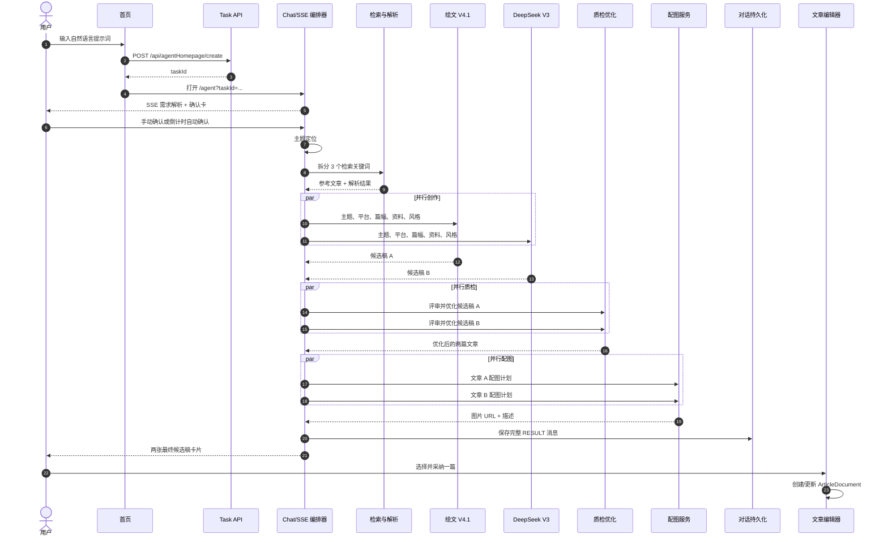
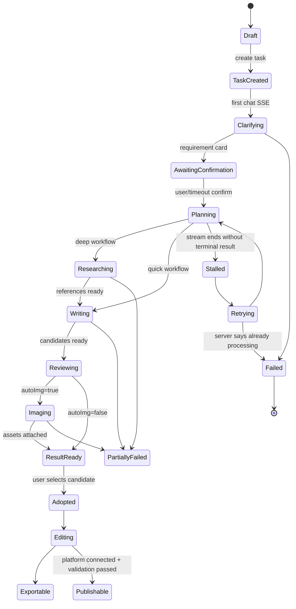

# 01｜从关键词到图文成果的完整流程

## 1. 测试目标与成功标准

### 1.1 测试输入

```text
创作一篇7月份头皮护理小红书图文
```

### 1.2 成功标准

- 登录态可以直接复用。
- 提示词能创建独立任务。
- 能观察需求澄清、检索、写作、质检、配图和结果输出。
- 刷新后成果仍存在，证明不是仅存于前端内存。
- 能区分“候选成果完成”和“编辑器文档已创建”。
- 记录每项功能的触发入口、请求、响应、前端状态和复刻逻辑。

### 1.3 实测策略

先按首页默认的快速模式提交；快速模式失败后，保留同一提示词和默认模型，仅关闭快速模式，创建第二个诊断任务。这样可以把主要变量收敛到 `quick=true/false`。

第二个任务的确认卡原计划把候选模型数改为一个，但倒计时在调整前自动继续，因此成功样本仍使用：

- 绘文 V4.1 × 1
- DeepSeek V3 × 1
- 共 2 篇
- 自动配图开启

这也是最终返回两篇候选稿的直接原因。

## 2. 页面信息架构

### 2.1 首页

首页承担四类工作：

1. 选择创作类型/入口。
2. 输入自然语言需求。
3. 切换快速模式与深度模式。
4. 带着当前配置创建任务。


[观察] 提示词编辑区支持富文本，提交请求中的文本不是裸字符串，而是：

```html
<p>创作一篇7月份头皮护理小红书图文</p>
```

[推断] 首页编辑器会先把 ProseMirror/Tiptap 内容序列化为 HTML，再写入任务创建请求。

### 2.2 任务工作区

任务页是左右分栏工作区：

- **左侧：Agent 对话与任务编排**
  - 显示需求解析、确认卡、检索、写作、质检、配图、最终候选稿。
  - 接收继续、重试、停止、采纳候选等操作。
- **右侧：文章编辑与检查**
  - 正文编辑器。
  - 插图能力：图片搜索、AI 生图、本地上传、图片库。
  - 审查能力：文字校对和风险提示入口。
  - 长文等扩展能力。
  - 顶部有复制、导出和发布操作。

[观察] 左侧候选稿生成完成后，右侧编辑器仍为空。

[推断] 左侧 Agent 负责产生 `CandidateArticle[]`，右侧编辑器负责维护单独的 `ArticleDocument`。两者通过“加入到对话/采纳”类命令发生显式转换，而不是共用一份实时正文。

## 3. 成功路径总时序



最后两步在本次测试中停在“候选稿已返回”。未主动采纳和发布，以避免把分析测试扩展为外部发布动作。

## 4. 逐阶段调用方式与实现逻辑

## 4.1 阶段 A：登录态复用

### 调用方式

- 用户已在内置浏览器登录。
- 直接访问 `https://turbodesk.xfyun.cn/`。
- 页面加载账号信息、会员等级、积分余额、发布账号和个性化配置。

### 前端表现

- 首页无需再次登录。
- 可以直接进入文章创作。

### 实现逻辑

- **[观察]** 浏览器会话中的 Cookie/本地认证状态被站点正常复用。
- **[推断]** 页面初始化先请求用户/会员相关接口，收到有效会话后渲染工作区。
- **[建议]** 复刻时使用服务端 Session 或短期 Access Token；任务接口必须从认证上下文取得 `userId`，禁止由浏览器自由传入。

### 失败处理

- 未登录：跳转登录页或显示登录弹窗。
- 会话过期：拦截 401，暂停任务提交，登录后恢复草稿。
- 多标签刷新：共享认证但不共享未提交编辑器状态。

## 4.2 阶段 B：首页输入与模式选择

### 调用方式

1. 进入「文章创作」。
2. 在富文本框输入测试提示词。
3. 选择快速/深度模式。
4. 点击发送。


### 关键配置

| 配置 | 快速失败样本 | 深度成功样本 |
| --- | --- | --- |
| `quick` | `true` | `false` |
| `search` | `false` | `false` |
| `styleId` | `-1` | `-1` |
| 附件 | 空 | 空 |
| 绘文 V4.1 | 选中，数量 0/后续确认 1 | 选中，后续确认 1 |
| DeepSeek V3 | 选中，数量 1 | 选中，数量 1 |

“选中”和“数量”是两个维度：模型可以处于 `selected=true`，而初始 `value=0`；确认卡再决定实际生成数量。

### 实现逻辑

- **[观察]** 首页提交的是任务创建请求，响应只有成功状态和数值型 `taskId`，并不直接返回文章。
- **[推断]** 首页只负责构造任务配置快照；复杂生成由任务页的 Chat/SSE 编排器接管。
- **[建议]** 将首页输入保存在本地草稿，同时让后端原子创建 `Task` 与首条 `ChatMessage(req)`，避免页面跳转时丢失需求。

## 4.3 阶段 C：创建任务并打开新工作区

### 调用方式

```http
POST /api/agentHomepage/create
Content-Type: application/json
```

成功响应的 `data` 是任务 ID：

```json
{
  "code": 0,
  "data": 18210820,
  "msg": "成功"
}
```

前端随后打开：

```text
https://turbodesk.xfyun.cn/agent?taskId=18210820
```

### 页面初始化

任务页至少恢复三类对象：

1. `/api/agent/config?taskId=...`：该任务的模式和模型配置。
2. `/api/agent/chat/page?...&taskId=...`：Agent 对话历史。
3. `/api/editor/article/:taskId`：右侧编辑器文档。

### 实现逻辑

- **[观察]** URL 只需 `taskId` 即可恢复完整任务。
- **[观察]** 配置、聊天、文章分开加载。
- **[推断]** `taskId` 是聚合根标识，但 Chat 与 Article 是独立子资源。
- **[建议]** 复刻时 URL 使用不可枚举的 UUID/ULID；对数值型 ID 仍必须做强制资源归属校验，防止越权读取。

## 4.4 阶段 D：需求解析与确认卡

### 调用方式

任务页向 Chat 接口发送提示词，响应为 `text/event-stream`：

```http
POST /api/agent/v2/chat
Accept: text/event-stream
```

### 前端表现

先显示“思考/理解需求”，随后出现结构化确认卡：

- 创作类型：小红书
- 篇幅：500 字
- 推荐方向/要点
- 多模型数量
- 自动配图开关
- 补充要求输入
- 倒计时自动继续


### 协议表现

SSE 中不是单一文本，而是顺序标记：

```text
[TASK_STEP_START]
[TASK_ITEM_START]
{"type":"TASK_TITLE", ...}
[THINKING_START]
[REQUIREMENT_START]
{"type":"REQUIREMENT", ...}
[REQUIREMENT_END]
{"type":"REQUIREMENT_BUTTON", ...}
[THINKING_END]
...
[CHAT_ID]
[CHAT_RETRY]
[TASK_STEP_END]
[EV_END]
```

### 实现逻辑

- **[观察]** `REQUIREMENT` JSON 提供卡片数据，前端不是从自然语言里正则提取“500 字”和“小红书”。
- **[观察]** 卡片控件以自定义槽位渲染，DOM 中出现 `<select-slot>`、`<input-slot>`。
- **[推断]** SSE 解析器维护一个“当前步骤/当前任务项”栈；遇到 JSON 类型后创建对应 React NodeView。
- **[建议]** 不要把协议直接混在 Markdown 字符串里。复刻时可保留 SSE，但事件应使用正式 envelope：

```json
{
  "eventId": "evt_...",
  "taskId": "task_...",
  "runId": "run_...",
  "seq": 12,
  "type": "requirement.ready",
  "payload": {
    "platform": "xiaohongshu",
    "wordCount": 500,
    "autoImages": true
  }
}
```

这样更容易做断线续传、去重和版本演进。

## 4.5 阶段 E：确认并启动生成

### 调用方式

确认卡可以：

- 用户立即点击继续。
- 修改配置后继续。
- 不操作，等待 30 秒倒计时自动继续。

本次成功任务由倒计时自动继续：

```http
POST /api/agent/v2/confirm/continue
```

请求包含：

- `taskId`
- 当前 `chatId`
- `writingModelConfig`
- `wordNum: "500"`
- `platform: "小红书"`
- `content: ""`
- `autoImg: true`
- `showType: "writeConfirm"`

随后前端再次调用 Chat SSE，内容转成机器可执行的明确指令：

```text
创作类型：小红书，篇幅：500。无其他补充，请开始创作。
```

同时带入：

```json
{
  "genArticle": true,
  "autoImg": true,
  "noSearch": true,
  "quick": false,
  "version": 2
}
```

### 实现逻辑

- **[观察]** 澄清与正式生成是两次 Chat 调用，中间有独立确认接口。
- **[观察]** `noSearch=true` 并未阻止深度模式生成搜索任务。
- **[推断]** `noSearch` 可能只控制某种外显联网开关，深度模式的内部资料检索由另一层策略决定；不能仅按字段名理解为绝对禁用检索。
- **[建议]** 将确认后的参数固化为不可变 `RunSpec`，为每次执行生成独立 `runId`。自动确认也应写入审计日志，区分 `confirmedBy=user|timeout|system`。

## 4.6 阶段 F：主题定位

### 实测结果

系统把宽泛需求：

```text
7月份头皮护理小红书图文
```

收敛为：

```text
7月份头皮护理控油技巧分享
```

### 实现逻辑

- **[观察]** 界面先显示“正在对创作主题进行定位”。
- **[推断]** 主题定位节点把季节、品类、平台和内容角度组合成一个更可执行的写作命题。
- **[建议]** 定位结果必须结构化保存：

```ts
type TopicBrief = {
  topic: string;
  audience: string;
  platform: "xiaohongshu";
  season: string;
  angle: string;
  intent: "education" | "recommendation" | "conversion";
  mustInclude: string[];
  prohibitedClaims: string[];
};
```

头皮护理属于健康敏感主题，定位阶段就应标记 `riskDomain=health`，推动后续使用更高可信来源和更严格审查。

## 4.7 阶段 G：资料检索与内容解析

### 实测检索任务

系统生成 3 个检索关键词：

1. `头皮护理 夏季出油原因 科学原理`
2. `头皮护理 控油成分 产品推荐`
3. `头皮护理 夏季控油技巧 用户心得`


### 返回数据

单条检索结果可观察到的字段包括：

- 头像
- 昵称
- 封面
- 标题
- URL
- 全文 `content`
- 平台
- 发布时间
- `noteId`
- `xsecToken`
- 点赞
- 收藏
- 标签
- 图片列表
- 排序索引

本次后续写作使用了 7 条参考内容。

### 右侧内容解析

界面同时呈现：

- 标题分析
- 内容结构
- 标签策略
- 引用标记
- 写作与配图思路

### 实现逻辑

- **[观察]** 检索是显式多任务，最终有 `SEARCH_TASK`、`SEARCH_RESULT`、`SEARCH_ANALYSIS` 三类结构化对象。
- **[观察]** 部分结果包含整页导航、页脚等噪音文本；至少一个来源不可访问。
- **[观察]** 来源以百度百家号和地方媒体/营销文章为主，没有显示权威性评分。
- **[推断]** 当前流程更像“关键词检索 → 抓取全文 → LLM 摘要/解析”，内容清洗和来源治理较弱。
- **[建议]** 复刻时搜索子系统至少增加：
  - URL 规范化与去重。
  - 正文抽取、导航/广告/页脚清理。
  - 来源类型和可信度评分。
  - 发布日期与时效性。
  - 每个事实主张对应的证据片段。
  - 医疗/功效主题优先官方、学术、专业机构来源。
  - 把“用户心得”和“科学事实”分开入库。

## 4.8 阶段 H：多模型并行写作

### 前端表现

两条写作任务并行展开：

- 绘文 V4.1
- DeepSeek V3


### 初稿标题

- 绘文 V4.1：`7月大油头自救：控油到位不塌`
- DeepSeek V3：`夏天头皮疯狂出油？2026公认有效的控油洗发水推荐`

### 结构化文章字段

从 `WRITING_ARTICLES` 开始，文章使用一致对象结构：

```text
taskTitle
name
modelName
llm
writingStatus
writingStatusName
iconType
title
content
tags
correctedContent
articleType
pictures
query
withImg
styleId
```

### 实现逻辑

- **[观察]** 两篇文章属于同一次 Run，但有独立模型、状态、标题和正文。
- **[推断]** 编排器对每个 `writingModelConfig.value` 创建相应数量的写作 Job，并通过 `Promise.all`、工作流 fan-out/fan-in 或队列子任务实现并行。
- **[建议]** 每篇候选稿都要有稳定 `candidateId`，不能只靠数组下标；单个模型失败时允许保留另一个成功结果：

```text
Run
 ├─ Candidate A / model A / succeeded
 └─ Candidate B / model B / failed → retryable
```

## 4.9 阶段 I：分维度质检与自动优化

### 实测维度

- 标题
- 开头钩子
- 正文
- 结尾互动
- 标签
- 人设
- 风格样本
- 关键词/SEO


其中第一篇初稿显示总分约 `60/90`，建议包括：

- 标题增加 SEO 关键词。
- 开头加强反差和痛点。
- 增强个人口吻。
- 标签更精准。

### 实现逻辑

- **[观察]** 质检后出现 `CORRECT_ARTICLES`，说明优化后的文章仍以结构化候选列表返回。
- **[推断]** 可能先由评审 Prompt 返回维度分和修改建议，再由改写 Prompt 生成 `correctedContent`。
- **[观察]** 自动审查更关注传播表现，不足以阻止未经证实的产品功效宣称。
- **[建议]** 复刻时把质量门拆成四条独立轨：
  1. 内容表现：标题、钩子、结构、互动、平台风格。
  2. 事实一致性：每个事实是否有来源、是否被来源支持。
  3. 合规安全：医疗、极限词、功效承诺、广告披露。
  4. 品牌约束：人设、禁词、产品资料和品牌语调。

不得用单一总分掩盖高风险项；任何硬性合规失败都应阻断自动发布。

## 4.10 阶段 J：自动配图

### 前端表现

每篇文章进入独立配图任务。界面文案称：

```text
1 张封面与 4 张内页的配图
```

### 真实结果

最终 `RESULT` 中，每篇文章的 `pictures` 数组实际都只有 **4 个对象**，不是 5 个。

每个图片对象只有：

```json
{
  "url": "https://...",
  "desc": "图片语义和场景描述"
}
```

### 实现逻辑

- **[观察]** `IMAGE_ARTICLES` 是单独阶段，最后再生成 `RESULT`。
- **[观察]** 图片 URL 存储在外部对象存储域名。
- **[推断]** 编排器先根据文章结构产生图片 Prompt/描述，再调用图片服务，成功后把 URL 回填到候选文章。
- **[建议]** 复刻时区分：
  - `imageBrief`：封面/内页位置、画面目的、视觉要求。
  - `generationJob`：模型、Prompt、尺寸、种子、状态、耗时、费用。
  - `asset`：最终文件、版权/来源、审核状态。
  - `placement`：文章段落锚点与图片排序。

还应对“计划 5 张、结果 4 张”做数量校验，未满足计划时明确显示部分成功。

## 4.11 阶段 K：最终候选稿

### 前端表现

最终显示两张候选稿卡片：

- 标题、正文、标签。
- 生成图片缩略图。
- 模型标识。
- 「加入到对话」操作。


### 持久化

成功任务刷新后：

- Chat：4 条记录，`completed=true`。
- 最后一条响应：147,574 字符，`refresh=true`。
- Article：标题空、正文空、`version=0`、`chatId=0`。

### 实现逻辑

- **[观察]** 最终结果在 Chat 的 `res` 消息中，以完整结构化协议保存。
- **[观察]** 编辑器不会因 Run 完成自动写入文章。
- **[推断]** “加入到对话”会选定某个 Candidate，再创建或更新 Article；它是显式的人机确认门。
- **[建议]** 复刻时提供以下动作：
  - 预览候选。
  - 采纳并覆盖空编辑器。
  - 追加到现有编辑器。
  - 比较两篇差异。
  - 合并指定段落。
  - 保留来源与生成链路。

## 4.12 阶段 L：编辑、插图、审查、导出和发布

### 页面可见能力

| 功能 | 调用入口 | 本次是否执行 | 可观察逻辑 |
| --- | --- | --- | --- |
| 编辑正文 | 右侧编辑器 | 未采纳，因此为空 | Article 独立保存，存在 `POST /api/editor/article` |
| 插图 | 右侧「插图」 | 仅观察入口 | 图片搜索、AI 生图、本地上传、图片库 |
| 审查 | 右侧「审查」 | 观察自动审查结果 | 校对/风险提示，但事实合规能力不足 |
| 长文 | 右侧「长文」 | 未执行 | 独立辅助工具入口 |
| 复制 | 顶部按钮 | 未执行 | 复制编辑器内容 |
| 导出 | 顶部按钮 | 未执行 | 需要先有编辑器内容 |
| 发布 | 顶部按钮 | 未执行 | 依赖编辑器内容和已绑定平台账号 |

发布账号初始化会加载微信、头条、百家号、小红书等平台资源。由于本次没有采纳候选稿，也未授权执行外部发布，所以没有继续探测发布请求。

## 5. 前端渲染机制

### 5.1 编辑器与节点

[观察] DOM 中存在：

- `div.tiptap.ProseMirror`
- `react-renderer node-agent-block`
- `node-json-block`
- `<select-slot>`
- `<input-slot>`

[推断] 前端使用 Tiptap/ProseMirror 作为可扩展文档渲染层：

1. SSE 文本先进入协议解析器。
2. 普通文本渲染为段落。
3. `[TASK_*]` 等标记维护步骤树。
4. JSON code block 按 `type` 转成专用 React NodeView。
5. `SEARCH_TASK`、`WRITING_ARTICLES` 等对象渲染为可折叠任务卡。
6. 确认卡中的槽位节点渲染成交互控件。

### 5.2 为什么采用这种方式

- 流式阶段可以持续追加，不必等待整个 JSON 完成。
- 历史消息刷新后仍能用同一套渲染器还原。
- 任务卡、进度、文章候选和表单可以共存在“对话文档”中。
- 新增类型只需注册新 NodeView。

### 5.3 复刻时的改良

建议在传输层使用正式事件 JSON，在持久化层保留标准事件数组；Markdown/ProseMirror 只负责显示，不负责承载唯一真相。

```text
Server events → event reducer → TaskViewModel → React components
                                  └→ optional ProseMirror snapshot
```

否则协议标记缺失、重复或截断时，整条历史消息会很难恢复。

## 6. 状态机



### 推荐终态定义

服务端必须只允许以下清晰终态：

- `SUCCEEDED`
- `PARTIAL_SUCCEEDED`
- `FAILED`
- `CANCELLED`

`SSE closed` 不是业务终态，`articleList:null` 也不能被解释为“仍在生成”而不继续轮询。

## 7. 快速模式失败路径

## 7.1 首轮异常

快速模式创建任务后，左侧出现不完整协议文本，类似：

```text
<gy protocol-only response
```

右侧 Article 始终为空。


## 7.2 任务内重试

再次提交相同提示词后：

1. 需求解析成功。
2. 确认卡成功。
3. 倒计时自动继续。
4. 正式生成 SSE 很快结束。
5. 结果卡中的 `articleList` 为 `null`。
6. UI 仍显示类似生成中的状态。


## 7.3 点击刷新/重试

前端调用：

```http
POST /api/agent/v2/chat/retry
```

SSE 返回：

```text
[GPT_ERROR]当前对话正在处理中，请稍后重试
```

随后页面调用：

```http
POST /api/agent/task/stop
```

刷新后的聊天历史中，末条请求 `status=6`；Article 仍为空。

## 7.4 根因边界

不能在没有服务端源码的情况下断言具体根因，但可以确定：

- **[观察]** 首个生成流已结束。
- **[观察]** 客户端没有收到可用文章。
- **[观察]** 服务端重试接口仍判断任务在处理。
- **[观察]** 客户端又主动发出停止。
- **[推断]** 流式连接、工作流执行状态和持久化终态之间存在竞态或状态同步延迟。
- **[推断]** 客户端可能仅按 `[EV_END]` 关闭流，却没有以明确的 `run.completed|run.failed` 事件结束 UI 状态。

## 7.5 复刻时必须避免

1. 每次 Run 有独立 `runId`。
2. 所有事件带单调递增 `seq`。
3. 服务端在数据库事务中写终态和最终结果，再发送终态事件。
4. SSE 断开后，客户端查询 `GET /runs/:runId`，不自行猜测成功/失败。
5. 重试接口必须区分：
   - 继续同一 Run。
   - 从失败步骤重跑。
   - 创建新 Run。
6. 对扣费使用幂等 `billingReservationId`。
7. 停止动作只在用户确认或明确超时策略下触发，不能因一次错误提示自动取消仍在执行的任务。

## 8. 功能调用矩阵

| 功能 | 用户入口 | 主要调用 | 输入 | 输出/状态 | 复刻关键点 |
| --- | --- | --- | --- | --- | --- |
| 创建文章任务 | 首页发送 | `POST /api/agentHomepage/create` | HTML 提示词、模式、模型配置 | `taskId` | 原子创建任务与首条消息 |
| 恢复任务配置 | 打开任务页 | `GET /api/agent/config` | `taskId` | 模式、风格、模型 | 配置快照不可受全局默认变化影响 |
| 恢复聊天 | 打开/刷新 | `GET /api/agent/chat/page` | `taskId`、分页 | req/res 历史、完成状态 | 结构化内容长期可重放 |
| 恢复编辑器 | 打开/刷新 | `GET /api/editor/article/:taskId` | `taskId` | Article 文档 | 与 Candidate 分离 |
| 需求解析 | 首次 Chat | `POST /api/agent/v2/chat` SSE | 原始需求 | 确认卡 | 用结构化事件驱动控件 |
| 确认需求 | 卡片继续/倒计时 | `POST /api/agent/v2/confirm/continue` | 平台、字数、模型、配图 | 确认成功 | 固化 RunSpec 和确认来源 |
| 正式生成 | 确认后自动 | `POST /api/agent/v2/chat` SSE | 标准化需求、生成开关 | 多阶段事件 | 可恢复编排、明确终态 |
| 搜索资料 | 深度模式内部 | 同一 SSE 中的阶段对象 | 三个关键词 | 搜索结果与分析 | 来源可信度、去重、事实映射 |
| 多模型创作 | 编排器内部 | 同一 SSE 中的文章对象 | Brief、参考资料、模型 | 多候选稿 | fan-out/fan-in、局部失败 |
| 质量优化 | 写作完成后 | 同一 SSE 中的校正对象 | 候选稿 | 评分、建议、改稿 | 风格/事实/合规分轨 |
| 自动配图 | `autoImg=true` | 同一 SSE 中的图片对象 | 文章段落、图片 Brief | URL、描述 | 数量校验、资产审查、位置锚点 |
| 采纳候选 | 「加入到对话」 | 本次未执行 | `candidateId` | Article 更新 | 明确覆盖/追加语义 |
| 编辑器保存 | 右侧编辑 | `POST /api/editor/article` | `fileId,title,content` | 版本更新 | 乐观锁、自动保存 |
| 重试 | 结果刷新 | `POST /api/agent/v2/chat/retry` SSE | Chat/Run 上下文 | 重放或错误 | 幂等、从失败节点恢复 |
| 停止 | 停止操作/异常链 | `POST /api/agent/task/stop` | Task/Run | cancelled | 明确授权与计费结算 |
| 发布 | 顶部发布 | 本次未执行 | Article、平台账号 | 平台草稿/发布结果 | 外部副作用必须二次确认 |

## 9. 体验层可复刻要点

### 9.1 用户为什么能理解复杂流程

- 每个阶段都有可读标题，而不是只显示统一 loading。
- 检索词、参考材料和模型名可见。
- 多篇候选稿并排呈现，结果选择权留给用户。
- 右侧编辑器始终在场，形成“生成 → 采纳 → 编辑”的连续工作台。

### 9.2 当前体验缺口

- 快速模式出现假进度，用户无法判断该等还是重试。
- 自动倒计时可能在用户尚未完成模型调整时继续。
- 最终图片数量与界面承诺不一致。
- “审查完美”类反馈会给未经事实核验的功效宣称错误安全感。
- 最终结果没有自动进入编辑器，对首次用户可能不够明显。
- 两篇候选没有显式比较视图。

### 9.3 推荐的交互改良

- 确认卡倒计时只在没有任何交互时运行；用户一编辑即暂停。
- 展示阶段级成功/失败/耗时/费用。
- 结果页明确显示“候选稿尚未进入编辑器”。
- 采纳前提供差异比较与风险徽标。
- 高风险事实旁显示来源和可信度。
- 部分图片失败时提供补生成按钮，而不是静默少图。

