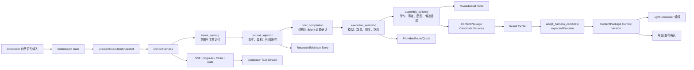

# 03｜面向「美业内容2」的复刻架构蓝图

## 1. 复刻原则

本项目不应逐接口、逐字段照抄讯飞绘文。正确做法是：

1. 复用其有效的用户体验：
   - 自然语言入口。
   - 可解释的分阶段进度。
   - 必要时的内联确认卡。
   - 多模型候选。
   - 研究、写作、审查、配图可见。
   - 候选完成后由用户采纳。
2. 保留本项目已经更成熟的产品真相：
   - `CreationExecutionSnapshot` 是服务端自持、不可变的执行根。
   - DBOS Harness 是 durable workflow。
   - SSE 已有 `eventId`、`workflowId`、`sequence`、`candidateId`。
   - `ContentPackage` 是唯一用户可见成品聚合。
   - 对话流只是投影，不另建第二套消息真相层。
   - 只有显式 adoption 才把候选写入成品版本。
   - 写入使用 `expectedRevision` 做 OCC。
   - Provider 路由、使用量、资产和导出回执已有审计边界。
3. 修复讯飞绘文暴露的问题：
   - 搜索来源可信度不足。
   - SSE 结束与业务终态脱节。
   - 质检不等于事实/合规核验。
   - 图片承诺数量与结果不一致。
   - 重试状态和计费不透明。

## 2. 当前项目能力与讯飞绘文能力映射

| 讯飞绘文概念 | 本项目已有概念 | 复刻决策 |
| --- | --- | --- |
| `taskId` | Task / Work / `workflowId` | 复用已有 ID，不新增平行 Task 真相 |
| 首页 prompt + 配置 | Composer submission | 复用当前 Composer |
| 任务配置快照 | `CreationExecutionSnapshot` | 当前实现更强，直接复用 |
| Chat SSE | `workflow.progress` / `workflow.token` / `workflow.state` | 复用正式 SSE 合同 |
| 需求确认卡 | `QuestionCard` + structured decision | 扩展为内联 Brief 确认，不复制协议标记 |
| 搜索任务 | Harness `context_injection` 子步骤 | 增加 ResearchEvidence 投影 |
| 多模型文章 | ContentPackage candidate versions | 使用稳定 `candidateId` |
| 质量分 | `harnessScore` + 质量详情 | 保留总分，新增分轨质量报告 |
| 最终 `RESULT` | workflow state snapshot + Candidate versions | 不把 147 KB 全塞入一条聊天消息 |
| 「加入到对话」 | `adopt_harness_candidate` | 当前 OCC adoption 正是所需 |
| 编辑器 Article | ContentPackage 当前版本 | 不新增第二个 Article 聚合 |
| 图片 URL | OwnedAsset + `orderedAssetIds` | 必须归档为受控资产，不能依赖外链 |
| 发布初始化 | Result Center / delivery | 沿用本项目发布确认与回执 |

### 关键判断

本项目已经具备讯飞绘文流程最难的基础设施。复刻工作不应重写工作流底座，主要增量应集中在：

- 研究阶段的结构化证据。
- 多候选生成与比较投影。
- 分维度质量审查。
- 图文配图计划与段落锚点。
- Composer/Result Center 的阶段可视化。

## 3. 目标架构



## 4. 五段 Harness 的具体拆解

## 4.1 `intent_naming`

### 输入

- 用户原始意图。
- 当前 lens：copy/image/video。
- 平台。
- 已选 Recipe。
- 门店身份和最小上下文。

### 处理

1. 识别创作对象：小红书图文。
2. 提取时间：7 月。
3. 提取主题：头皮护理。
4. 判断内容角度：知识科普、问题解决、产品推荐或活动转化。
5. 标记敏感域：健康/功效。
6. 生成明确主题和缺口。

### 输出

```ts
type IntentNamingResult = {
  normalizedIntent: string;
  platform: "xiaohongshu";
  deliverableKind: "graphic_post";
  topic: string;
  seasonalContext: "july";
  riskDomains: Array<"health" | "product_claims">;
  ambiguities: Array<{
    field: string;
    reason: string;
    blocking: boolean;
  }>;
};
```

### UI

- 进度文案：`已理解为：7 月头皮护理小红书图文`
- 若没有阻塞缺口，不弹全屏表单。
- 如果内容角度会显著影响结果和费用，可显示 2–3 个内联 chip。

## 4.2 `context_injection`

### 输入

- 服务端冻结的门店事实。
- 已授权素材。
- 身份/语气。
- 用户引用。
- 外部研究策略。

### 处理

1. 先注入本项目事实源，外部资料不能覆盖商家事实。
2. 根据敏感域决定来源白名单和检索深度。
3. 生成互补检索任务：
   - 原因/机制。
   - 方法/成分。
   - 平台表达/用户问题。
4. 抓取、正文抽取、去重、可信度评估。
5. 抽取可验证主张和证据片段。
6. 将低可信营销材料标为灵感，不允许充当事实依据。

### 推荐对象

```ts
type ResearchEvidence = {
  id: string;
  workflowId: string;
  query: string;
  canonicalUrl: string;
  title: string;
  publisher?: string;
  publishedAt?: string;
  fetchedAt: string;
  authorType:
    | "official"
    | "professional"
    | "media"
    | "brand"
    | "ugc"
    | "unknown";
  trustScore: number;
  extractionQuality: number;
  usage: "fact" | "inspiration" | "platform_style" | "rejected";
  rejectionReason?: string;
  claims: Array<{
    id: string;
    statement: string;
    evidenceExcerpt: string;
    confidence: number;
  }>;
};
```

### 数据边界

- 搜索原文不直接进入 ContentPackage。
- ContentPackage 只保存被采用的事实引用、来源标识和最终可追溯关系。
- 供应商原始响应、抓取正文和 Prompt trace 留在执行/审计域，不暴露给普通浏览器合同。

### UI

参考讯飞绘文的透明度，但做可信度强化：

```text
正在查找 3 类资料
✓ 夏季头皮出油机制 · 2 个高可信来源
✓ 控油成分与使用边界 · 3 个来源，1 个被降级为营销材料
✓ 小红书常见用户问题 · 2 个 UGC 灵感来源
```

## 4.3 `brief_compilation`

### 输入

- 规范化意图。
- 门店事实与身份。
- ResearchEvidence。
- Recipe/平台规则。
- 风险域。

### 输出

```ts
type GraphicPostBrief = {
  topic: string;
  audience: string;
  platform: "xiaohongshu";
  goal: "education" | "engagement" | "conversion";
  wordCount: number;
  tone: string[];
  structure: Array<{
    sectionId: string;
    purpose: string;
    keyPoints: string[];
  }>;
  facts: Array<{
    claimId: string;
    evidenceIds: string[];
  }>;
  forbiddenClaims: string[];
  imagePlan: {
    cover: number;
    inline: number;
    aspectRatio: "3:4";
  };
};
```

### 确认策略

不要照抄讯飞绘文“每次固定倒计时 30 秒”的行为。

建议：

- 输入足够明确且费用未变化：直接执行，Brief 以可撤销 chip 展示。
- 存在会显著改变内容的歧义：用现有 `QuestionCard` 询问。
- 涉及额度、外部付费模型或批量数量：必须显式确认，不自动倒计时。
- 用户开始修改卡片后，任何自动继续都应暂停。

### 与当前合同的关系

当前 `QuestionCard` 已包含：

- `questionId`
- `workflowId`
- `workflowRevision`
- 选项
- 自由文本
- 目标字段与原因
- 作用域

因此无需新增讯飞绘文式 `<select-slot>` 协议，只需在 Composer 里增加对应生成式 UI 投影。

## 4.4 `execution_selection`

### 目标

把 Brief 转成可执行且可计费的子任务图。

### 子任务

```text
research/finalize
copy/generate/candidate-A
copy/generate/candidate-B
quality/review/candidate-A
quality/review/candidate-B
image/plan/candidate-A
image/plan/candidate-B
image/generate/*
assembly/candidate-A
assembly/candidate-B
```

### 路由

使用当前 `CreationExecutionSnapshot` 中已有的：

- `modelPolicy`
- `catalogModel`
- `quote`
- `route`
- `deliverables`

不要把真实 Provider deployment、API counterparty 或内部成本写回浏览器。

### 多候选策略

首发建议：

- 默认生成 1 个主推荐，符合当前产品“一份直接可用主推荐”原则。
- 用户明确选择“对比两个方向”时，再 fan-out 两个候选。
- 多候选必须使用稳定 `candidateId`。
- 可允许相同模型使用不同 angle，也可使用不同模型；产品层显示“方向差异”，不必暴露供应商细节。

### 配额

沿用已有 Quote/usage 体系：

1. 服务端生成 Quote。
2. 创建执行快照时冻结 Quote revision。
3. Run 开始时预占。
4. 子任务成功/失败分别记录。
5. 终态结算或退款。

## 4.5 `assembly_delivery`

这个阶段负责把多个子结果组装成可供用户选择的完整图文候选。

### 写作

- 每个候选独立生成。
- `workflow.token` 按 `candidateId` 和 channel 增量输出。
- 当前 channel 已有：
  - `copy.title`
  - `copy.body`
  - `copy.cta`
- 标签可先放在 state snapshot；若需要实时显示，再新增经过决策的 `copy.topics` channel，不应把标签混入正文 delta。

### 质量审查

每个候选生成四条独立报告：

```ts
type CandidateQualityReport = {
  candidateId: string;
  contentScore: number;
  groundingScore: number;
  complianceStatus: "pass" | "warn" | "block";
  brandStatus: "pass" | "warn" | "block";
  findings: Array<{
    code: string;
    severity: "info" | "warning" | "blocking";
    field: "title" | "body" | "cta" | "topics" | "image";
    message: string;
    evidenceIds?: string[];
    suggestedChange?: string;
  }>;
};
```

硬规则：

- 总分高不能覆盖 `complianceStatus=block`。
- 具体产品成分、比例、时长、临床/功效数字必须有受信事实。
- 搜索到的营销软文不能自动转成门店产品事实。
- 修改后的文本需要重新检查，不可只检查初稿。

### 配图

推荐数据模型：

```ts
type ImagePlacement = {
  id: string;
  candidateId: string;
  role: "cover" | "inline";
  sectionId?: string;
  order: number;
  brief: string;
  assetId?: string;
  status: "planned" | "generating" | "succeeded" | "failed";
  failureCode?: string;
};
```

生成图必须：

- 先写 OwnedAsset。
- 记录 object key、SHA-256、content type、大小。
- 再把 `assetId` 放入候选版本的 `orderedAssetIds`。
- 不把供应商临时 URL 当长期事实。
- 未达到计划数量时返回 `partial`，不能静默显示完成。

### 候选落库

当前 `ContentPackageVersion` 已有：

- `harnessCandidateId`
- `harnessScore`
- `title`
- `body`
- `topics`
- `orderedAssetIds`
- `source=ai_generated`

可以直接承载候选，不需要新增讯飞绘文式 `Article`。

`ContentPackage.harnessSelection` 已支持：

- `recommendedCandidateId`
- `adoptedCandidateId`

这比讯飞绘文的数组下标和“加入到对话”隐式语义更可靠。

## 5. SSE 实现

## 5.1 当前合同已优于竞品

现有三类帧：

```text
workflow.progress
workflow.token
workflow.state
```

已有字段：

- `eventId`
- `workflowId`
- `sequence`
- `sourceRevision`
- `candidateId`
- `stage`
- `state`
- `occurredAt`

服务端还支持 `Last-Event-ID` 恢复，并在事件结束后返回权威 `workflow.state`。

因此无需引入：

```text
[TASK_STEP_START]
[TASK_ITEM_START]
[EV_END]
```

这类文本哨兵。

## 5.2 推荐的阶段事件

```json
{
  "event": "workflow.progress",
  "data": {
    "eventId": "evt-100",
    "workflowId": "wf-001",
    "workflowType": "graphic_post",
    "sequence": 100,
    "sourceRevision": 1,
    "stage": "context_injection",
    "state": "running",
    "occurredAt": "2026-07-24T06:35:31.939Z",
    "message": "正在查找夏季头皮护理的科学依据"
  }
}
```

## 5.3 State snapshot 应承载什么

```ts
type GraphicWorkflowSnapshot = {
  brief?: GraphicPostBrief;
  questions: QuestionCard[];
  research: {
    tasks: ResearchTaskProjection[];
    acceptedEvidenceCount: number;
    rejectedEvidenceCount: number;
  };
  candidates: Array<{
    candidateId: string;
    status: "queued" | "writing" | "reviewing" | "imaging" | "ready" | "failed";
    title?: string;
    quality?: CandidateQualityReport;
    placements: ImagePlacement[];
  }>;
  recommendedCandidateId?: string;
  contentPackageDelivery?: {
    packageId: string;
    versionIds: string[];
    revision: number;
  };
};
```

不要把搜索全文、完整中间稿和供应商响应全部塞进 snapshot。大对象应通过受权分页接口按需取。

## 5.4 前端 reducer

```ts
function reduceWorkflowFrame(
  state: WorkflowProjection,
  frame: WorkflowEventFrame,
): WorkflowProjection {
  if (alreadyApplied(state, frame.data.eventId)) return state;

  if (frame.event === "workflow.token") {
    return appendCandidateDelta(state, frame.data);
  }

  if (frame.event === "workflow.progress") {
    return updateStage(state, frame.data);
  }

  return reconcileSnapshot(state, frame.data);
}
```

终态只取 `workflow.state.status`，绝不把浏览器 EventSource close 当作成功。

## 6. 前端工作台

## 6.1 推荐组件树

```text
ComposerHome
 └─ CreationWorkbench
     ├─ PromptComposer
     ├─ InlineBriefConfirmation
     ├─ WorkflowTimeline
     │   ├─ IntentStageCard
     │   ├─ ResearchStageCard
     │   ├─ WritingStageCard
     │   ├─ QualityStageCard
     │   └─ ImagingStageCard
     └─ CandidateWorkspace
         ├─ CandidateCompareTabs
         ├─ CandidateArticlePreview
         ├─ QualityAndSourceDrawer
         ├─ ImagePlacementStrip
         └─ AdoptCandidateAction
```

采纳后跳转/展开：

```text
ResultCenter / ContentPackageDetail
 ├─ CurrentVersionEditor
 ├─ AssetSetEditor
 ├─ CompliancePanel
 ├─ ExportActions
 └─ PublishPreparation
```

## 6.2 交互状态

| 状态 | 主界面 | 主操作 |
| --- | --- | --- |
| `waiting` | 输入已保存 | 开始/补充 |
| `running` | 可折叠阶段时间线 | 后台运行、可离开 |
| `suspended` | 内联问题卡或质量阻断 | 回答/修正 |
| `success` + candidate | 候选预览 | 采纳、调整方向 |
| `partial` 投影 | 成功项保留，失败项标记 | 只重试失败部分 |
| `failed` | 失败节点、错误码、费用状态 | 从失败步骤重试 |
| adopted | ContentPackage 当前版本 | 编辑、导出、发布准备 |

当前 `workflowStateSchema` 没有 `partial`，可以：

- 保持顶层 `success`，snapshot 中标记部分候选/图片失败；或
- 经正式决策扩展顶层枚举。

首选前者，避免仅为一类流程扩大全局状态，除非多个工作流都需要顶层部分成功。

## 6.3 与讯飞绘文不同的体验选择

- 不固定把左右两栏永久平分；移动端先显示 Timeline，候选 ready 后自动聚焦结果。
- 不把所有搜索全文塞到主对话；只显示摘要和来源抽屉。
- 不以“加入到对话”命名采纳，使用更明确的“采用为成品”。
- 不默认返回两个候选；主推荐优先，备选按需。
- 不用无条件倒计时确认费用变化。

## 7. 候选采纳与编辑

## 7.1 当前已有命令

```ts
adoptHarnessCandidateCommandSchema = {
  candidateId,
  expectedRevision,
  packageId,
}
```

这个命令已经覆盖核心需求：

- 选择稳定候选 ID。
- 对具体 ContentPackage 操作。
- 用 `expectedRevision` 阻止覆盖并发编辑。

## 7.2 采纳规则

1. 候选必须已经持久化为该 ContentPackage 的版本。
2. `candidateId` 必须属于当前包。
3. `expectedRevision` 必须匹配。
4. 采纳更新 `adoptedCandidateId` 和 `currentVersionId`。
5. 写审计事件和用户行为信号。
6. 不重复复制图片二进制，只引用 OwnedAsset。
7. 采纳后才允许进入发布准备。

## 7.3 调整方向

不要直接改写已采纳版本：

```text
用户输入调整方向
→ 派生新 Work/Revision
→ 生成新候选版本
→ 用户再次采纳
```

这样保持版本谱系，也符合当前“结果阶段常驻自由文本调整方向”的产品决策。

## 8. 搜索与事实核验

## 8.1 讯飞绘文暴露的风险

本次测试中：

- 主要参考来自百家号/地方媒体/营销文。
- 至少一个来源不可访问。
- 抓取正文含导航和页脚噪音。
- 第二篇文章把产品营销数字当作确定事实。

## 8.2 本项目推荐的来源优先级

健康护理主题：

1. 国家/行业监管与官方科普。
2. 专业医学组织、医院、同行评议论文。
3. 可信专业媒体。
4. 品牌官方资料，只支持“品牌自述”。
5. UGC，只作为用户痛点和表达灵感。

## 8.3 Claim-Evidence Gate

```ts
type ClaimDecision =
  | { status: "supported"; evidenceIds: string[] }
  | { status: "qualified"; wording: string; evidenceIds: string[] }
  | { status: "unsupported"; action: "remove" | "ask_user" }
  | { status: "prohibited"; code: string };
```

生成稿进入候选前：

1. 抽取所有可核验主张。
2. 与 Evidence 和门店事实匹配。
3. 对未支持的数字、绝对效果、持续时长降级或删除。
4. 重写后再次抽取检查。

## 9. 质量与合规

## 9.1 四轨评审

| 轨道 | 内容 | 是否可阻断 |
| --- | --- | --- |
| 表现 | 标题、钩子、结构、互动、平台语气 | 通常不阻断 |
| 事实 | 主张、来源、时效、一致性 | 可阻断 |
| 合规 | 医疗、广告、极限词、平台政策 | 必须可阻断 |
| 品牌 | 身份、产品资料、禁词、视觉规范 | 可阻断/警告 |

## 9.2 评审执行顺序

```text
draft
→ fact check
→ compliance check
→ performance critique
→ bounded rewrite
→ fact/compliance recheck
→ candidate ready
```

表现优化最后做，防止为了点击率重新引入夸大表述。

## 10. 图片生成与资产

## 10.1 计划

对小红书图文建议显式输出：

```json
{
  "planned": {
    "cover": 1,
    "inline": 3
  },
  "actual": {
    "succeeded": 4,
    "failed": 0
  }
}
```

计划与实际必须同时存在。

## 10.2 生成

每张图一个 child run 或 generation checkpoint：

- 稳定 job ID。
- Prompt/negative prompt 的审计引用。
- 供应商路由快照。
- 费用和用量。
- 失败码。
- 重试次数。

## 10.3 归档

成功后：

1. 下载到受控对象存储。
2. 计算 SHA-256。
3. 写 OwnedAsset。
4. 执行视觉/内容安全审核。
5. 绑定到 ImagePlacement。
6. 进入 `orderedAssetIds`。

不能直接把讯飞绘文式外部 OSS URL 当长期成品资产。

## 10.4 段落锚点

只保存图片顺序不够。建议保存：

```ts
type ArticleMediaAnchor = {
  assetId: string;
  sectionId: string;
  position: "before" | "after";
  order: number;
};
```

编辑正文后若 section 消失，前端提示重新放置，而不是静默把图片移到错误段落。

## 11. Durable execution、重试和恢复

## 11.1 DBOS 工作流

每个高价值节点用 durable step：

```text
normalizeIntent
injectContext
compileBrief
awaitDecision (optional)
selectExecution
generateCandidate × N
reviewCandidate × N
generateImage × M
assembleCandidate × N
persistCandidateVersions
completeWorkflow
```

纯模型调用与状态写入分开：

- 模型调用返回不可变结果。
- 事务步骤负责幂等落库。
- 外部调用使用稳定 attempt ID。

## 11.2 局部失败

```text
Candidate A: ready
Candidate B: writing failed
Image A1: succeeded
Image A2: failed
```

用户应看到：

- A 可预览。
- B 可单独重试。
- A2 可单独补图。
- 已成功项不重复执行、不重复计费。

## 11.3 心跳和失联

- 每个长任务写 `lastHeartbeatAt`。
- 浏览器重连携带 `Last-Event-ID`。
- 若 SSE 中断，先恢复事件，再读取 `workflow.state`。
- 只有状态为 `failed` 才显示“从失败步骤重试”。
- 状态为 `running` 只允许等待或显式取消。

## 11.4 幂等键

至少覆盖：

- Composer submit。
- 确认 Brief。
- Run retry。
- 图片重试。
- 候选采纳。
- 导出。
- 发布确认。

## 12. 计费与用户信任

## 12.1 确认前

展示：

- 候选数量。
- 预计图片数。
- 使用的套餐能力，而非内部 Provider。
- 预计额度。
- 哪些节点失败会退款。

## 12.2 执行中

展示阶段级状态，不必实时暴露内部成本。

## 12.3 完成后

提供用量明细：

```text
文案候选 × 2
图片 × 8（成功 7，失败 1 已退回）
总计：...
```

不能让一次重试造成用户无法解释的重复扣费。

## 13. 可观测性

每个 Run 至少记录：

```ts
type RunTrace = {
  workflowId: string;
  snapshotId: string;
  workspaceId: string;
  stages: Array<{
    stage: string;
    startedAt: string;
    completedAt?: string;
    status: string;
    attempt: number;
    inputHash: string;
    outputRef?: string;
    failureCode?: string;
  }>;
  candidates: Array<{
    candidateId: string;
    modelRouteRef: string;
    tokenUsage?: { input: number; output: number };
    qualityReportRef?: string;
  }>;
  assets: Array<{
    placementId: string;
    runId: string;
    assetId?: string;
    status: string;
  }>;
};
```

浏览器公共投影必须剥离：

- workspace 内部实现细节。
- Provider secret/endpoint。
- 真实进货成本。
- 未经清洗的模型响应。

## 14. 测试矩阵

## 14.1 主流程

| 用例 | 验证 |
| --- | --- |
| 明确的小红书图文需求 | 不出现不必要阻塞表单 |
| 有歧义需求 | 生成 QuestionCard，回答后恢复同一 workflow |
| 双候选 | token 按 candidateId 不串流 |
| 自动配图 | 计划数与实际成功数一致 |
| 采纳候选 | OCC 成功，ContentPackage 当前版本更新 |
| 刷新页面 | 从事件和 state 恢复一致 UI |

## 14.2 失败与恢复

| 用例 | 验证 |
| --- | --- |
| SSE 中途断开 | `Last-Event-ID` 续传，不重复 token |
| SSE 结束但 workflow running | UI 读取 state，仍显示运行 |
| 一个模型失败 | 另一个候选保留 |
| 一张图失败 | 文章和成功图片保留，可局部重试 |
| 重复点击提交 | 同一幂等键只创建一个 workflow |
| 重复采纳 | OCC/幂等不创建重复版本 |
| Provider 已接单但响应未知 | 状态 unknown，不盲目重发 |
| 用户取消 | 未执行节点释放额度 |

## 14.3 事实与合规

| 用例 | 预期 |
| --- | --- |
| 低可信文章宣称“72 小时控油” | 不得作为支持证据 |
| 产品成分比例无门店事实 | 删除或要求确认 |
| 医疗化诊断/治疗表述 | 阻断或改为一般护理表达 |
| 引用来源已失效 | 降级可信度，不得隐藏 |
| 优化后重新出现夸张词 | 二次合规检查拦截 |

## 14.4 资产

| 用例 | 预期 |
| --- | --- |
| 供应商 URL 过期 | 成品继续使用已归档 OwnedAsset |
| 图片下载成功但 DB 写失败 | 幂等恢复，不产生孤儿资产 |
| 图片数不足 | 明确 partial，提供补生成 |
| 正文段落删除 | 失效锚点提示重新放置 |

## 15. 分阶段实施建议

## Slice 1：透明阶段投影

目标：

- 不改生成能力。
- 把现有五段 Harness 显示为可折叠 Timeline。
- 为每个阶段显示真实 `workflow.progress`。
- 失败时显示权威 `workflow.state`。

验收：

- 刷新/断线恢复一致。
- 不出现讯飞绘文式假进度。

## Slice 2：多候选与比较

目标：

- 支持两个稳定 `candidateId`。
- token 分流。
- 候选版本持久化到 ContentPackage。
- 推荐/采纳状态和 OCC 操作接通。

验收：

- 两候选不会正文串线。
- 采纳后只有一个 current version。
- 重复采纳不重复写版本。

## Slice 3：研究证据与质量四轨

目标：

- ResearchEvidence。
- 来源可信度。
- Claim-Evidence Gate。
- 表现、事实、合规、品牌四轨报告。

验收：

- 本次“0.9%/72 小时/14 种植萃”等无受信事实声明会被阻断。

## Slice 4：图文配图组装

目标：

- ImagePlacement。
- 计划/实际数量。
- OwnedAsset 归档。
- 段落锚点。
- 失败图片局部重试。

验收：

- 图片数量无静默缺失。
- 外部 URL 失效不影响已采纳成品。

## Slice 5：结果工作台收口

目标：

- 候选比较。
- 来源/风险抽屉。
- 采用为成品。
- 自由文本调整方向派生新 revision。
- 编辑、导出、发布准备连续工作流。

验收：

- 候选、采纳、编辑、导出各自真相边界清晰。
- 未采纳候选不能进入发布准备。

## 16. 不建议复刻的细节

- 把中间结果全部塞进一条超大 Chat 消息。
- 文本哨兵式 SSE 协议。
- 客户端上送并信任 `localIP`。
- 无条件 30 秒自动确认。
- 以营销来源支撑健康功效。
- 用一个内容评分替代事实与合规门。
- 把外部图片 URL 直接当永久资产。
- 流结束却没有业务终态。
- 重试冲突后由客户端自动停止任务。
- 界面承诺 5 张图、结果合同只给 4 张且无部分成功提示。

## 17. 最小可用复刻定义

若只做最小但正确的版本，范围应为：

1. 自然语言输入。
2. 一个可选内联确认卡。
3. 主题定位和 3 个可见阶段。
4. 一个主候选 + 一个按需候选。
5. 现有三类 SSE 帧。
6. 候选写入 ContentPackage versions。
7. 明确的 `adopt_harness_candidate`。
8. 4 轨质量报告中至少先实现事实与合规硬门。
9. 1 张封面 + 3 张内页的计划/实际计数。
10. OwnedAsset 归档和 Result Center 编辑。

这已经能复刻讯飞绘文最有价值的“从一句话到可选择图文成品”体验，同时保留本项目更可靠的 durable、版本、资产和发布边界。

