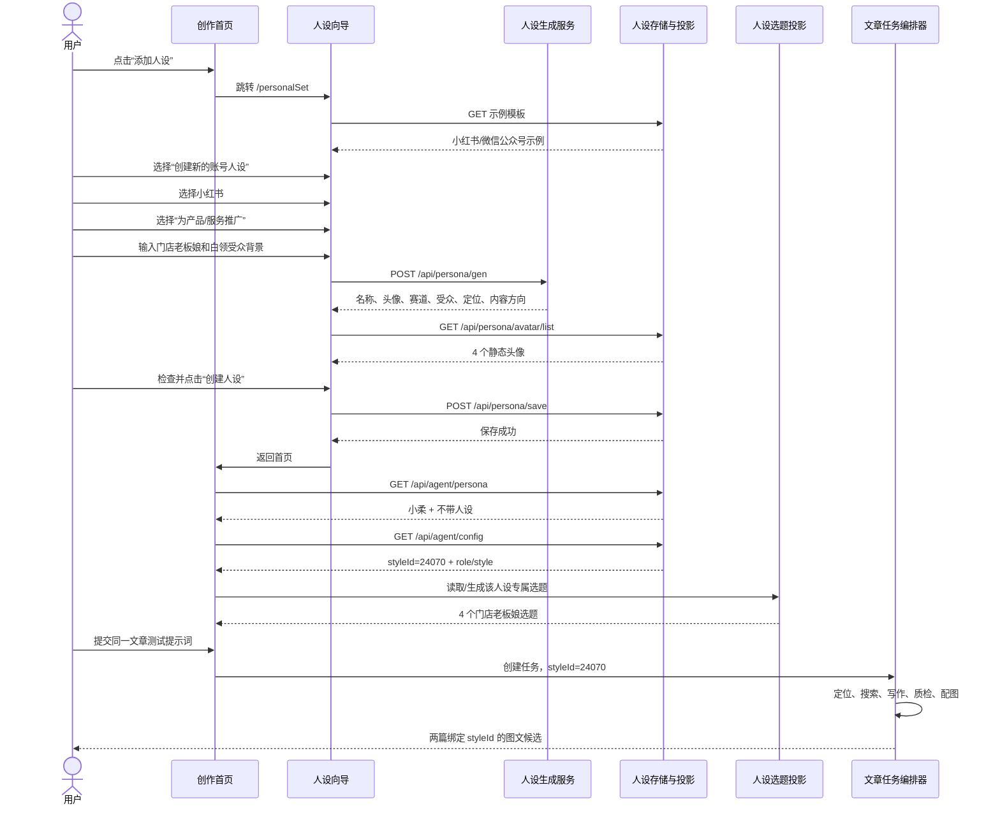
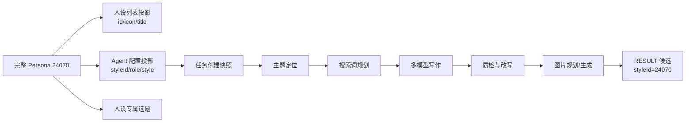
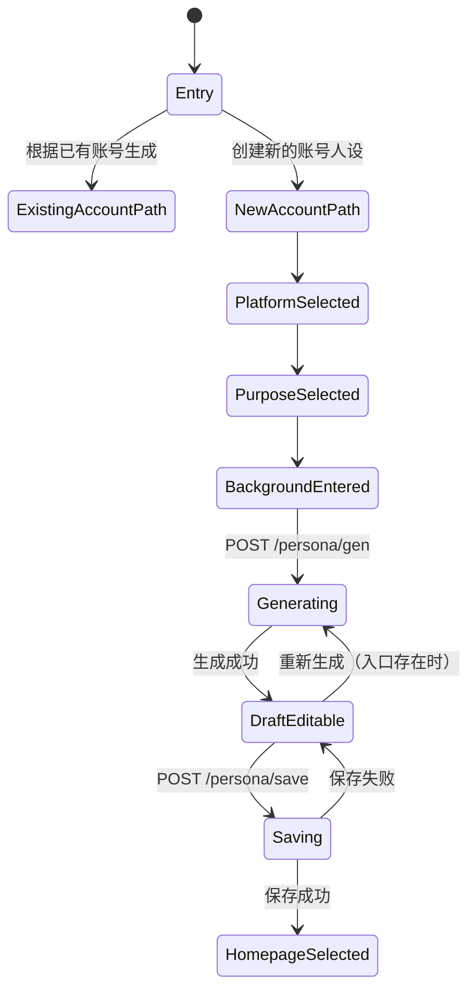
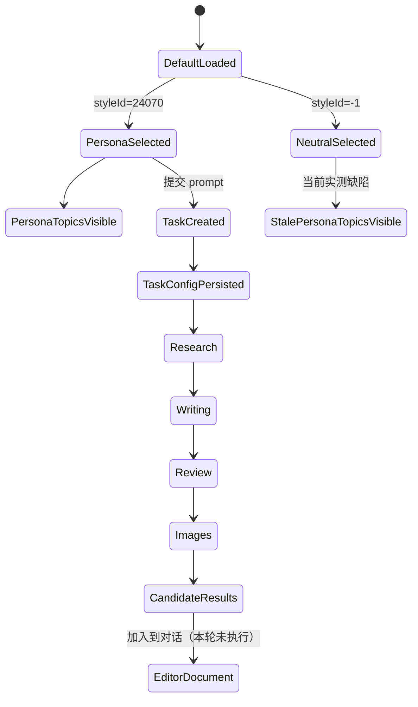

# 05｜讯飞绘文「增加人设」全流程、应用链路与复刻拆解

> 测试日期：2026-07-24  
> 站点：`https://turbodesk.xfyun.cn/`  
> 创建入口：首页「添加人设」  
> 用户提供背景：`护发门店老板娘，客户群体为年轻女性白领群体为主`  
> 系统生成人设：`小柔`，`styleId=24070`  
> 应用测试提示词：`创作一篇7月份头皮护理小红书图文`  
> 成功应用任务：`taskId=18210911`，深度模式，`quick=false`  
> 证据等级：登录态真实页面、请求/响应、SSE 结构化结果、刷新后的持久化状态  
> 隐私处理：Cookie、令牌、账号 ID、设备标识、真实内网 IP 和可识别账号信息不落盘

## 1. Question

本轮要回答四个问题：

1. 从首页点击「添加人设」后，用户经历了哪些页面、选择和编辑步骤？
2. 人设生成、头像读取、保存、选择、默认值恢复分别调用什么合同？
3. 人设究竟只改变文风，还是会进入选题、检索、写作、质检、配图和最终成果？
4. 如果在本项目复刻，哪些机制值得保留，哪些实现必须改良？

本轮不继续触发以下后续面：

- 选题中心的完整独立工作流。
- 爆款注入机制。
- `xhsEditor` / `imageEditor` 专用编辑器。
- `workbench` / `accountMatrix` 运营回流。
- 完整商业面记账。
- 最终候选的「加入到对话」和图片微调。
- 人设删除；也未猜测未观察到的删除接口。

这些能力与人设有交叉，但应各自使用独立测试用例，避免一次操作改变多个变量。

## 2. 结论先行

### 2.1 人设不是一个纯文风预设

**[观察]** 本次创建的人设进入了至少四个投影：

1. 首页选择器：`id + icon + title`。
2. 首页「人设专属选题」。
3. Agent 配置：`styleId + role + style`。
4. 任务创建、正式生成和最终候选：`styleId=24070`。

同一提示词与无人物基线相比，主题定位、搜索词、参考来源、标题、正文第一人称、商业表达和配图场景都发生了变化。因此它实际上是一个**跨阶段生成上下文**，而不是只在最后一步替换语气。

### 2.2 真实实现是“完整人设对象 → 多个瘦投影”

**[观察]** 创建页保存的是完整字段：

- 平台。
- 名称和头像。
- 赛道。
- 受众。
- 账号定位。
- 主要内容方向。
- 可选风格样例。

但首页选择器接口只返回：

```json
{
  "id": 24070,
  "icon": "<avatar-url>",
  "title": "小柔"
}
```

Agent 配置又把完整人设压缩成：

```json
{
  "styleId": 24070,
  "role": "主要受众：...\n人设定位：...",
  "style": ""
}
```

**[推断]** 服务端至少维护了“完整人设记录”“选择器摘要”“执行提示投影”三种读模型。字段没有直接一比一进入任务请求。

### 2.3 最大问题不是生成质量，而是事实边界

用户只提供了“护发门店老板娘”和“年轻女性白领客户群体”。最终稿却新增了：

- “开了快十年护发店”。
- “后台好多来店里的小姐姐”。
- “店里最近推的 TWG 乳酸菌海盐洁发膏”。
- “抽一位送同款试用装”。

这些不是文风，而是可被消费者理解为真实的经营年限、客户案例、在售商品、库存和促销承诺。

**[观察]** 图片规划继续把这些未经提供的事实视觉化成门店、产品陈列、试用装礼盒和店内海报。  
**[结论]** 讯飞绘文把“人设角色提示”和“可公开声明的经营事实”混在一个自由文本上下文中；这对美业商家内容是严重的事实、广告和履约风险。

### 2.4 保存人设隐式改变默认值

**[观察]**

- 保存后回到首页，新人设立即成为已选人设。
- 刷新后仍恢复为 `小柔`。
- 临时切换「不带人设」没有请求；刷新后又恢复为 `小柔`。
- 切换「不带人设」后，原有「人设专属选题」没有立即刷新。

因此当前产品把三个概念混在了一起：

1. 创建并保存人设。
2. 设置账号默认人设。
3. 当前 Composer 会话临时选择。

复刻时必须拆成显式动作。

## 3. Local sources used

- 本研究包原有无人物基线：
  - `01-end-to-end-flow.md`
  - `02-observed-api-contracts.md`
  - `04-final-output-and-quality-audit.md`
  - `observed-contracts.json`
- 本项目现有身份与执行合同：
  - `packages/contracts/src/marketing-package.ts`
  - `packages/contracts/src/context-bundle.ts`
  - `apps/core/src/p1/execution-spine/creation-execution-snapshot.ts`
  - `apps/core/src/p1/harness/production-context-port.ts`
  - `apps/core/src/p1/harness/langfuse-prompts.ts`
- 当前实现审计：
  - `references/analysis/lightweight-generation-spine-research-2026-07-24/02-personalization-context-prompt-implementation-audit.md`
  - `references/analysis/lightweight-generation-spine-research-2026-07-24/07-lightweight-generation-spine-synthesis.md`

## 4. Live sources used

只使用登录态中的讯飞绘文真实页面和同页实际请求，没有使用公开网页推测其内部实现。

页面：

- `/`
- `/personalSet`
- `/agent?taskId=18210911`

接口和 SSE 合同详见第 7 节及 `persona-observed-contracts.json`。

## 5. 用户交互全流程



### 5.1 首页入口

**[观察]**

- 首页原入口文案为「添加人设」。
- 点击后跳转到 `/personalSet`，不是在首页弹窗内完成。
- 人设创建是独立向导，而不是 Composer 的强制前置表单。

**[复刻启示]**

- 保留“创作时顺手添加”的入口。
- 不要让未创建人设的新商家无法开始第一次创作；无人物时应走中性官方表达。

### 5.2 示例与两条创建路径

页面初始化调用：

```http
GET /api/persona/v2/example/template?keys=&keys=
```

返回两个示例模板：

- 小红书示例「阿玲」。
- 微信公众号示例「检票员」。

每个示例具有：

```text
platform
platformDesc
name
avatar
tracks[]
audience
accountPosition
mainContentThemes
contentStyle
```

页面提供两条路径：

1. 「根据已有账号生成人设」。
2. 「创建新的账号人设」。

本次选择第 2 条。

**[推断]** 第一条路径可能需要账号内容或账号授权作为上下文，但本轮没有触发，不能推断其抓取、授权或解析接口。

### 5.3 选择平台

可见平台：

- 小红书。
- 微信公众号。

本次选择小红书，生成请求使用：

```json
{
  "platform": "xiaohongshu"
}
```

平台选择位于人设生成之前，说明平台规则会参与人设草案，而不是仅在文章生成阶段适配。

### 5.4 选择创建目的

页面给出三个互斥目标：

1. `用人设打造个人IP，未来尝试变现`
2. `塑造一个贴切的人设，为某产品/服务进行推广`
3. `塑造品牌人设，进行品牌内容推广`

本次选择第 2 项。

这个值没有转换成枚举，而是以完整中文文案写入 `accountPosition`：

```json
{
  "accountPosition": "塑造一个贴切的人设，为某产品/服务进行推广"
}
```

**[问题]** 展示文案直接成为协议值，后续改文案可能改变模型输入或服务端分支。复刻应使用稳定枚举，例如 `service_promotion`。

### 5.5 输入背景

页面提示用户描述：

- 产品/服务及卖点。
- 目标受众。
- 想要的账号风格。
- 可选上传文件。

本次只输入用户指定背景：

```text
护发门店老板娘，客户群体为年轻女性白领群体为主
```

没有上传附件，因此：

```json
{
  "docIds": []
}
```

### 5.6 AI 生成人设草案

请求：

```http
POST /api/persona/gen
Content-Type: application/json
```

```json
{
  "genSource": "custom",
  "platform": "xiaohongshu",
  "accountPosition": "塑造一个贴切的人设，为某产品/服务进行推广",
  "additional": "护发门店老板娘，客户群体为年轻女性白领群体为主",
  "docIds": []
}
```

关键响应：

```json
{
  "avatar": "<persona_avatar1.svg>",
  "name": "小柔",
  "tracks": [
    "美客引流 干货实用",
    "门店运营 干货实用",
    "护发干货 干货实用",
    "女性护发 干货实用",
    "开店创业 干货实用",
    "养发技巧 干货实用"
  ],
  "audience": "20-35岁有脱发、发质受损问题的年轻职场女性白领",
  "accountPosition": "你是开线下护发门店的老板娘，性格直爽热心，懂专业护发知识，会分享真实护发经验，帮年轻白领解决发质问题",
  "mainContentThemes": "围绕年轻白领常见发质问题，分享干货护发知识，推荐店内靠谱项目，晒真实客照效果，分享门店日常与护发避坑指南",
  "contentStyle": ""
}
```

#### 输入到输出的扩写

| 字段 | 用户明确提供 | 系统新增 | 性质 |
| --- | --- | --- | --- |
| 行业角色 | 护发门店老板娘 | 线下门店 | 合理改写 |
| 客户群体 | 年轻女性白领 | 20–35 岁、脱发、发质受损 | 未确认的人群细分 |
| 性格 | 无 | 直爽、热心 | 文风建议 |
| 专业性 | 无 | 懂专业护发知识 | 能力声明，需确认 |
| 内容素材 | 无 | 真实护发经验、真实客照 | 事实/授权风险 |
| 商业方向 | 产品/服务推广选项 | 推荐店内项目 | 合理策略，但项目事实未登记 |
| 内容支柱 | 无 | 门店运营、护发、创业等六类 | 内容策略建议 |

人设草案的生成质量不差，但**建议字段、事实字段和授权字段没有区分**。

### 5.7 头像与字段编辑

页面调用：

```http
GET /api/persona/avatar/list
```

返回 4 个静态 SVG 头像地址。

生成后可编辑字段：

- 人设名称。
- 关联平台。
- 六个赛道标签。
- 「新增赛道」。
- 主要内容方向。
- 主要受众。
- 人设定位。
- 风格样例。

风格样例占位提示：

```text
补充你希望该人设创作的风格样本案例，300~1000字为佳
```

**[观察]** `contentStyle=""` 可以直接保存，说明风格样例不是必填项。  
**[观察]** 赛道标签普遍重复「干货实用」，标签的“主题”和“表达方式”没有结构化拆分。  
**[观察]** 头像选择空间只有 4 个静态图；这更像轻量标识，不是肖像/数字人系统。

### 5.8 保存

请求：

```http
POST /api/persona/save
Content-Type: application/json
```

请求体由生成结果和用户可编辑字段组成：

```json
{
  "genSource": "custom",
  "platform": "xiaohongshu",
  "avatar": "<persona_avatar1.svg>",
  "name": "小柔",
  "tracks": [
    "美客引流 干货实用",
    "门店运营 干货实用",
    "护发干货 干货实用",
    "女性护发 干货实用",
    "开店创业 干货实用",
    "养发技巧 干货实用"
  ],
  "audience": "20-35岁有脱发、发质受损问题的年轻职场女性白领",
  "accountPosition": "你是开线下护发门店的老板娘，性格直爽热心，懂专业护发知识，会分享真实护发经验，帮年轻白领解决发质问题",
  "mainContentThemes": "围绕年轻白领常见发质问题，分享干货护发知识，推荐店内靠谱项目，晒真实客照效果，分享门店日常与护发避坑指南",
  "contentStyle": ""
}
```

响应：

```json
{
  "code": 0,
  "data": null,
  "msg": "成功"
}
```

**[观察]**

- 创建请求没有客户端生成的 `personaId`。
- 响应不返回新 ID。
- 页面回到首页后，才通过人设列表读取到 `id=24070`。

**[建议]** 复刻 API 应直接返回新建资源及 revision，避免前端靠刷新列表猜测刚创建的是哪一项。

## 6. 保存后的持久化、选择与默认值

### 6.1 人设列表投影

创建前：

```json
[
  {
    "id": -1,
    "icon": "",
    "title": "不带人设"
  }
]
```

创建后：

```json
[
  {
    "id": 24070,
    "icon": "<persona_avatar1.svg>",
    "title": "小柔"
  },
  {
    "id": -1,
    "icon": "",
    "title": "不带人设"
  }
]
```

接口：

```http
GET /api/agent/persona
```

`-1` 是哨兵值，不是 `null`。这会让“无人物”混入正常资源 ID 空间。

### 6.2 Agent 配置投影

创建后首页读取到：

```json
{
  "styleId": 24070,
  "role": "主要受众：20-35岁有脱发、发质受损问题的年轻职场女性白领\n人设定位：你是开线下护发门店的老板娘，性格直爽热心，懂专业护发知识，会分享真实护发经验，帮年轻白领解决发质问题",
  "style": "",
  "quick": false,
  "search": false
}
```

字段映射：

| 完整人设字段 | Agent 配置字段 | 观察结果 |
| --- | --- | --- |
| `persona.id` | `styleId` | `24070` |
| `audience` | `role` 第一行 | 以中文前缀拼接 |
| `accountPosition` | `role` 第二行 | 以中文前缀拼接 |
| `contentStyle` | `style` | 空字符串 |
| `tracks` | 未出现在该配置 | 可能由选题侧单独读取 |
| `mainContentThemes` | 未出现在该配置 | 可能由选题侧单独读取 |
| `name/avatar/platform` | 未出现在该配置 | 选择器另行投影 |

这里的 `styleId` 实际指“人设 ID”，命名与语义不一致。

### 6.3 选择器行为

首页选择器包含：

- `小柔`。
- `不带人设`。
- 每行存在悬浮后显示的编辑图标。

**[观察]**

- 临时切换到「不带人设」时，没有发出保存默认值的请求。
- 刷新后，选择又恢复为 `小柔`。
- 因此临时选择只存在前端当前状态；服务端默认仍是 `styleId=24070`。
- 切换到「不带人设」后，页面上的「人设专属选题」没有立即清空或刷新。

**[推断]**

- 创建成功同时写入了某个账号级 Agent 默认配置。
- Composer 选择器的当前值与账号默认值是两个状态，但 UI 没有解释差异。
- 专属选题有缓存或独立查询生命周期，缓存键/失效条件没有正确绑定当前选择。

### 6.4 编辑与删除的证据边界

- 列表 DOM 中能观察到编辑图标。
- 本轮没有进入编辑页，也没有触发编辑/删除写接口。
- 为保留用户刚创建的人设，没有测试删除。

因此本报告不声明：

- 编辑是否原地覆盖。
- 是否存在 revision。
- 历史任务是否随编辑发生漂移。
- 删除是软删除还是硬删除。
- 是否有引用检查。

这些应使用第二个人设或专用测试账号单独验证。

## 7. API 与调用方式总表

| 方法 | 路径 | 作用 | 关键输入/输出 | 证据 |
| --- | --- | --- | --- | --- |
| `GET` | `/api/persona/v2/example/template?keys=&keys=` | 读取人设示例 | 返回 2 个完整模板 | 已观察 |
| `POST` | `/api/persona/gen` | 根据向导输入生成草案 | `genSource/platform/accountPosition/additional/docIds` | 已观察 |
| `GET` | `/api/persona/avatar/list` | 读取默认头像 | 4 个静态 SVG | 已观察 |
| `POST` | `/api/persona/save` | 保存人设 | 完整人设字段；响应 `data:null` | 已观察 |
| `GET` | `/api/agent/persona` | 读取 Composer 人设选项 | `id/icon/title` + `id=-1` | 创建前后观察 |
| `GET` | `/api/agent/config` | 读取首页 Agent 默认配置 | `styleId/role/style/quick/search` | 已观察 |
| `POST` | `/api/agentHomepage/create` | 创建文章任务 | `styleId=24070` | 已观察 |
| `GET` | `/api/agent/config?taskId=18210911` | 恢复任务配置 | 保留 `styleId` 和编译后的 `role` | 刷新验证 |
| `POST` | `/api/agent/v2/chat` | 需求解析/正式生成 | 正式生成请求带 `styleId=24070` | 已观察 |
| `POST` | `/api/agent/v2/confirm/continue` | 确认并继续 | 不再重复 `styleId` | 已观察 |
| `GET` | `/api/agent/chat/page?...taskId=18210911` | 恢复对话与最终结果 | 4 条记录，最终消息可恢复 | 刷新验证 |
| `GET` | `/api/editor/article/18210911` | 读取编辑器文档 | 仍为空 | 刷新验证 |
| `POST` | `/api/editor/article` | 自动保存空编辑器 | 页面刷新后出现空保存 | 已观察 |
| `GET` | `/api/member/score` | 读取积分余额 | 完成后为 `2924` | 已观察 |

### 7.1 任务创建中的人设绑定

本次应用任务与无人物基线使用相同提示词、平台、模型和自动配图，只改变人设：

```json
{
  "type": "input",
  "query": "<p>创作一篇7月份头皮护理小红书图文</p>",
  "quick": false,
  "search": false,
  "styleId": 24070,
  "attachment": [],
  "file": null
}
```

`writingModelConfig` 与原基线相同：

- 绘文 V4.1 × 1。
- DeepSeek V3 × 1。
- 其他模型 × 0。

创建响应：

```json
{
  "code": 0,
  "data": 18210911,
  "msg": "成功"
}
```

### 7.2 人设在编排中的传递

**[观察]**

- 首页创建任务：带 `styleId=24070`。
- 正式 `/api/agent/v2/chat`：仍带 `styleId=24070`。
- `/api/agent/v2/confirm/continue`：不带 `styleId`。
- 刷新任务后 `/api/agent/config?taskId=...`：保留 `styleId=24070` 和已编译 `role`。
- 两篇最终 `articleList` 对象：各自带 `styleId=24070`。

**[推断]** `confirm/continue` 只传确认卡增量；编排器通过任务配置读取已冻结的人设选择。  
**[风险]** 合同只有可变的数字 ID，没有显式 persona revision。虽然任务配置保存了 `role` 文本，但编辑人设后历史任务能否完全复现仍未验证。

## 8. 人设如何影响完整文章流水线



### 8.1 首页专属选题

创建后立即显示四个专属选题：

1. `养发店老板娘说句大实话：养发不是“养养”，而是“不养”！`
2. `护发门店老板娘亲测：这3个“24小时营业”护发技巧，让你睡梦中悄悄养发`
3. `来我店里做护理的姑娘，为什么都越来越‘美’了？`
4. `别再花冤枉钱！老板娘揭秘：白领最常踩的6个“护发智商税”，你中招几个？`

**[观察]** 这些题目明显使用了老板娘、白领、门店、护发等字段。  
**[推断]** `tracks` 和 `mainContentThemes` 很可能进入选题生成/缓存；具体接口未从本轮网络记录中可靠隔离，因此不写成已确认合同。

### 8.2 主题定位变化

| 条件 | 定位结果 |
| --- | --- |
| 不带人设 | `7月份头皮护理控油技巧分享` |
| `小柔` | `7月份夏季头皮护理指南：控油防晒清洁技巧` |

人设版主题更明确地覆盖：

- 夏季。
- 控油。
- 防晒。
- 清洁。

这说明人设已进入搜索前的 Planning 节点。

### 8.3 搜索任务变化

无人物基线：

1. `头皮护理 夏季出油原因 科学原理`
2. `头皮护理 控油成分 产品推荐`
3. `头皮护理 夏季控油技巧 用户心得`

人设版：

1. `夏季头皮防晒 防晒喷雾 遮阳帽 体验分享`，返回 3 条。
2. `头皮深层清洁 磨砂膏 油性发质 使用感受`，返回 5 条。
3. `职场女性 夏季头皮控油 控油喷雾 日常护理技巧`，返回 4 条。

变化点：

- 受众“职场女性”进入搜索词。
- “门店专业建议”倾向把搜索角度从原理推向产品、使用感受和操作技巧。
- “防晒”从主题定位继续进入搜索规划。

### 8.4 最终采用的 6 个来源

| # | 发布者 | 标题 | 域名/类型 |
| ---: | --- | --- | --- |
| 1 | 澎湃新闻 | 这些部位也要防晒，99% 的人都忽略了 | `thepaper.cn`，科普转载 |
| 2 | 搜狐时尚频道 | TWG 头皮磨砂膏全系列深度解析 | `fashion.sohu.com`，标注 AI 生成的产品文 |
| 3 | 搜狐时尚频道 | 爱德兰丝头皮磨砂膏：告别油腻…… | `fashion.sohu.com`，促销产品文 |
| 4 | 视听甘肃 | 2026 公认口碑好的去屑止痒洗发水…… | 百家号，SEO 营销文 |
| 5 | 新华网 | 头顶变“油田”？四招儿甩掉发丝油腻 | `xinhuanet.com`，健康生活稿 |
| 6 | 新浪时尚 | 头发控油法 夏日油头不再愁 | `fashion.sina.com.cn`，时尚生活稿 |

相较无人物基线“最终 7 条全部百家号”，来源域名更多样；但两条搜狐产品文和一条百家号营销文把特定品牌与促销话术引入了生成上下文。

### 8.5 多模型写作

初稿标题：

- 绘文 V4.1：`7月头皮控油防晒清洁`
- DeepSeek V3：`7月油头自救指南✨｜老板娘亲测3步搞定`

最终标题：

- 绘文 V4.1：`7月油头塌发3步稳住`
- DeepSeek V3：`7月油头控油指南｜老板娘亲测3步清爽过夏`

最终结果：

| 候选 | 模型 | 正文 JS 字符长度 | 图片对象 | `styleId` |
| --- | --- | ---: | ---: | ---: |
| A | 绘文 V4.1 | 1025 | 4 | 24070 |
| B | DeepSeek V3 | 680 | 5 | 24070 |

候选 A 使用较弱角色表达：

- “我店里这阵子来得最多的……”
- “我这边不少油头会用……”

候选 B 使用强角色和强商业表达：

- “后台好多来店里的小姐姐……”
- “作为开了快十年护发店的老板娘……”
- “店里最近推的 TWG 乳酸菌海盐洁发膏……”
- “抽一位送同款海盐洁发膏试用装……”

完整候选正文、图片 URL 和图片描述保存于 `persona-observed-contracts.json`。

### 8.6 图片阶段继续放大人设与虚构事实

候选 B 的 5 张图片规划包含：

1. 护发店老板娘在店内与顾客交流。
2. 店内陈列 TWG 乳酸菌海盐洁发膏。
3. 户外头皮防晒。
4. 逆发根吹发。
5. 店内 TWG 试用装礼盒和活动海报。

这证明图片生成不是独立安全域：它消费了文章中的角色和商业断言，并把未登记事实做成“视觉证据感”更强的画面。

### 8.7 最终持久化仍遵循“候选 ≠ 编辑器文档”

任务刷新后：

- 4 条 Chat 记录。
- 最终响应 `completed=true`。
- 最终候选可恢复。
- 编辑器 Article 仍为：
  - `title=""`
  - `content=""`
  - `version=0`
  - `chatId=0`

因此人设没有改变原有结果模型：

```text
人设化候选 RESULT
    !=
已采纳编辑器 Article
```

「加入到对话」仍是下一独立状态转换，本轮未触发。

## 9. 与无人物基线的控制变量对比

| 维度 | 无人物基线 `18210820` | 人设版 `18210911` | 判断 |
| --- | --- | --- | --- |
| 用户提示词 | 相同 | 相同 | 控制变量 |
| 模式 | 深度 | 深度 | 控制变量 |
| 模型 | V4.1 + DeepSeek V3 | 相同 | 控制变量 |
| 自动配图 | 开 | 开 | 控制变量 |
| `styleId` | `-1` | `24070` | 唯一关键变量 |
| 主题 | 控油技巧分享 | 控油+防晒+清洁指南 | Planning 被影响 |
| 受众显式化 | 弱 | 职场女性 | Audience 被注入 |
| 第一人称 | 普通分享 | 店主/老板娘 | Voice 被注入 |
| 商业内容 | 搜索材料带品牌偏置 | 直接变成“店里在推” | Persona 放大商业断言 |
| 来源 | 7 条，全部百家号 | 6 条，5 个域名/类型 | 多样性提高但仍混入营销文 |
| 图片 | 通用护理图 | 门店、老板娘、店内产品、赠品 | Image planner 被影响 |
| 候选图片数 | 每篇 4 | 4 + 5 | 数量仍不稳定 |
| 编辑器 | 空 | 空 | 采纳边界不变 |

该对比能证明人设进入了搜索和内容规划上游，而不是只作为文末润色。

## 10. 观察到的状态机

### 10.1 创建状态机



### 10.2 使用状态机



## 11. 可推断的内部实现

下列内容是由多个直接观察支持的高概率结构，不是服务端源码事实。

### 11.1 人设生成服务

可能输入：

```ts
type PersonaGenerationInput = {
  source: "custom" | "existing_account";
  platform: "xiaohongshu" | "wechat";
  purpose: string;
  background: string;
  documentIds: string[];
};
```

可能输出：

```ts
type PersonaDraft = {
  name: string;
  avatar: string;
  tracks: string[];
  audience: string;
  accountPosition: string;
  mainContentThemes: string;
  contentStyle: string;
};
```

LLM 负责把一个自由文本背景扩展成多个字段，前端把结果作为可编辑草案展示。

### 11.2 人设资源与读模型

```text
PersonaRecord
├── Authoring projection
│   └── 创建/编辑页完整字段
├── Picker projection
│   └── id/icon/title
├── Agent prompt projection
│   └── styleId/role/style
└── Topic recommendation context
    └── tracks/mainContentThemes/audience/accountPosition
```

这种 CQRS 式投影方向本身合理；问题是：

- ID 没有 revision。
- 字段来源和确认状态缺失。
- 默认值写入是隐式的。
- 选择器和专属选题投影失效不同步。

### 11.3 执行上下文编译

高概率链路：

```text
personaId
  -> load persona
  -> compile audience + accountPosition into role
  -> persist task config
  -> inject role/style into topic/search/writing prompts
  -> carry styleId into candidate result
```

`confirm/continue` 不重复携带 `styleId`，说明服务端任务配置是后续阶段的事实来源之一。

### 11.4 专属选题

创建完成后立即出现人设专属选题，且题目同时使用：

- 行业。
- 门店角色。
- 受众。
- 内容方向。
- “老板娘亲测”等表达。

高概率输入为 `tracks + audience + accountPosition + mainContentThemes + platform`。  
当前缺陷表明专属选题的缓存键可能没有包含“当前临时选择”或切换时没有失效。

## 12. 产品与技术风险

### 12.1 事实、人设和风格混为一体

| 输出 | 用户是否提供 | 风险类型 | 应有处理 |
| --- | --- | --- | --- |
| 门店老板娘 | 是 | 低 | 可使用 |
| 年轻女性白领 | 是 | 低 | 可使用 |
| 20–35 岁 | 否 | 受众猜测 | 标记为建议并确认 |
| 脱发、发质受损 | 否 | 健康画像猜测 | 不应默认固化 |
| 性格直爽热心 | 否 | 风格建议 | 可编辑确认 |
| 懂专业护发知识 | 否 | 专业资质暗示 | 需要资质/边界确认 |
| 真实客照 | 否 | 客户案例和肖像授权 | 必须有资产与授权 |
| 开店快十年 | 否 | 虚假经营年限 | 硬阻断 |
| 店里最近推 TWG | 否 | 虚假商品/库存 | 硬阻断 |
| 赠送试用装 | 否 | 虚假促销和履约承诺 | 硬阻断 |

### 12.2 搜索材料被错误转成商家事实

搜索到某产品文章只证明“互联网上存在一篇关于该产品的内容”，不证明：

- 商家在售。
- 商家使用过。
- 商家推荐。
- 商家有库存。
- 商家可以赠送试用装。

当前系统把第三方材料中的品牌和促销叙述，与老板娘第一人称组合成“店里最近推”。这是一个明确的 provenance 丢失问题。

### 12.3 健康和功效风险

头皮护理涉及：

- 脱发。
- 真菌。
- 头皮屏障。
- 去屑/止痒。
- 防晒和皮肤风险。
- 产品成分与功效。

当前自动质检更偏标题、结构、传播力和 SEO，没有证明它能阻断医疗化建议、未经证实的功效或错误频率。

### 12.4 历史可复现性不明确

最终对象只带 `styleId=24070`，没有显式：

- `personaRevision`。
- `compiledPersonaHash`。
- 使用的事实引用。
- 用户确认记录。

任务配置保存了 `role` 文本，能降低一部分漂移，但不足以证明编辑人设后所有历史阶段可完全重放。

### 12.5 选择、默认和缓存状态不一致

- 保存即默认，没有单独确认。
- 临时选择没有持久化。
- 切为无人物后专属选题仍旧可见。
- 首页余额也曾在任务完成前后出现旧值，刷新后才更新。

这些都说明复杂首页依赖多个异步投影，但缺少统一 invalidation 和“最后更新于”反馈。

### 12.6 图片数量合同仍不稳定

界面声称每篇生成“1 张封面 + 4 张内页”，本次：

- 候选 A：4 张。
- 候选 B：5 张。

结果没有显式 `partial`、失败 slot 或重试信息。图片成功态应按 slot 管理，而不是只看数组长度。

### 12.7 计费只观察到总余额差

- 提交前首页显示：`2948`。
- 成功任务完成后 `/api/member/score`：`2924`。
- 观察差值：`24`。

不能据此断言人设本身收费 24 分。该差值包含深度搜索、两模型写作、质检和 9 个实际图片对象等组合执行，且首页存在余额投影延迟。

## 13. 复刻原则：保留、改良、拒绝

### 13.1 建议保留

- 首页轻入口，不阻断第一次创作。
- 平台和业务目标先于 AI 草案生成。
- AI 先生成结构化草案，再让用户编辑。
- 人设选择器紧邻 Composer。
- 人设进入上游选题和搜索，而不只进入末端文风。
- 专属选题作为人设价值的即时反馈。
- 任务保存人设绑定，刷新后结果可恢复。

### 13.2 必须改良

- 每个 AI 生成字段显示来源：`用户输入 / 账号内容 / AI 建议 / 已验证事实`。
- 对年龄、痛点、专业能力、真实案例等新增字段逐项确认。
- 把人设、事实、受众、内容策略、表达样例拆开。
- 保存人设与设置默认人设分离。
- 选择器切换后立即刷新专属选题。
- 执行必须绑定 identity revision，而不是可变整数 ID。
- 图片规划继承事实/授权门。
- 结果展示图片 slot 成功、失败和重试状态。

### 13.3 不建议复用

- 用 `styleId` 表示人设。
- 用 `-1` 伪装空资源。
- 用中文展示文案作为稳定业务枚举。
- 把多字段拼成无来源的 `role` 字符串直接注入。
- 保存后隐式改变全局默认值。
- 把第三方搜索到的商品改写成“本店在售/推荐”。
- 允许模型自行创建活动、库存和履约承诺。

## 14. 面向本项目的领域映射

本项目已有：

- 版本化 `MarketingIdentityAsset`。
- `StoreFact` 与 ContextBundle。
- `CreationExecutionSnapshot.identity`。
- 身份 lifecycle 与撤权。
- `professionalBoundaries`、`allowedPlatforms`、`allowedScenes`、`expressionSamples`。
- 品牌身份的 `brandClaims`、`forbiddenClaims`、`visualPrinciples`、`seriesAnchors`。

因此不需要复制一套 `styleId` 系统，应把讯飞绘文的人设体验映射到现有领域。

### 14.1 正确拆分

| 讯飞字段/行为 | 本项目建议 owner | 原因 |
| --- | --- | --- |
| 名称、真实角色、表达样例、专业边界 | `MarketingIdentity` revision | 身份和表达授权 |
| 性格/语气 | `expressionSamples` 或明确 voice contribution | 不能当经营事实 |
| 受众 | Brief 的 audience revision/context | 受众随任务和活动变化 |
| 赛道、主要内容方向 | Recipe/series strategy | 是内容策略，不是身份本体 |
| 在售服务、门店年限、价格、库存 | `StoreFact` revision | 必须可验证、可撤回 |
| 客照、案例 | OwnedAsset + rights | 需要肖像、用途、期限 |
| 促销活动和赠品 | Campaign/offer fact + validity | 有履约和有效期 |
| 默认选择 | Workspace/Composer preference | 与资源创建分离 |
| 本次使用的人设 | `CreationExecutionSnapshot.identity` | 冻结精确 revision |

### 14.2 不把身份登记设为硬前置

当前 `CreationExecutionSnapshot.identity` 是必填 revision reference，但产品体验不能要求新商家先建档才能创作。

推荐两种产品语义之一：

1. 系统 provision 一个明确标注的「门店中性/官方口吻」身份 revision。
2. 执行快照支持显式 `neutral`，不伪造某个人设资源。

无论选哪种，都必须让用户知道当前是：

- 中性表达。
- 某个已登记人设。
- 某个临时任务级人设草案。

## 15. 推荐的数据合同

### 15.1 AI 草案与正式资源分离

```ts
type PersonaDraft = {
  draftId: string;
  platform: "xiaohongshu" | "wechat";
  purpose: "personal_ip" | "service_promotion" | "brand_promotion";
  fields: {
    displayName: SuggestedField<string>;
    audience: SuggestedField<string>;
    realWorldRole: SuggestedField<string>;
    professionalBoundaries: SuggestedField<string[]>;
    contentPillars: SuggestedField<string[]>;
    expressionSamples: SuggestedField<string[]>;
  };
  unresolvedClaims: ProposedClaim[];
};

type SuggestedField<T> = {
  value: T;
  provenance: "user" | "account_import" | "document" | "ai_suggestion";
  confirmed: boolean;
  evidenceRefs: string[];
};

type ProposedClaim = {
  text: string;
  category:
    | "identity"
    | "professional_qualification"
    | "store_fact"
    | "product"
    | "promotion"
    | "customer_case";
  status: "unconfirmed" | "verified" | "rejected";
};
```

生成草案不等于创建正式 `MarketingIdentity`。只有用户确认后才注册 revision。

### 15.2 显式默认值

建议命令分离：

```http
POST /marketing-identities/drafts:generate
POST /marketing-identities
PUT  /composer/preferences/default-identity
```

创建响应至少返回：

```json
{
  "identityId": "identity-xiaorou",
  "revision": "1",
  "status": "active"
}
```

设置默认值是第二个显式动作，不能作为创建副作用。

### 15.3 执行绑定

```json
{
  "intent": "创作一篇7月份头皮护理小红书图文",
  "identity": {
    "id": "identity-xiaorou",
    "revision": "1"
  },
  "audience": {
    "id": "audience-young-white-collar-women",
    "revision": "3"
  },
  "factRefs": [
    "store_fact:service-scalp-care:2"
  ],
  "recipe": {
    "id": "xhs-educational-post",
    "revision": "4"
  }
}
```

服务端创建 `CreationExecutionSnapshot` 时冻结这些引用。

## 16. 推荐的 Prompt Compiler

不要把所有内容拼成：

```text
主要受众：...
人设定位：...
```

推荐按来源和权限编译：

```text
System invariants
  -> Platform policy
  -> Identity voice and professional boundaries
  -> Verified store/product/promotion facts with refs
  -> Audience and campaign objective
  -> Content strategy / recipe
  -> Research evidence with source quality
  -> Prohibited claims and unsupported-claim rule
  -> User task
```

编译产物至少记录：

```ts
type CompiledPersonaContext = {
  identityRef: string | null;
  identityRevision: string | null;
  voiceInstructions: string[];
  professionalBoundaries: string[];
  verifiedFacts: Array<{ text: string; sourceRef: string }>;
  forbiddenClaims: string[];
  unresolvedClaims: string[];
  audienceRef: string | null;
  compilerVersion: string;
  contentHash: string;
};
```

硬规则：

- 没有 `store_fact` 不得说“本店在售/最近在推”。
- 没有 promotion revision 不得创建抽奖、折扣、赠品。
- 没有经营年限事实不得说“开店十年”。
- 没有案例和授权不得说“真实客照/顾客反馈”。
- 搜索来源只能成为研究证据，不能自动升级为商家自有事实。
- 图片 Prompt 只能消费已通过同一事实门的内容。

## 17. 推荐的人设选题缓存

缓存键至少包含：

```text
workspaceId
platform
identityId
identityRevision
audienceRevision
contentStrategyRevision
locale
generatorVersion
```

失效事件：

- 当前 Composer 人设切换。
- 人设 revision 变化。
- 默认人设变化。
- 受众或内容策略变化。
- 人设撤销/离职/运营者变更。

UI 需要明确：

- 当前选题由哪个人设生成。
- 最后更新时间。
- 正在刷新、已刷新或刷新失败。

切换「不带人设」时不得继续显示带人设选题，除非明确标为历史缓存。

## 18. 事实与合规门

### 18.1 写作候选门

每个第一人称商业声明抽取为结构化 claim：

```ts
type CandidateClaim = {
  text: string;
  category: "identity" | "store" | "product" | "promotion" | "health";
  sourceRefs: string[];
  verdict: "supported" | "unsupported" | "contradicted";
};
```

以下内容必须阻断：

- `unsupported store`
- `unsupported product`
- `unsupported promotion`
- 未授权 customer case
- 高风险健康功效无可信来源

### 18.2 图片门

图片计划应先解析场景实体：

```text
店内
老板娘
顾客
TWG 产品
试用装礼盒
活动海报
```

每个实体检查：

- 是否属于商家。
- 是否有肖像/品牌/商品展示权。
- 是否是已验证事实。
- 是否允许在当前平台和用途使用。

只有通过后才启动图片任务。

## 19. P0 复刻切片

### P0-A：创建与选择

- 首页「添加人设」。
- 平台、目标、背景三步向导。
- AI 生成结构化草案。
- 字段 provenance 和逐项确认。
- 注册 `MarketingIdentity` revision。
- Composer 选择器支持 neutral 和 active identity。

### P0-B：执行注入

- Composer 提交绑定 identity revision。
- ContextBundle 解析完整 identity 和 active StoreFacts。
- Prompt Compiler 输出带引用的上下文。
- `CreationExecutionSnapshot` 冻结精确引用。
- 选题、搜索、写作、图片使用同一 snapshot。

### P0-C：安全门

- 未登记经营年限、商品、促销、案例不得生成第一人称声明。
- 搜索资料不得转成自有事实。
- 图片规划重复执行同一事实与 rights gate。
- 候选 UI 显示人设、revision、引用和阻断原因。

### P1：增强体验

- 已有账号内容导入。
- 人设版本差异预览。
- 人设专属选题缓存与刷新。
- 多人设/多门店排序与搜索。
- 失效、撤销、运营者变更后的历史内容处置。
- 基于已发布表现提出人设优化建议，但必须由用户确认新 revision。

## 20. 验收测试建议

### 20.1 创建

1. 用本测试背景生成草案。
2. 允许 AI 建议“20–35 岁”，但默认标记 `unconfirmed`。
3. 不得自动确认“专业资质”“真实客照”“开店年限”。
4. 空风格样例可保存。
5. 保存返回 `identityId + revision`。
6. 保存不自动改变默认值，除非用户勾选。

### 20.2 选择与缓存

1. 选择人设后专属选题带正确 revision。
2. 切换 neutral 后，旧人设选题立即失效。
3. 刷新恢复显式设置的默认值，而不是最后一次临时选择。
4. 多窗口修改默认值有版本冲突提示。

### 20.3 执行可复现性

1. 任务冻结 identity revision。
2. 人设之后被编辑，旧任务仍使用旧 revision。
3. 人设被撤销后，新任务不可使用；历史任务仍可审计。
4. 最终候选保存 identity ref、compiler version 和事实引用。

### 20.4 事实红线

用本测试输入验证输出不得自行出现：

- 开店快十年。
- 本店在售 TWG。
- 本店赠送试用装。
- 已有大量顾客案例。

如果用户后来登记这些事实，也必须引用对应 fact revision 和有效期。

### 20.5 图片

1. 文案被事实门阻断时，不生成对应店内产品图。
2. 每个图片 slot 记录 `planned/running/succeeded/failed`。
3. 声明 5 张时，返回 4 张必须显式标记 partial。
4. 单张重试不重复计费其他成功 slot。

## 21. Findings

1. **[观察]** 人设向导以 AI 草案降低了建档成本，且字段结构比单一“角色 Prompt”完整。
2. **[观察]** 人设进入了首页选题、主题定位、搜索规划、写作、图片规划和最终对象。
3. **[观察]** 选择器、Agent 配置和任务结果是不同投影；`styleId` 被用作人设 ID。
4. **[观察]** 保存后隐式成为默认人设，临时切换不持久化。
5. **[观察]** 切到无人物后专属选题仍旧显示，存在缓存失效缺陷。
6. **[观察]** 同一提示词的人设版更像真实老板娘账号，但同时生成了未经提供的门店经营和促销事实。
7. **[观察]** 第三方产品资料被改写成“本店最近推”，provenance 在搜索到写作之间丢失。
8. **[观察]** 图片阶段把虚构的商品、赠品和店内活动进一步视觉化。
9. **[观察]** 最终候选仍未自动进入编辑器，「加入到对话」保持独立采用边界。
10. **[推断]** 讯飞绘文通过任务配置保存编译后 `role/style`，并在多个编排节点复用。

## 22. Decision / open risk

### 建议决策

把「增加人设」列为本项目图文生成 P0 的首个可借鉴对标面，但只复用它的：

- 低门槛向导。
- AI 结构化草案。
- Composer 就近选择。
- 对选题到成品的全链应用。

领域实现必须基于现有 `MarketingIdentity + StoreFact + ContextBundle + CreationExecutionSnapshot`，不新增 `styleId` 式平行真相源。

### 开放风险

- 讯飞绘文编辑人设是否创建 revision，尚未观察。
- 历史任务在人设被修改后是否仍可完全重放，尚未验证。
- 「根据已有账号生成人设」的数据授权与抽取流程未拆。
- 人设专属选题的具体接口和缓存策略尚未隔离。
- 人设本身是否单独计费无法从本次 24 分总差值判断。
- 「加入到对话」后人设信息如何进入编辑器版本，待后续独立验证。

## 23. Follow-up tickets

| Ticket | 优先级 | 后续测试面 | 验证目标 |
| --- | --- | --- | --- |
| HW-PER-02 | P0 | 人设编辑与 revision | 修改字段后接口、并发、历史任务漂移 |
| HW-PER-03 | P0 | 已有账号生成人设 | 授权、采样范围、内容抽取、证据回链 |
| HW-PER-04 | P0 | 人设专属选题 | 请求合同、缓存键、刷新和采用 |
| HW-PER-05 | P0 | 事实红线 | 商品、年限、客照、促销如何进入/阻断 |
| HW-PER-06 | P1 | 人设 lifecycle | 删除、撤销、默认回退、历史内容 |
| HW-ADOPT-01 | P0 | 加入到对话 | 候选到编辑器的采用合同、版本和溯源 |
| HW-IMG-01 | P0 | 图片成功态与微调 | slot 状态、单图重试、加入对话后的图片编辑 |
| HW-BILL-01 | P0 | 商业面记账 | 人设、搜索、模型、图片和重试的逐项账本 |

## 24. 证据地图

| 文件 | 内容 |
| --- | --- |
| [`persona-system/01-home-persona-selected.jpg`](./persona-system/01-home-persona-selected.jpg) | 首页已选 `小柔`、选择菜单、余额和人设专属选题 |
| [`persona-system/03-persona-task-final-results.jpg`](./persona-system/03-persona-task-final-results.jpg) | 任务完成、图片阶段、两篇绑定 `小柔` 的最终候选 |
| [`persona-system/04-persona-task-confirmation-view.jpg`](./persona-system/04-persona-task-confirmation-view.jpg) | 任务页初始配置和需求确认区域 |
| [`persona-observed-contracts.json`](./persona-observed-contracts.json) | 创建合同、投影、任务绑定、检索、完整候选正文、图片与风险的机器可读快照 |

## 25. 证据边界

- 未访问服务端源码；内部服务拆分、数据库表、缓存和 Prompt 内容均以 `[推断]` 标识。
- 本报告只代表 2026-07-24 当天该账号可见版本。
- 未编辑或删除新建人设，避免破坏本轮可复核状态。
- 未点击「加入到对话」，最终编辑器仍为空。
- 未发布任何内容，也没有对外创建抽奖、促销或商品承诺。
- 最终文章中的经营、产品和健康表述仅作为被测系统输出，不视为事实。
