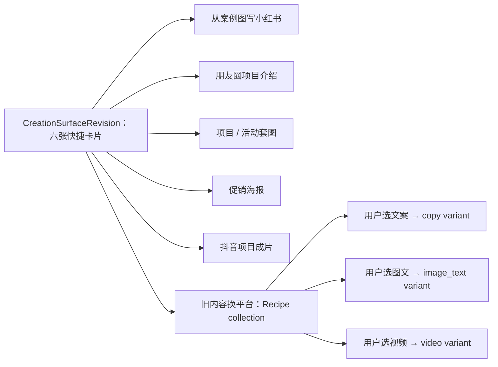

# 首批快捷模板与 `CreationRecipeVersion` 提案（2026-07-20）

> 状态：`accepted_for_initial_release`（D-082）。用户确认暂按本方案开发，后续允许通过后台发布新 Surface / Recipe revision 调整；本状态不表示六张卡片、八个 variant 或字段默认值永久固定。

## 1. 本轮要解决的问题

前台已经暂定六个快捷模板，但不能把它们实现成六段散落在前端的 `internalIntent + model + aspectRatio` 硬编码。首轮需要同时确定：

1. 一个可发布的 `CreationRecipeVersion` 最少包含哪些字段；
2. 六张用户可见卡片与实际 Recipe revision 如何对应；
3. 哪些内容应该复用，哪些内容必须在发布时冻结；
4. “旧内容换平台”如何遵守 D-081——创作对口只能由用户主动选择。

## 2. 三种实现方式比较

| 方案 | 做法 | 优点 | 主要问题 | 结论 |
| --- | --- | --- | --- | --- |
| 六个大 Recipe | 每张卡片保存完整 prompt、模型、参数、来源和输出 | 最快理解 | 重复多；“旧内容换平台”会变成一个跨三对口的大分支；变更难审计 | 不推荐 |
| 六张卡片 + 八个具体 Recipe | 五张卡片各指向一个具体 Recipe；“旧内容换平台”按文案/图文/视频拆成三个 variant | 每个 Recipe 只有一个对口和一套输出合同；报价、校验、回滚清楚 | 比卡片数多两个 revision | **推荐** |
| 通用节点编排器 | 运营人员自由拼输入、prompt、模型、工具和输出节点 | 表面最灵活 | 实际会形成第二套工作流引擎、第二套路由与大量非法组合 | P0 不采用 |

推荐保持“六张卡片”的产品认知，但发布 **八个单对口、可独立校验的 Recipe variant**。不建设任意节点编排，也不允许一个 Recipe 在运行时自动决定文案、图文或视频。



`Recipe collection` 只是一组有序的 published revision 引用和卡片展示信息，属于 Surface 编排，不是第五套运行时对象。冷态点击“旧内容换平台”时，必须先显示未预选的 `文案 | 图文 | 视频` 选择；确认后才解析到对应 variant。

## 3. 推荐的最小字段合同

下面是产品合同，不是要求前端直接接收全部服务端字段：

```ts
interface CreationRecipeVersion {
  recipeId: string;
  versionId: string;
  familyId: string;
  variantKey: string;
  revision: number;
  status: 'draft' | 'validated' | 'published' | 'retired';

  presentation: {
    name: string;
    summary: string;
    previewAssetId?: string;
    tags: string[];
  };

  applicability: {
    lensId: 'copy' | 'image_text' | 'video';
    outputIntentId: string;
    distributionTargets: Array<
      | 'xiaohongshu'
      | 'douyin'
      | 'video_account'
      | 'wechat_moments'
      | 'generic_export'
    >;
  };

  inputContract: {
    factRequirements: FactRequirement[];
    sourceSlots: SourceSlot[];
    visibleBriefDefaults: Partial<{
      scene: string;
      tone: string;
      audience: string;
    }>;
  };

  deliveryContract: {
    kind:
      | 'copy_document'
      | 'image_text_package'
      | 'image_set'
      | 'poster'
      | 'video_package';
    deliverables: DeliverableSpec[];
    editableParameters: ParameterDescriptorRef[];
    defaultParameters: Record<string, string | number | boolean>;
  };

  executionPolicy: {
    workflowRevisionId: string;
    promptBindings: Array<{
      stage: string;
      promptRevisionId: string;
    }>;
    modelPolicy:
      | { mode: 'auto'; policyRevisionId: string }
      | {
          mode: 'fixed';
          catalogModelId: string;
          catalogRevision: string;
          unavailableBehavior: 'block';
        };
    quotePolicyRevisionId: string;
  };

  resultWorkspaceId: string;
  createdBy: string;
  reason: string;
  createdAt: string;
  contentHash: string;
}
```

### 3.1 `FactRequirement`

事实要求只描述“生成前必须知道什么”，不能在 Recipe 中伪造事实：

- 稳定 `key` 和用户可见名称；
- 来源允许为已确认门店事实、选中来源或用户本次输入；
- `required` 与条件性要求；
- 缺失时是阻塞、原位追问，还是允许省略；
- 冲突时必须由用户确认，不能让 prompt 自行择一；
- 价格、折扣、活动期限、医疗/功效表达和顾客身份默认使用严格确认策略。

### 3.2 `SourceSlot`

每个来源槽至少包含：

- `role`：案例图、项目素材、品牌素材、原内容等业务角色；
- 允许的 `CreativeSourceReference.kind` 与素材类别；
- `min / max`；
- 所需授权范围，例如 `public_marketing`；
- 人脸、未成年人、前后对比、医疗或 PII 的阻塞/脱敏策略；
- 缺失时的用户提示。

Recipe 只定义槽位，不保存用户实际选择的 Asset/Content/Work ID。

### 3.3 `deliveryContract`

输出合同描述用户最终拿到什么，不直接等于单个模型调用：

- 文案、封面、套图、视频、发布说明等 deliverable 及数量；
- 比例、时长、页数等默认值和可编辑范围；
- 目标载体与结果工作区；
- 是否复用原素材、生成新素材或二者组合。

一个图文或视频成品可以编译为多个 child run，但 Recipe 不复制 Product Core 的任务、接受态和路由逻辑。

### 3.4 `executionPolicy`

- prompt 只保存服务端不可变 revision 引用，不把隐藏正文下发浏览器；
- Auto 模型只引用已发布策略，Fixed 模型不可用时阻塞，不得静默换 CatalogModel；
- 参数只能引用 Catalog 的 parameter descriptor，不能接收任意 JSON；
- Recipe 保存报价策略引用，不保存实际金额；实际模型、数量和总价由服务端重新报价并在提交时冻结；
- 不允许出现 Provider、Deployment、Credential、New API 或 Sub2API 字段。

## 4. 首批六张卡片与八个 Recipe variant

| 用户可见卡片 | `familyId / variantKey` | 对口 | 最小输入合同 | 默认交付 | 执行与结果 |
| --- | --- | --- | --- | --- | --- |
| 从案例图写小红书 | `case_to_xhs_note / xhs_image_text` | 图文 | 1–9 张已获公开营销授权的案例图；项目/服务事实至少一项 | 1 篇小红书笔记 + 1 张 3:4 封面；正文复用所选案例图，不默认生成虚构案例照 | Auto 文案 + 封面模型；进入图文成品工作区 |
| 朋友圈项目介绍 | `project_intro / wechat_copy` | 文案 | 项目/服务、核心特点、预约 CTA；价格仅在已确认时使用 | 1 条约 80–180 汉字的可发布朋友圈文案 | Auto 文案模型；进入文案工作区 |
| 项目 / 活动套图 | `campaign_visual_set / image_set` | 图文 | 项目或活动主题、核心信息、CTA；活动分支需要期限/权益事实；素材可选 | 默认 4 张 3:4：封面、亮点、详情、CTA | Auto 图片策略；进入套图工作区 |
| 促销海报 | `promotion_poster / poster` | 图文 | 活动标题、项目/权益、至少一种优惠机制、有效期、CTA；主视觉可选 | 默认 1 张 3:4 海报，可改 1:1 或 9:16 | Auto 图片策略；进入图片工作区 |
| 抖音项目成片 | `douyin_project_video / douyin_video` | 视频 | 1–6 个已获公开营销授权的案例图片/片段、项目事实和 CTA | 默认 1 条 15 秒 9:16 MP4 + 封面 + 发布文案 | 复用现有 15 秒视频工作流；进入视频成品工作区 |
| 旧内容换平台 | `reuse_content / copy_adapt` | 文案 | 恰好 1 个 Content/Work/ContentPackage；用户主动选文案和目标载体 | 1 份目标载体文案 | `copy.adapt` 或相应 workflow；进入文案工作区 |
| 旧内容换平台 | `reuse_content / image_text_adapt` | 图文 | 同上；用户主动选图文和目标载体 | 1 个目标平台图文包 | 图文 workflow；进入图文成品工作区 |
| 旧内容换平台 | `reuse_content / video_adapt` | 视频 | 同上；用户主动选视频和目标载体；不足的公开营销素材原位补齐 | 1 个目标平台视频包 | 视频 workflow；进入视频成品工作区 |

补充边界：

- “项目 / 活动套图”不拆成两个 Recipe；`subject_kind` 是当前 Recipe 内的可见 brief 字段，有明确来源时可预填，无法确认时只追问一次。
- “旧内容换平台”三项 variant 共用 `familyId`，但每项仍有独立输入、输出、模型和报价校验；不得用一个跨对口 Recipe 在后台自动分支。
- 当前 `ContentPackagePlatform` 只有小红书、抖音和视频号，而朋友圈是导出载体，不应为了模板展示把 `wechat_moments` 冒充自动发布平台。Recipe 使用 `distributionTarget`，真正的自动/辅助发布能力继续由 Integration capability 单独决定。

## 5. 复用关系：复用引用，不做深层继承

首轮不增加通用 `RecipeFragment` 或任意继承 DSL。八个 published Recipe 都保存完整、可独立校验的输入与输出快照；后台可以“复制自已有 Recipe”帮助编辑，但发布后不再动态继承源 Recipe。

允许复用的只有不可变引用：

- `workflowRevisionId`；
- 各阶段 `promptRevisionId`；
- `modelPolicyRevisionId`；
- `quotePolicyRevisionId`；
- `resultWorkspaceId`；
- `familyId` 仅用于分组、选择 variant 和分析，不承担字段覆盖。

这样更新共用 prompt 或模型策略时，需要显式发布新 revision 并展示受影响 Recipe；历史任务仍能按旧引用回放，不会被“父模板”静默改写。

## 6. 套用与提交过程

```text
浏览卡片
  → 预览 Recipe 需要的对口、来源、事实、输出和预计费用
  → 用户显式选择/确认创作对口
  → 服务端编译 RecipePatchPreview
  → 界面展示 保留 / 暂存 / 改变
  → 用户套用，仍只写本地版本化草稿
  → 服务端校验事实、授权、模型可用性并重新报价
  → 用户开始创作
  → 冻结 lens / surface / recipe / workflow / prompt / model / quote / route revisions
```

Recipe 套用不能把用户原文替换为 `internalIntent`。用户原文保持可见；隐藏执行提示通过服务端 prompt revision 与结构化 brief 共同编译。

## 7. 后台编辑器对应结构

“创作入口与模板”中的 Recipe 编辑器首轮只需要六个页签：

1. 基本信息：名称、说明、预览素材、标签、family/variant；
2. 对口与输入：唯一 lens、事实要求、来源槽、授权策略；
3. 输出：deliverable、数量、比例/时长和目标载体；
4. 模型与参数：Auto/Fixed、可编辑参数和默认值；
5. 执行与结果：workflow/prompt/quote revision、结果工作区；
6. 预览与发布：桌面/移动卡片、Patch 差异、示例报价、校验、发布历史和回滚。

Surface 页面只负责选择“哪六张卡片、顺序和上下架”；不能在 Surface 中改 prompt、来源、模型、参数或输出合同。

## 8. 发布校验与首轮自动化

- 每个具体 Recipe 必须且只能绑定一个 lens；
- 不允许 `defaultLens`、自动推断 lens 或多 lens execution branch；
- 所有 workflow/prompt/model policy/quote policy/result workspace 引用必须存在且已发布；
- output、目标载体、参数和结果工作区必须与 lens 兼容；
- 促销价格/权益/期限缺失或冲突时阻塞，不由模型补写；
- 案例图、顾客素材、前后对比、人脸和医疗类内容必须通过权利与数据类别校验；
- Fixed 模型不可用时阻塞；Auto 无合格候选时显示不可用原因；
- “旧内容换平台”冷态点击后没有默认 variant，必须由用户选择文案、图文或视频；
- 浏览、预览、套用、取消和撤销不创建 Work/Task/Job/ContentPackage，不预占额度；
- 后台发布新 Recipe 不改写已打开草稿和已提交任务；
- 同一 Recipe 的桌面与移动 PatchPreview、报价和冻结 revision 一致。

## 9. 当前代码迁移提醒

- `NAMED_PRESET_CONTRACTS` 仍把 `inputGuide`、`internalIntent` 和 content modules 固定在前端 family 映射中；应迁入独立 Recipe Catalog。
- 当前创建 Work 会以 `selectedPreset.internalIntent` 替换用户 intent；必须改成保留用户原文并记录 recipe revision / 服务端 prompt binding。
- `RawTemplate` 与后台官方模板 version 仍围绕 CanvasDocument，不能直接扩成 Recipe 存储。
- `CreativeExecutionContract` 已冻结 operation、CatalogModel、报价、数量、比例/时长和合规设置，但还需让 Work/Task 可追溯 lens、surface、recipe、workflow 与 prompt revisions。
- `ContentPackagePlatform` 与朋友圈导出载体不是同一概念，需要在 Recipe 合同中明确区分。

## 10. 已拍板范围

首个发布版本暂按以下组合实施：

1. 首发保持六张卡片，但发布八个单对口 Recipe variant；
2. “旧内容换平台”是 Surface 内的 Recipe collection，用户主动选对口后解析 variant；
3. Recipe 使用上面的最小字段合同，首轮不建设任意节点编排和深层继承；
4. 复用采用不可变 revision 引用，published Recipe 自身可独立校验、回滚和回放；
5. 六项默认输出按第 4 节落地，后续只通过后台新 revision 调整。

后续调整不得追改已打开草稿、已冻结报价、已提交任务和历史回放；真实运营需求只形成新的 published revision，并保留预览、校验、审计、回滚和版本对照。
